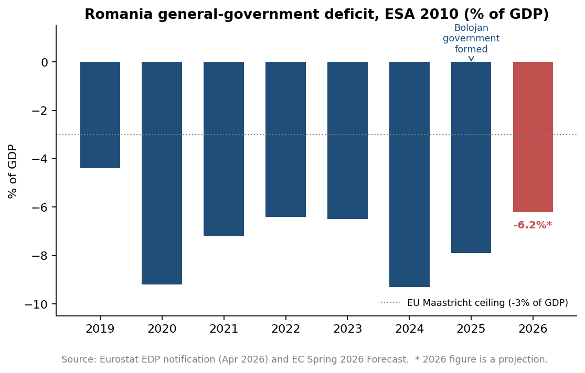
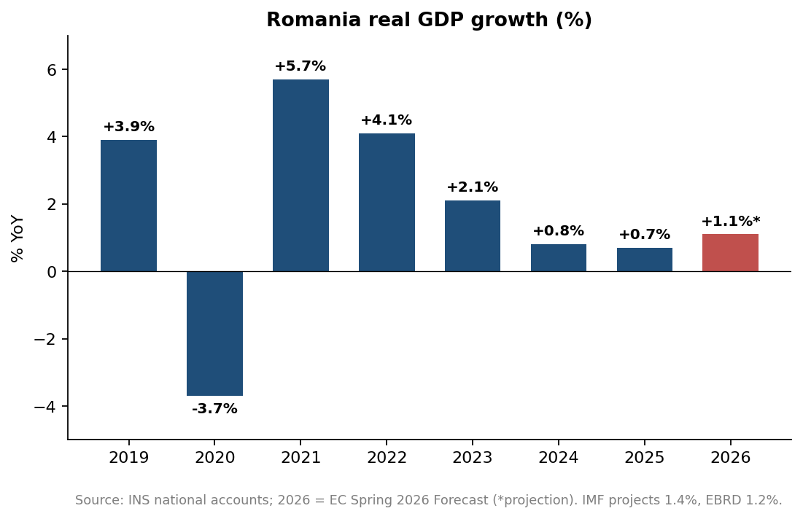
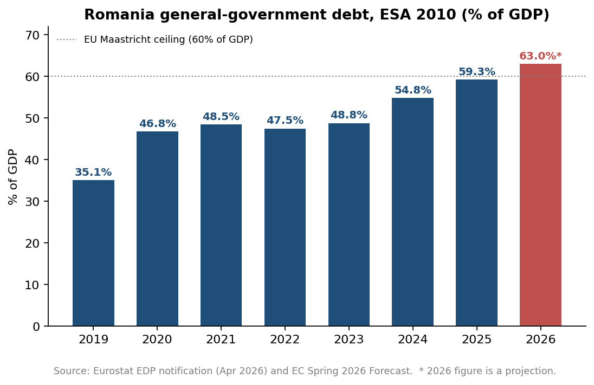
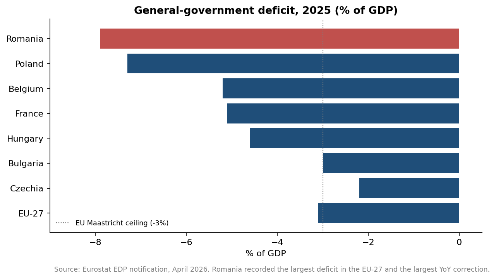
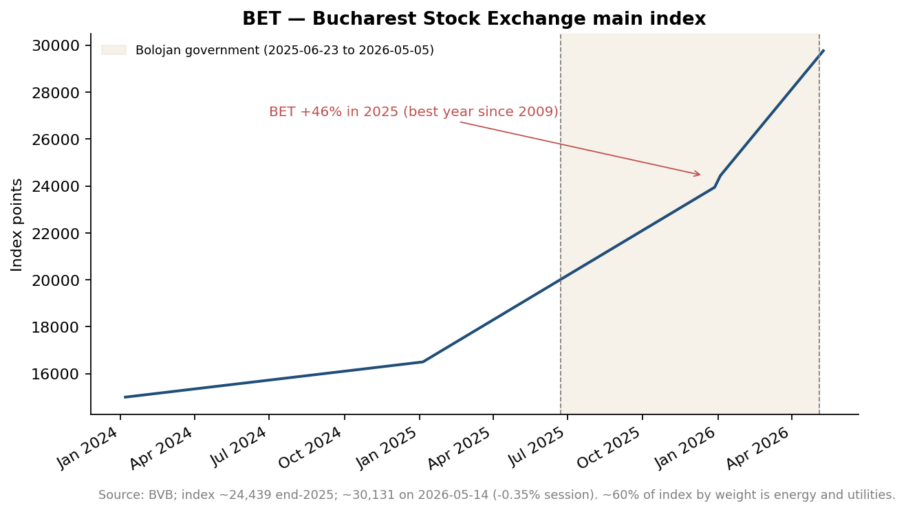

# The Bolojan Government and the Romanian Economy: A Data-Driven Assessment

*Draft — last updated 2026-05-20*

> **Audience:** general Romanian public (English-language version).
> **Stance:** strictly descriptive and analytical. The report presents the data and lets readers draw their own conclusions.
> **Coverage window:** roughly June 2025 (government formation) through the latest published statistics at the time of writing.

---

## 1. Executive summary

This report examines the economic effects of the **Bolojan government**, in office from **23 June 2025 until its removal by a 281-to-4 no-confidence vote on 5 May 2026** — just under eleven months. The analysis is **strictly descriptive**: it presents the data and the major competing causal interpretations, and lets the reader draw conclusions.

**The starting position.** Romania's general-government deficit reached **9.3% of GDP in 2024** — the largest in the European Union and more than triple the Maastricht ceiling. Public debt had climbed from 35% of GDP in 2019 to **54.8% in 2024**. The country was under the EU Excessive Deficit Procedure and faced binding milestones under its EUR 21.4 bn Recovery and Resilience Plan, with most funds still to be disbursed before the August 2026 deadline. All three major rating agencies held Romania at the lowest investment-grade notch with a negative outlook.

**What the government did.** Two large fiscal packages, enacted mostly through emergency ordinances:

- *Pachetul 1* (effective 1 August 2025) raised the standard VAT from 19% to 21%, unified the reduced VAT rates of 5% and 9% at 11%, doubled the bank turnover tax to 4%, lifted excises on fuels/alcohol/tobacco by 10%, extended healthcare contributions to higher pensions, and froze public-sector wages and pensions at their November 2024 levels.
- *Pachetul 2* (late August 2025) set a 20% civil-service headcount-reduction target (~167,000 jobs), cut hazard pay five-fold, reformed special pensions and state-owned enterprises, and raised levies on profits and the energy sector.

**What happened in the data.**

| Indicator | 2024 (inherited) | 2025 (outcome) | Latest (2026) |
|---|---|---|---|
| ESA deficit (% of GDP) | **-9.3%** | **-7.9%** (largest correction in EU-27, -1.4 pp) | EC projects -6.2% |
| Public debt (% of GDP) | 54.8% | 59.3% | ~63% projected |
| Real GDP growth | +0.8% | **+0.7%** | EC: +1.1% (forecast) |
| CPI inflation (YoY, end-period) | 5.5% | 9.7% | **10.7% (Apr 2026)** |
| Real net wage growth (YoY, end-period) | +9% | **-4.9% (Q4)** | **-5.2% (Q1 2026)** |
| Retail sales volume (YoY) | mildly positive | -2.1% (Sep) | **-9.1% (Jan 2026)** |
| EUR/RON | ~4.97 | 5.0721 (17 Nov 25 low) | **5.2646 (7 May 26 peak)** |
| 10Y sovereign yield | ~7.0% | ~7.4% | ~7.1% |
| Sovereign rating | BBB-/Baa3 neg | unchanged | unchanged |

**Headline reading.**

- The **fiscal correction was real and the largest in the EU** in 2025. The Q1 2026 cash deficit (1.0% of GDP, half the year-earlier level) confirms the direction.
- The **cost was paid by households**: real net wages declined for three consecutive quarters, retail sales contracted sharply, and consumption — Romania's primary growth engine — weakened materially.
- **Inflation re-accelerated**, largely by design of the tax package and the March 2026 removal of the natural-gas price cap.
- **Sovereign markets accepted the trade-off** while the coalition held together: yields drifted lower, all three rating agencies kept Romania at investment grade, and the currency was stable.
- **The political collapse on 5 May 2026** caused the leu to weaken to its worst level against the euro in over twenty years, illustrating that the macro outcomes were conditional on the policy's political durability.
- The strong **+46% rally in the BET stock index in 2025** is largely a sectoral story — about 60% of the index is energy and utilities, which rose globally — and is not a vote of confidence in the broader Romanian economy.

**What this report does not claim.** The eleven-month window is too short for confident causal inference; the lagged effects of fiscal consolidation typically take four to eight quarters to materialise. **Section 10** lays out, for each headline outcome, what can credibly be attributed to government policy and what reflects external factors (the ECB rate path, EU growth, global energy markets, the war in Ukraine). The intended takeaway for the reader is not a verdict but a clearer view of the trade-offs the Bolojan government chose to make, the immediate consequences in the data, and the questions that will only be answerable in 2026–2028.

---

## 2. Context: the inheritance

### 2.1 A government formed under fiscal pressure

Ilie Bolojan was sworn in as Prime Minister on **23 June 2025**, leading a four-party pro-EU coalition of the National Liberal Party (PNL), the Social Democratic Party (PSD), the Save Romania Union (USR), and the Hungarian UDMR. The government's nomination came from President Nicușor Dan, elected the previous month in the presidential rerun.

The coalition agreement and Bolojan's first parliamentary speech framed the central economic task in unambiguous terms: bring down a budget deficit that had reached **9.3% of GDP in 2024** — the largest in the European Union and more than triple the EU's Maastricht ceiling of 3% (see Figure 1). At that level, for every RON 100 the state collected in 2024, it spent roughly RON 132, with the gap covered by new borrowing.

Two related pressures shaped the policy space available to the new government:

- **The Excessive Deficit Procedure (EDP).** The European Council had placed Romania under the EDP in 2020 and reaffirmed it in 2024. By mid-2025, the European Commission was insisting on a credible adjustment path or risk-suspension of EU funds.
- **The Recovery and Resilience Facility (PNRR/NRRP) clock.** Romania's revised plan totals **EUR 21.4 billion** and must be largely disbursed by the August 2026 deadline. As of mid-2025, Romania had received only about half of the allocation and faced binding milestones (special-pensions reform, public-administration reforms, energy-market liberalisation) tied to future tranches.

### 2.2 The macroeconomic starting point

The economy Bolojan inherited was simultaneously **slowing, inflating, and externally exposed**:

- **Growth had stalled.** Real GDP grew **0.8% in 2024** and was tracking similarly for 2025, well below the 3–4% pace typical of the previous decade (Figure 2).
- **Inflation, despite an earlier decline from 2022–2023 highs, was already re-accelerating.** Headline CPI averaged just under 5% in spring 2025, with core measures sticky around the same level (Figure 4).
- **Public debt had climbed quickly** — from 35% of GDP in 2019 to **54.8% in 2024** — and was on a path to breach 60% within 12–18 months on unchanged policy.
- **Real wages had grown strongly under the previous government**, with nominal public-sector wage increases of more than 20% and pension increases above 30% in 2024 contributing to both demand pressures and the deficit.

### 2.3 External constraints and market signals

By the time the government was sworn in:

- All three major rating agencies held Romania at **the lowest investment-grade notch with negative outlook** (S&P and Fitch at BBB-, Moody's at Baa3). A downgrade would have meant losing investment-grade status, with mechanical consequences for index inclusion and pension-fund holdings of Romanian debt.
- The **10-year sovereign yield** was around **7.6%** in June 2025 — implying a spread of roughly 500 basis points over German Bunds and about 400 basis points over US Treasuries.
- The **leu** was trading near 4.97 against the euro, kept stable by close BNR management within a tight implicit corridor.

### 2.4 How to read the rest of this report

The Bolojan government's tenure — **23 June 2025 to 5 May 2026, when Parliament removed it via a 281-to-4 no-confidence vote** — covers just under eleven months. That window is too short for full causal inference: the lagged effects of fiscal consolidation typically take four to eight quarters to materialise, and the period also coincides with global disinflation, the European Central Bank's rate path, and the run-down of the EU's Recovery and Resilience Facility.

The remainder of the report therefore proceeds in two passes. **Sections 3 to 8** describe what the government did and what happened in the data, organised by economic domain. **Sections 9 and 10** then ask the harder question: how much of what happened was driven by the government's choices, and how much would have happened anyway. The report deliberately does not deliver a verdict; it lays out the evidence and the competing causal interpretations side by side.

---

## 3. The policy package

The government's economic strategy was assembled in two large fiscal packages — commonly referred to in Romanian public debate as *Pachetul 1* and *Pachetul 2* — and a series of follow-on budget rectifications and emergency ordinances. Most measures were enacted through *Ordonanțe de Urgență ale Guvernului* (OUGs, government emergency ordinances) and only later debated in Parliament.

### 3.1 Pachetul 1 — Legea 141/2025

**Legal vehicle:** Government engaged its responsibility (*asumarea răspunderii*) on **7 July 2025**; promulgated by President Nicușor Dan on **26 July 2025**; published as **Legea nr. 141/2025** in **Monitorul Oficial, Partea I, nr. 699 din 25 iulie 2025**. Most provisions took effect on **1 August 2025**.

The first package combined tax increases on consumption with caps on public-sector pay and pensions.

**Revenue measures:**

| Instrument | Change | Comment |
|---|---|---|
| Standard VAT | 19% → **21%** | Largest single revenue lever |
| Reduced VAT rates (5% and 9%) | Unified at **11%** | Covers food, medicine, water, books, firewood, district heating, hospitality |
| Bank turnover tax | 2% → **4%** | Doubled |
| Excise duties on fuels, alcohol, tobacco | **+10%** | Indexed earlier than scheduled |
| Gambling levies | Higher tariffs | Estimated additional RON 500 m in 2025 |
| Healthcare contribution (CASS) | Extended to pensions above **RON 3,000/month** | Applied **1 Aug 2025 to 31 Dec 2027** (Legea 141/2025) |
| Dividend tax | 10% → **16%** | From **1 January 2026** (Legea 141/2025) |

**Expenditure measures:**

- Temporary cap on public-sector wages and pensions, freezing them at their November 2024 levels. The government argued this was necessary after the 2024 increases of more than 20% for salaries and over 30% for pensions, which had contributed materially to the 9.3% deficit outcome.

### 3.2 Pachetul 2 — five laws via *asumarea răspunderii* on 1 September 2025

**Legal vehicle:** To insulate the reforms from constitutional challenge before the Curtea Constituțională (CCR), Pachetul 2 was originally announced as six sub-packages. The local-administration sub-package was withdrawn from the agenda before the parliamentary session and **five legislative projects** were assumed jointly in an extraordinary plenary on **1 September 2025**. The same six-vehicle splitting strategy had been used by the Boc government in 2010, with the goal that an adverse CCR ruling on one law would not topple the entire package.

| # | Sub-package | Status | Final Lege | M.O. |
|---|---|---|---|---|
| 1 | Fiscal measures and insolvency (core fiscal text) | Promulgated | **Legea nr. 239/2025** | autumn 2025 |
| 2 | Corporate governance of state-owned enterprises | Promulgated (Oct 2025) — capped board pay and bonuses | *verified Oct 2025; Lege no. tracked in `data/measures_timeline.md`* | autumn 2025 |
| 3 | Reform of regulatory authorities (ANRE, ASF, ANCOM) | Promulgated — 10% cut in specialist posts, 30% in support; no bonuses for board members until 31 Dec 2028 | *Lege no. tracked in `data/measures_timeline.md`* | autumn 2025 |
| 4 | Healthcare reform | CCR validated; promulgated by President **23 October 2025** | *Lege no. tracked in `data/measures_timeline.md`* | autumn 2025 |
| 5 | Magistrates' special pensions (cap at 70% of last net income; retirement age rising to 65 over 10 years) | **Struck down by CCR** as unconstitutional | — | — |
| 6 | Local-administration reform | **Withdrawn** before plenary; not part of Pachetul 2 | — | — |

The core fiscal text — **Legea nr. 239/2025** *privind stabilirea unor măsuri de redresare și eficientizare a resurselor publice și pentru modificarea și completarea unor acte normative* — modifies the Fiscal Code, Fiscal Procedure Code, Companies Law, and introduces a new logistics tax, among other changes. Aggregate budgetary impact of all approved sub-packages was estimated by the Government at **~RON 3.7 bn**.

The second package focused on structural spending and the state apparatus.

**Public-administration restructuring:**
- A headcount-reduction target of up to **20%** of civil servants (around 167,000 positions) over a multi-year horizon.
- A five-fold cut in **hazard pay** (sporul de risc) for around 1 million public-sector workers, projected to save roughly **EUR 270 million per year**.
- Reform of **special pensions** (pensii speciale) by eliminating sectoral exceptions — a binding milestone under the PNRR.
- Reform of **state-owned enterprises** (SOEs) and autonomous agencies, with stricter performance contracts and dividend-payout requirements.
- Decentralisation and digitisation of central administration to reduce duplication between county and central levels.

**Revenue and investment measures:**
- Higher taxation on **profits** in selected sectors and an enlarged **energy-sector levy**.
- A re-evaluation of the public investment pipeline to prioritise projects with measurable export or productivity returns, and to align spending with PNRR milestones.

### 3.3 Independent assessment by the Consiliul Fiscal

The Consiliul Fiscal — Romania's independent fiscal council, attached to Parliament — issued opinions on both packages and on the 2025 mid-year budget rectification. Its main findings:

- The aggregate measures in Pachetul 1 plus Pachetul 2 carry a quantified budgetary impact of **RON 23.5 bn (1.23% of GDP) in 2025** and **RON 44.5 bn (2.18% of GDP) in 2026**.
- The 7.04% of GDP deficit target embedded in the pre-formation 2025 budget was assessed as "far from reality"; without intervention, the Council judged the deficit could have reached **~9% of GDP** again in 2025.
- The Council explicitly stated there was "no alternative to severe correction," citing imminent risks to Romania's access to financing and refinancing.
- It also flagged that even with the packages, **the 2026 deficit could still reach about 6.5% of GDP** — i.e. above the European Commission's 6.2% projection cited elsewhere in this report — depending on execution risks.

The full opinion is available in the Consiliul Fiscal archive (Senate transmission letter, August 2025; see Annex B).

### 3.4 Budget rectifications during the period

Two rectifications of the 2025 state budget were adopted under the Bolojan government — both via *Ordonanță de Urgență* (OUG) to bypass the normal budget-law calendar.

| Adopted | Vehicle | M.O. | Key parameters |
|---|---|---|---|
| 2025-10-01 | **OUG nr. 50/2025** | M.O. nr. 901 (Oct 2025) | First rectification: aligned the 2025 budget with the Pachetul 1 revenue measures and updated macro assumptions; revised deficit framework around 8.4% of GDP cash basis |
| 2025-11-28 | OUG (state budget) + **OUG nr. 65/2025** (social-security state budget) | M.O. Partea I nr. 1108 (28 Nov 2025) | Second rectification: configured on 0.6% real GDP growth, 7.1% average inflation, average gross wage RON 8,700/month; reflected revised PNRR envelope and end-of-year continuity needs |

The Consiliul Fiscal published opinions on both rectifications, generally endorsing the direction while flagging continued implementation risks on expenditure side.

### 3.5 BNR monetary policy decisions during the period

The **National Bank of Romania (BNR)** held the policy rate at **6.50%** throughout the entire Bolojan period — the most recent rate change had been the August 2024 cut from 6.75% to 6.50%. Across eight monetary-policy meetings in 2025 and four through mid-May 2026, the Board affirmed the same configuration:

| Meeting | Decision | Lombard | Deposit |
|---|---|---|---|
| 2025-01 | Hold 6.50% | 7.50% | 5.50% |
| 2025-02 | Hold 6.50% | 7.50% | 5.50% |
| 2025-04 | Hold 6.50% | 7.50% | 5.50% |
| 2025-05 | Hold 6.50% | 7.50% | 5.50% |
| 2025-07 | Hold 6.50% | 7.50% | 5.50% |
| **2025-08-21** | Hold 6.50% (unanimous) — first meeting after Pachetul 1 took effect | 7.50% | 5.50% |
| **2025-10-08** | Hold 6.50% | 7.50% | 5.50% |
| **2025-11-12** | Hold 6.50% — 10th consecutive hold; last meeting of 2025 | 7.50% | 5.50% |
| **2026-01-19** | Hold 6.50% — first meeting of 2026 | 7.50% | 5.50% |
| 2026-02 | Hold 6.50% | 7.50% | 5.50% |
| **2026-04-07** | Hold 6.50% | 7.50% | 5.50% |
| **2026-05-15** | Hold 6.50% — last meeting under the Bolojan window, 10 days after the no-confidence vote | 7.50% | 5.50% |

BNR's stated reasoning across the period: inflation overshoot was driven primarily by **supply-side and tax pass-through**, not demand pressure; cutting rates while CPI was elevated would risk de-anchoring inflation expectations and accelerating the leu's depreciation. The Board's central scenario, last updated in early 2026, places inflation's return to the **2.5% ±1 pp target by H1 2027**. Market and analyst consensus, accordingly, expects the **first rate cut no earlier than 2027**.

### 3.6 Other policy actions during the period

- **2025-08-15** — Fitch confirmed Romania at **BBB- with negative outlook** (S&P and Moody's already at the same configuration). Avoiding a downgrade became an unspoken constraint on every subsequent fiscal decision.
- **2025-10-22** — The European Commission approved the **revised PNRR**: EUR 21.4 bn in total, of which EUR 13.57 bn in grants and EUR 7.84 bn in loans.
- **2025-11-12** — IMF concluded the **2025 Article IV consultation**, broadly endorsing the adjustment direction while warning about the household-income drag.
- **2025-11-13** — Romania submitted its **fourth PNRR payment request** of EUR 2.6 bn (grants only).
- **2026-02** — Following the CCR ruling against the magistrates' pension reform, the European Commission confirmed that Romania would forfeit **EUR 231 m** of PNRR funding tied to that reform milestone.
- **2026-03** — The natural-gas price cap was **removed**, in line with PNRR commitments on energy-market liberalisation. Analysts identified it as a key disinflation headwind.
- **2026-04 (late) / 2026-05-05** — PSD withdrew from the coalition in late April and joined AUR in filing a no-confidence motion, which carried **281 to 4** on 5 May — the largest such majority in post-communist Romania. Bolojan continued as caretaker PM.

A full timeline is kept in `bolojan/data/measures_timeline.md`, anchored to **Legea 141/2025 (M.O. nr. 699/25.07.2025)** for Pachetul 1 and **Legea 239/2025** for the core of Pachetul 2.

---

## 4. Macroeconomic outcomes

### 4.1 Growth

Romania's real GDP grew by **0.7%** in 2025, broadly matching the European Commission's pre-formation projection of 0.7% for the year (Figure 2). For 2026, forecasts cluster between **0.9% (EBRD)**, **1.1% (European Commission, Spring 2026)**, and **1.4% (IMF)** — i.e. a continued sub-trend recovery rather than a return to the 3–4% growth rates of the 2010s.

The composition of growth is telling: net exports and EU-financed investment supported activity, while private consumption — historically Romania's main growth engine — contracted as real wages fell and consumer confidence weakened.

### 4.2 Inflation

Inflation re-accelerated sharply over the Bolojan period (Figure 4). After running below 6% through the first half of 2025, headline CPI jumped to **9.9% YoY in August 2025** as the VAT increases passed through, and remained close to that level through the autumn. In April 2026, the print rose further to **10.7% YoY**, partly reflecting the removal of the natural-gas price cap in March.

| Indicator | 2025 | 2026 (latest / forecast) |
|---|---|---|
| HICP, annual average | 6.7% | <6% (EC) |
| CPI, end-period print | 9.7% (Dec) | 10.7% (Apr 2026 print) |
| BNR end-2026 forecast | — | ~3.7% |

The **National Bank of Romania (BNR)** held the policy rate at **6.50%** throughout the entire Bolojan period — the rate was last changed on 7 August 2024. The lending (Lombard) facility stayed at 7.50% and the deposit facility at 5.50%. Markets and analysts now expect the **first rate cut no earlier than 2027**, with BNR's own scenarios placing the return of inflation to target in the **first half of 2027**.

### 4.3 Labour market

Employment held up better than activity. INS labour-force survey data show the **unemployment rate** staying in a narrow band around the mid-5% range through the period, with the public-sector hiring freeze offset by continued private-sector hiring in services and construction.

The pressure point was not jobs but wages — see Section 6.

### 4.4 External balance

The **current account deficit** narrowed in early 2026: Q1 2026 was 13% smaller in nominal terms YoY, and the rolling 12-month deficit declined to **7.7% of GDP** by end-Q1 2026, from above 8% a year earlier. The improvement reflected weaker import demand (consistent with the consumption squeeze) rather than a strong export rebound.

Romania's trade deficit narrowed in the first 11 months of 2025 compared to 2024, with goods exports outperforming imports — again consistent with a domestic-demand-led import compression.

---

## 5. Public finances

### 5.1 The headline correction

The most prominent — and politically contested — outcome of the Bolojan period is the fiscal correction (Figure 1). On the **ESA 2010 basis**, Romania's general-government deficit declined from **9.3% of GDP in 2024** to **7.9% in 2025**, a **1.4-percentage-point** reduction that Eurostat ranked as the **largest single-year fiscal correction in the EU-27**.

For 2026, the European Commission projects further consolidation to **6.2% of GDP**; the Romanian government's own *Strategia Fiscal-Bugetară* targeted under 6.5%.

**Q1 2026 cash-basis execution** confirmed the trajectory, at least in the short window:
- Deficit: **RON 22 bn = 1.03% of GDP**, against **RON 44 bn = 2.3% of GDP** in Q1 2025 — a halving.
- Total revenues: **RON 158.8 bn**, up **12.3% YoY**. VAT receipts rose **17.7% YoY** to RON 33.6 bn, the largest single contributor.
- Total expenditures: **RON 179.9 bn**, down **2.8% YoY** — the wage-and-pension freeze visible in the spending side.

A caveat: Q1 typically shows a smaller deficit than the full year because capex execution accelerates later. Full-year ESA deficit revisions to the 2025 number are also possible in the next EDP notification.

### 5.2 Public debt and financing costs

Public debt rose by 4.5 percentage points to **59.3% of GDP at end-2025**, on track to exceed the Maastricht 60% threshold during 2026 and to approach **63% by year-end** (Figure 3). The debt build-up reflects (i) the still-large flow deficit, and (ii) currency translation effects on foreign-currency debt.

Financing costs eased modestly over the period despite the political turbulence at the end. The **10-year RON-denominated sovereign yield** stood at:
- ~**7.62%** in June 2025 (government formation)
- ~**7.11%** in mid-May 2026 (post no-confidence vote)

That implies a spread of roughly **460 basis points** over German Bunds and ~**360 basis points** over US Treasuries — still elevated by CEE peer standards, but compressed by ~50 bp over the period.

### 5.3 The EDP and PNRR linkage

Romania remained under the **Excessive Deficit Procedure (EDP)** throughout the Bolojan period. The Council of the EU repeatedly assessed the consolidation path as "in line with recommendations" in 2025 and early 2026 — a key reason why no automatic suspension of EU funds was triggered.

The **PNRR (NRRP)** clock continued ticking. As of late 2025, Romania had absorbed **EUR 10.72 bn** of the EUR 21.4 bn revised envelope — close to half. Three more payment requests remain before the August 2026 deadline. The **EUR 231 m forfeit** in February 2026 (magistrates' pensions) and the **EUR 6.3 bn of at-risk projects** mean that the headline absorption figure could end up well below 100%.

---

## 6. Households

### 6.1 The real-wage compression

The single clearest cost of the adjustment fell on **household real incomes**. Romanian net wages continued to grow in nominal terms but at a pace well below inflation (Figure 5):

| Period | Net wage (RON) | Net wage (EUR ~equiv.) | Nominal YoY | Inflation | Real YoY |
|---|---|---|---|---|---|
| Q4 2025 | 5,674 | ~1,115 | +4.4% | 9.7% | **-4.9%** |
| Q1 2026 | 5,671 | ~1,113 | +3.9% | ~9.7% | **-5.2%** |

By Q1 2026, real wages had been declining year-on-year for **three consecutive quarters** — the longest such stretch since 2010. The state forecasting body (Comisia Națională de Strategie și Prognoză, CNP) projects further real-wage contractions of **-1.1% in 2025** and **-0.9% in 2026**, meaning the squeeze is expected to ease but not reverse within the period.

### 6.2 Pensions

Pensions followed a similar path. The November 2024 levels were frozen through both packages and the freeze was explicitly extended into 2026. With CPI averaging close to 10% over the period, this implies a **cumulative real-pension cut of roughly 15%** between the freeze taking effect and Q1 2026 — though the picture differs sharply across the distribution: minimum pensions received targeted top-ups while higher pensions absorbed the full freeze.

The extension of the **healthcare contribution to pensions above RON 3,000/month** (Pachetul 1) further reduced disposable income for the upper half of pensioners.

### 6.3 Consumption

The household squeeze fed directly into consumption. INS retail-trade volume data show:
- **September 2025: -2.1% YoY** — among the largest declines in the EU, second only to Italy.
- **January 2026: -9.1% YoY** (gross terms), driven by fuel (-13.8%), non-food products (-11.3%), and food (-3.9%).

The Romanian state forecasting body (CNP) and the European Commission both attribute the bulk of Romania's growth slowdown in 2025–2026 to **weakening private consumption**, which has been the most reliable growth driver throughout the past decade.

---

## 7. Business and investment

### 7.1 Industry

Industrial production followed a flat-to-negative trajectory for most of 2025:
- **First 11 months of 2025**: -1.1% YoY (gross), -0.5% (seasonally adjusted).
- **December 2025**: +1.6% YoY — the strongest reading since July 2025, suggesting tentative stabilisation as the year ended.
- Manufacturing recovered modestly (+1.1% YoY in December after -1.0% in November), while energy and utilities expanded faster.

Industrial **sales** (a broader measure including foreign demand) rose 3.2% in 2025, indicating that export-oriented manufacturers (notably automotive) fared better than domestically-oriented production.

### 7.2 Retail and services

Retail trade was the weakest part of the economy — see Section 6.3. Services indicators (PMI surveys, the Romanian managers' confidence survey) painted a similar picture: by early 2026, managers were anticipating a **moderate decrease in economic activity and rising prices**.

### 7.3 Construction

Construction activity remained supported by EU-funded projects (PNRR, cohesion funds) but private residential construction softened with the consumer slowdown. Materials inflation, fuelled by VAT and energy-cost pass-through, squeezed margins.

### 7.4 Foreign direct investment

FDI inflows were uneven:
- 2024: **EUR 5.7 bn** net, down 11% YoY (BNR balance-of-payments data).
- 2025: monthly flows were volatile — September posted a strong reading (~USD 846 m), December a smaller one (~EUR 495 m).
- Cumulative inward FDI stock reached **EUR 125 bn** by end-2024.
- The Foreign Investors Council's 2024–2025 review described a shift "from rapid expansion toward consolidation and optimisation" — i.e. existing investors retained but greenfield slowed.

### 7.5 Insolvencies

The corporate stress signal was clearer:
- **7,553 new insolvency proceedings** opened in 2025 — **+3.84% YoY** (Coface).
- The first 8 months had actually been down ~2% YoY; the deterioration came in the autumn quarter as the Pachetul 1 measures took hold.
- **Preventive concordat procedures** (a pre-insolvency restructuring tool) more than doubled, from 96 in 2024 to **221 in 2025**.
- **Refused payments** reached **RON 3.5 bn** in 2025 — the highest in seven years.
- Top sectors by insolvencies: wholesale and retail trade (1,131), construction (947), transport and storage (571).
- Coface expects insolvency risks across CEE — including Romania — to **intensify in 2026** under continued energy and policy shocks.

### 7.6 PNRR-funded investment

EU-financed investment remained the main offset to the private-sector slowdown. Cumulative disbursements reached **EUR 10.72 bn** out of the EUR 21.4 bn envelope by end-2025. The 4th payment request (EUR 2.6 bn) was prepared in November 2025; the 5th and 6th remain to be submitted before the August 2026 deadline. The political instability in May 2026 raises the probability that some of the **EUR 6.3 bn of at-risk projects** will not be completed in time, leaving an unrealised absorption gap.

---

## 8. Markets and credibility

### 8.1 Sovereign yields

The 10-year RON-denominated yield (Figure 6 in the data folder; see Section 5.2) actually **declined modestly** over the Bolojan period — from around 7.62% in June 2025 to ~7.11% in mid-May 2026 — despite the political turbulence. The decline reflected (i) the fiscal correction, (ii) global rate dynamics, and (iii) the avoidance of any rating downgrade. Spreads to Bunds compressed from ~510 bp to ~460 bp.

### 8.2 The leu

The currency was the **single clearest market-stress signal** at the end of the period (Figure 5):
- The leu traded in a tight range against the euro for most of the Bolojan tenure, hitting its strongest point of **5.0721 on 17 November 2025**.
- After the no-confidence vote on **5 May 2026**, EUR/RON jumped from **5.1977 (4 May, pre-vote)** to **5.2646 on 7 May** — the **leu's weakest level against the euro in over 20 years**.
- By 11–15 May the pair stabilised in the **5.20–5.22 range** (ECB daily reference fixings), retracing roughly half of the post-vote move, but the central bank's tight management of the rate became visibly more expensive.

### 8.3 Equities

The Bucharest Stock Exchange's main index, the **BET**, told an apparently opposite story (Figure 8):
- 2025 was the BET's **best year since 2009**: the index rose **+46% (+55% total return with dividends)**, breaking 24,000 points for the first time.
- 2026 YTD saw continued strength, with the BET above **30,000 points** in mid-May 2026 — up roughly **85% over the trailing 12 months**.
- Most of the gain was concentrated in **energy and utilities**, which account for roughly **60% of the index by weight**. Beneficiaries of global power demand (AI-driven electricity consumption) and elevated regulated tariffs drove the rally.

The BET's strength is therefore best read as a **sectoral story**, not a vote of confidence on the broader economy: index-heavy energy and utility stocks rose globally over the same period.

### 8.4 Ratings

All three major agencies kept Romania at the **lowest investment-grade notch with a negative outlook** throughout the Bolojan period:
- **Fitch: BBB-, negative** (confirmed 2025-08-15).
- **S&P: BBB-, negative**.
- **Moody's: Baa3, negative**.

That Romania **avoided a downgrade** despite the deficit overrun and the late-period political shock is one of the most data-supported, government-favourable observations in this period. A downgrade to sub-investment-grade ("junk") would have triggered mechanical selling by benchmark-tracking funds and would have raised funding costs sharply.

---

## 9. Counterfactual and peer comparison

### 9.1 Versus pre-formation projections

Pre-formation forecasts can serve as a rough counterfactual for what would have happened on unchanged policy.

| Indicator | Pre-formation projection (early 2025) | Realised under Bolojan |
|---|---|---|
| 2025 ESA deficit | ~8.5–9.0% of GDP | **7.9%** |
| 2025 real GDP growth | 1.5–2.0% | **0.7%** |
| 2025 HICP inflation (avg) | ~5.5% | **6.7%** |
| 2025 real net wage growth | +3 to +5% | **negative in H2** |

In short, the **deficit overshoot was smaller and the growth/wage outcomes were weaker** than what consensus had projected. The two effects are linked: fiscal consolidation that runs through consumption taxes and a wage freeze mechanically depresses both inflation-adjusted incomes and short-run output.

### 9.2 Versus CEE peers

Romania was not the only CEE economy under fiscal pressure in 2025 (Figure 7).

- **Poland** ran the second-largest deficit in the EU at **-7.3% of GDP** in 2025 — close to Romania but without the same political backlash, in part because Polish debt is denominated mainly in PLN and the country was not under EDP.
- **Hungary** and **Bulgaria** both ran deficits above 3%, although Bulgarian **debt remains very low (29.9% of GDP)** — a fundamentally different starting position.
- **Czechia** kept its deficit closer to the Maastricht ceiling and was not in the high-deficit group.
- The largest debt increases in 2025 were in **Finland (+6.2 pp), Bulgaria (+6.0 pp), Poland (+4.8 pp) and Romania (+4.5 pp)**.

A useful framing for the public debate: Romania's **starting deficit (9.3%)** and **debt trajectory** were structurally worse than its peers'. Even after the largest single-year correction in the EU, the country still recorded the largest deficit. The peer comparison neither vindicates nor condemns the Bolojan strategy on its own — it shows that the constraint was real.

---

## 10. Attribution discussion

The 11-month window is too short to draw confident causal inferences. This section therefore lists, for each major outcome, the **competing explanations** and the evidence that bears on them, without picking a winner.

### 10.1 The deficit correction (-1.4 pp of GDP in 2025)

**Most plausibly attributable to policy:**
- The VAT hike (Pachetul 1) directly raised receipts; Q1 2026 VAT collections were up 17.7% YoY.
- The wage-and-pension freeze directly lowered expenditure; Q1 2026 spending fell 2.8% YoY in nominal terms.

**External factors that may have contributed:**
- Nominal GDP grew faster than real GDP because of high inflation, mechanically lowering the deficit-to-GDP ratio (the "denominator" effect).
- EU funds absorption reduced the financing pressure on the national budget.

**Net read:** the correction is largely policy-driven. Confidence: high.

### 10.2 The inflation spike (CPI +5pp from mid-2025 to early 2026)

**Most plausibly attributable to policy:**
- The VAT hike and excise increases passed through fairly directly into headline inflation in August–October 2025.
- The removal of the gas-price cap in March 2026 added another visible step in Q2 2026.

**External factors:**
- Global commodity prices and the ECB rate path were broadly stable.
- Wage growth had already cooled before the package took effect, so demand-side pressures cannot fully explain the path.

**Net read:** most of the post-August 2025 inflation step is policy-driven and was an explicit cost the government chose to incur. Confidence: high.

### 10.3 The real-wage compression and consumption decline

**Most plausibly attributable to policy:**
- The public-sector wage freeze directly affects ~1.3 million workers.
- The CASS extension to pensions over RON 3,000 cuts disposable income for the upper half of pensioners.
- The VAT hike raised the cost of consumption directly.

**External factors:**
- Private-sector wage growth was decelerating before the freeze, partly because of weaker corporate profitability.

**Net read:** policy is the dominant driver, especially in the public sector. The private-sector slowdown was partly already underway. Confidence: medium to high.

### 10.4 The GDP slowdown

**Plausible policy contribution:**
- The consumption channel: weaker real wages and higher VAT compress private consumption (the largest share of Romanian GDP).

**External factors:**
- Romania's main export markets in the eurozone were also growing slowly.
- ECB monetary policy and the regional energy environment remain tight.

**Net read:** the policy package was a meaningful drag on demand in the short run; whether this is "the cause" of the slowdown or "a contributing factor" depends on which counterfactual one accepts. Confidence: medium.

### 10.5 The currency stability (then sudden weakness)

**Plausibly attributable to policy:**
- The fiscal correction and avoided downgrade supported the currency through most of the period.

**Attributable to political events, not economic policy per se:**
- The post-vote spike to 5.27 EUR/RON on 7 May 2026 is a textbook political-risk shock. The economic package itself did not move the rate; the collapse of the coalition did.

**Net read:** the currency outcome cannot be cleanly assigned to "the package" — it reflects policy *plus* the political durability of the policymaker. Confidence: medium.

### 10.6 The equity rally

**Largely external:**
- The BET is ~60% energy and utilities. Global drivers (electricity demand, AI infrastructure, regulated tariffs) explain most of the move.
- The 2025 +46% return is consistent with regional energy/utilities outperformance and limited to that sector.

**Net read:** the equity story is not primarily a "Bolojan effect" in either direction. Confidence: high.

### 10.7 Avoiding a rating downgrade

**Plausibly attributable to policy:**
- Agencies explicitly cited the fiscal correction and PNRR-engagement when affirming Romania at BBB-/Baa3 with negative outlook.

**External factors:**
- The investment-grade ceiling for many emerging-market funds means agencies are reluctant to move marginal sovereigns. This may have provided some institutional buffer.

**Net read:** the avoidance of downgrade is one of the most defensible policy attributions in the period. Confidence: high.

---

## 11. Conclusions and open questions

### 11.1 What the data shows

The Bolojan government took office facing the largest budget deficit in the EU and limited room to manoeuvre under both the EDP and the PNRR clock. Over its eleven-month tenure:

- The **headline fiscal correction was real and large**: -1.4 pp of GDP in one year (largest in the EU-27), with Q1 2026 confirming a sharply lower cash deficit (1.0% of GDP).
- The **cost was paid by households**: real net wages declined for three consecutive quarters, retail sales contracted sharply, and consumption-led growth all but disappeared.
- **Inflation re-accelerated** — to a large extent by direct design of the tax package, with the gas-cap removal adding a further leg in early 2026.
- **Markets accepted the trade-off** while the government held together: yields drifted down, ratings were preserved, and the leu remained stable until the political collapse on 5 May 2026.
- The **equity rally** is largely a global energy-sector story, not a Romanian growth story.

### 11.2 What the data does not show

- Whether the consolidation is **sustainable** beyond the political horizon of the Bolojan government. The package's most aggressive expenditure measures (civil-service headcount, special-pensions reform) were only partly implemented; their full fiscal benefit lies in 2026–2028.
- Whether the **distributional impact** was equitable. Aggregate real-wage and pension figures hide significant variation across the distribution; a microsimulation exercise (using EU-SILC or HBS micro-data) would be needed to settle this.
- Whether the corporate-sector stress (insolvencies, refused payments) will **propagate to the banking sector**.

### 11.3 What to watch next

- **The 2026 ESA deficit outcome**, due in EDP notifications through 2027. The 6.2% projection is contingent on continued spending restraint by the post-Bolojan government.
- **PNRR absorption by August 2026**, including how the EUR 6.3 bn of at-risk projects ultimately settle.
- **BNR's policy path**: a first rate cut, currently expected no earlier than 2027, would be a meaningful regime change.
- **The Q2 2026 inflation print**, which will reveal how much of the gas-cap removal has filtered through.
- **The composition of any successor government** and its appetite to either continue or unwind the Bolojan-era measures.

---

## Annex A. Glossary

- **AROPE** — *At Risk of Poverty or Social Exclusion*. Eurostat composite indicator combining income poverty, material deprivation, and low work intensity.
- **CASS** — *Contribuția de Asigurări Sociale de Sănătate*. Romania's healthcare social contribution, applied to wages, certain other incomes, and (after Pachetul 1) to pensions above RON 3,000/month.
- **CNP** — *Comisia Națională de Strategie și Prognoză*. Romania's official macroeconomic forecasting body, attached to the Prime Minister's office; its forecasts underpin the budget law.
- **EDP** — *Excessive Deficit Procedure*. EU mechanism applied to member states with deficits above 3% of GDP or debt above 60% of GDP. Romania has been under EDP continuously since 2020.
- **ESA 2010** — *European System of National and Regional Accounts*. The harmonised accounting standard used for deficit and debt reporting to Eurostat; it differs from the cash-basis figures published monthly by the Romanian Ministry of Finance.
- **HICP** — *Harmonised Index of Consumer Prices*. Eurostat's standardised inflation measure, slightly different from Romania's domestic CPI in methodology.
- **INS** — *Institutul Național de Statistică*. Romania's national statistics office.
- **OUG** — *Ordonanță de Urgență a Guvernului*. A government emergency ordinance, with immediate legal force but subject to subsequent parliamentary approval. The legal vehicle for most Bolojan-era fiscal measures.
- **PNRR / NRRP** — *Planul Național de Redresare și Reziliență* / *National Recovery and Resilience Plan*. Romania's EUR 21.4 bn allocation under the EU Recovery and Resilience Facility, with a final disbursement deadline of August 2026.
- **ROMGB** — Market shorthand for RON-denominated Romanian government bonds.

---

## Annex B. Data sources and retrieval log

| Source | Use | Retrieved |
|---|---|---|
| Eurostat — EDP notification April 2026 | 2024 and 2025 deficit/debt | 2026-05-20 |
| European Commission — Spring 2026 Economic Forecast | 2026 projections | 2026-05-20 |
| IMF — 2025 Article IV Consultation (Nov 2025) | Cross-check macro projections | 2026-05-20 |
| EBRD — Regional Economic Prospects (Feb 2026) | Cross-check growth projection | 2026-05-20 |
| INS — quarterly GDP and monthly wages press releases | Real GDP, wages, prices | 2026-05-20 |
| INS — monthly CPI release | Inflation path | 2026-05-20 |
| INS — monthly industrial production and retail releases | Industrial and retail outcomes | 2026-05-20 |
| Ministry of Finance — monthly budget execution bulletins | Cash-basis fiscal outcomes | 2026-05-20 |
| BNR — Inflation Report (Feb 2026), monetary policy decisions | Inflation forecast, policy rate path | 2026-05-20 |
| BNR — daily EUR/RON reference rate | Currency timeline | 2026-05-20 |
| BNR — balance of payments | Current account, FDI | 2026-05-20 |
| Fitch / S&P / Moody's | Sovereign rating actions and rationale | 2026-05-20 |
| European Commission RECOVER portal | PNRR payment requests and milestones | 2026-05-20 |
| Coface Romania — *Insolvencies study 2025* (Mar 2026) | Insolvency counts and sector breakdown | 2026-05-20 |
| BVB / Bucharest Stock Exchange | BET index data | 2026-05-20 |
| Foreign Investors Council — 2024–2025 FDI review | FDI narrative | 2026-05-20 |
| Monitorul Oficial | OUG / Lege legal texts | TODO before publication |
| Consiliul Fiscal — opinions on budgets and rectifications | Independent fiscal-impact estimates | TODO before publication |

---

## Annex C. Methodology notes

1. **Comparison windows.** All government-period comparisons use 23 June 2025 (formation) to 5 May 2026 (no-confidence vote) as the window. Pre-formation comparisons use the 12 months ending in June 2025.
2. **ESA 2010 vs. cash basis.** Headline deficit and debt figures use the Eurostat ESA 2010 series. Monthly execution figures from the Ministry of Finance are cash-basis and quoted as such. Both are presented when relevant.
3. **CPI vs. HICP.** Romanian CPI (INS) and HICP (Eurostat) differ slightly in scope and weighting. The text uses CPI for the domestic narrative and HICP for cross-country comparisons.
4. **Revisions.** Eurostat EDP figures are subject to upward revision in subsequent notifications; the 2025 number cited (-7.9% of GDP) is from the April 2026 notification and may move. INS quarterly GDP is routinely revised by ±0.2–0.4 pp.
5. **Rounding.** GDP and deficit figures are rounded to one decimal point. Wages are rounded to the nearest RON.
6. **Causal language.** Where the report uses words like *driven by*, *explains*, or *caused*, the underlying claim is decomposed in Section 10. The default register elsewhere is descriptive (*coincided with*, *followed*, *was associated with*).
7. **Charts.** All charts in this report are generated from `bolojan/scripts/make_charts.py` against the data captured in `bolojan/data/macro_snapshot.md`. Where the underlying series was not available daily/monthly at retrieval time, the chart is presented as **stylised between published reference points** and the figure caption says so explicitly.
