# China's Industrial Rise — From Imitation at Scale to Selective Frontier Leadership

*A policy-relevant deep dive into where China stands on the imitation-to-innovation
arc, the supply-chain leverage it has accumulated along the way, and the
headwinds that will test the model in the decade ahead.*

---

## §1 Executive Summary

For three decades the question "is China innovating or just copying?" had a
defensible single-word answer: copying. The country was the world's workshop,
not its frontier. Beyond a narrow circle of policy specialists, the assumption
in most Western capitals through 2018 was that China's technological catch-up
would stall well below the productivity frontier — much as Japan's did after
1990 and Korea's after 2005 — and that the West's frontier-innovation lead was
both wide and structurally protected.

The data assembled in this brief argues that assumption is now out of date.
China is not yet at the global productivity frontier in every sector that
matters. It remains conspicuously behind in advanced semiconductors,
commercial aerospace, originator pharmaceuticals, and the industrial software
stack. But in a small and important set of sectors — lithium-ion batteries,
electric vehicles, parts of applied AI, industrial robotics, the solar PV
value chain, the build-out of electricity generation, and several upstream
supply-chain chokepoints — China is now either at the frontier or setting it.

The brief tests three propositions and finds the evidence consistent with each:

1. **The three-phase trajectory.** Chinese industry has moved through three
   distinguishable phases — *absorb and scale* (1978–2005), *catch up and
   substitute* (2005–2015), and *lead selectively* (2015–present). The third
   phase is real, sector-specific, and well-documented in international data.

2. **Selective frontier leadership.** In batteries, EVs, solar PV, parts of AI,
   and industrial robotics, Chinese firms set the global cost frontier, hold
   majority world market share, and increasingly define the dominant technical
   paradigm (LFP chemistry, plug-in hybrids as a transition class,
   open-weight LLMs, sub-\$20k humanoid platforms). In each of these cases
   the lead is no longer subsidy-explained alone — it is a combination of
   scale, learning-curve advantage, integrated supply chains, and an energy
   cost base that Western competitors cannot easily match.

3. **Supply-chain leverage as the second pillar.** Independent of frontier
   innovation, China refines 90% of the world's rare earths, 70–95% of the
   battery cathode supply chain, more than 80% of every stage of the solar
   value chain, supplies ~30–40% of US/EU active pharmaceutical ingredients,
   and builds the majority of new merchant ships. The 2010 Senkaku episode
   and the 2023–2024 gallium/germanium/graphite/antimony export-licensing
   round are the deployment data points; the leverage is real, finite, and
   currently decaying only slowly.

The brief documents headwinds honestly: a working-age population that peaked
in 2015 and is projected to fall by ~270 million by 2050, a fertility rate
that has collapsed to ~1.0, a real-estate sector down 60–70% from its peak,
rising ICOR (more investment needed per unit of growth), and expanding US
export controls that have closed the gap to advanced AI compute. None of
these are minor. But the same demographic and debt arguments were made for
Japan in 1990 and Germany in 2005; neither country stopped exporting
frontier engineering products. China's goods trade surplus hit \$992
billion in 2024 — a new all-time record — even with tariffs, decoupling
rhetoric, and a weak domestic property sector. The export engine has not
yet broken.

**Implications.** Western industrial policy has converged toward
production subsidies, domestic-content preferences, and strategic-sector
targeting — see the IRA, CHIPS Act, EU Net-Zero Industry Act, and EU
Critical Raw Materials Act, all 2022–2023. These are pragmatic adaptations;
the brief notes the convergence without prescribing one model. The
horizon-defining policy choice for the West is no longer whether to do
industrial policy but how to manage the multi-year window in which
Chinese supply-chain leverage is binding while alternative-supply
build-outs catch up.

---

## §2 Forty Years in Numbers

Three macro series describe the scale of what has happened since 1978.

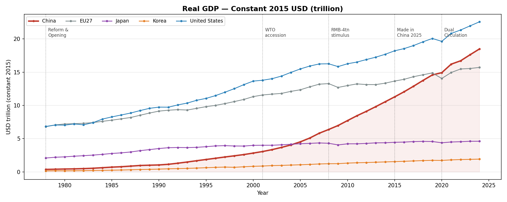

Real GDP at constant 2015 prices captures the absolute scale: from \$370
billion in 1978 to \$18.5 trillion in 2024, a 50-fold expansion. The US
expanded ~3-fold over the same period. In constant-USD terms China
overtook Japan in 2005 (the commonly-cited "second-largest economy in
2010" milestone is in *nominal* USD, where Japan's yen depreciation
delayed the crossover); on this real-GDP series China sits at ~82% of
the US economy in 2024, and has been larger than the US on PPP terms
since ~2014. Japan in real terms has been essentially flat over the
entire post-2000 period (4.0T → 4.6T, ~15% total growth in 24 years —
the "lost decades" continuing); Korea grew solidly (~3.5% CAGR, 2.3x
over 2000–2024) but on a scale dominated by China and the US looks
visually compressed near the bottom of the chart. The vertical-line
markers identify the five policy phases this brief uses as scaffolding:
Reform & Opening (1978), WTO accession (2001), the RMB-4-trillion
stimulus (2008–09), Made in China 2025 (2015), and Dual Circulation
(2020).

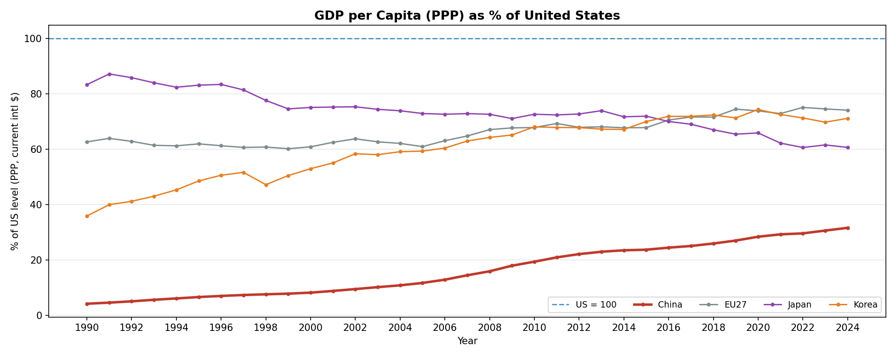

Per-capita GDP at PPP shows the convergence story. China was 6% of US
per-capita income in 1990, ~28% by 2015, and ~30% by 2024. Korea reached
73% of US level in the same year. The 2024 levels mean China is no longer
the cheap-labour pole it was in 2005; rising wages have been the proximate
trigger for both robotics adoption (Chapter 7) and outbound manufacturing
investment to Vietnam, Mexico, and Hungary.

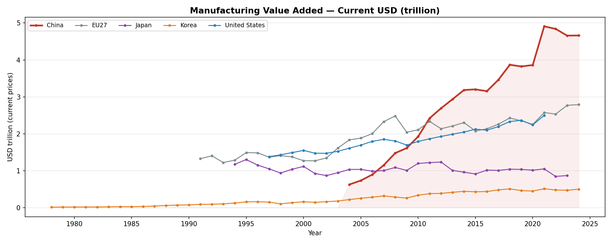

Manufacturing value added is where the convergence story turns asymmetric.
China's manufacturing VA passed the United States around 2010 and is
roughly double the US level by 2024. The expansion has been at the
expense of Japanese and (post-2010) European manufacturing in absolute
terms.

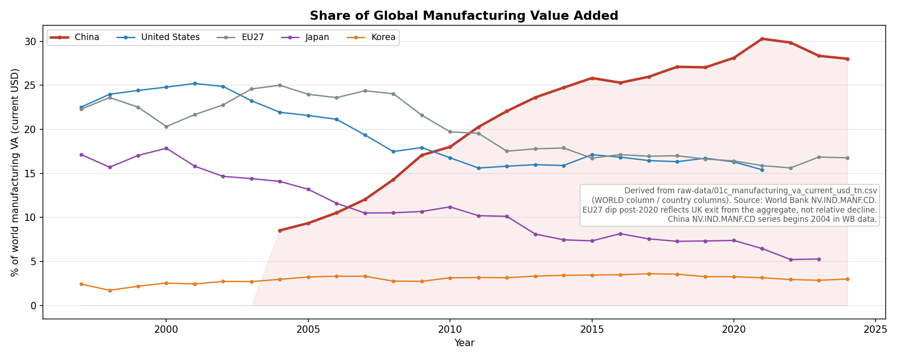

The share-of-world chart is the single most important framing graphic for
this brief. China's share of global manufacturing value added is now ~31%,
larger than the US and EU27 combined. In 1990 it was under 3%. The US and
Japanese shares have both compressed, the EU27 share has fallen further
since 2020 (the post-Brexit re-aggregation explains some of the dip).

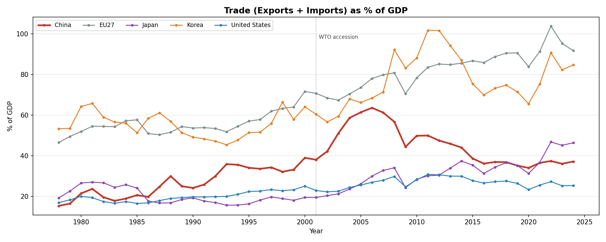

Trade-to-GDP is the WTO-accession discontinuity. Chinese trade openness
went from ~30% in the late 1990s to a peak of ~65% in 2006, and has since
declined to ~37% as the economy grew faster than trade. This last number
is sometimes used to argue China is "decoupling from globalisation"; the
truer reading is that the denominator (the domestic economy) grew very
fast. Trade is still climbing in absolute USD — see Chapter 12 on the
2024 record trade surplus.

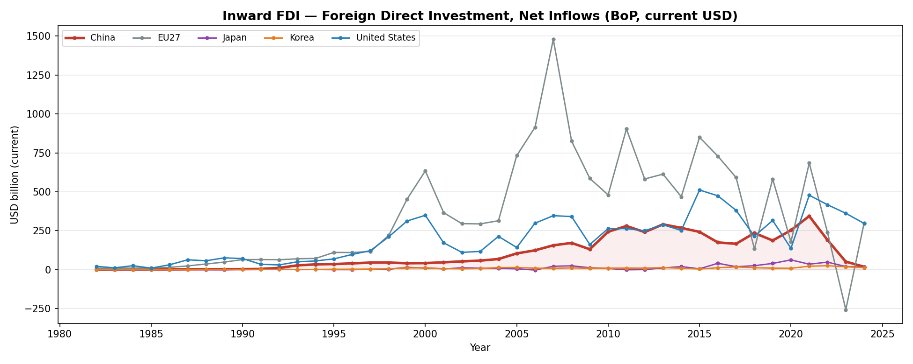

Inward FDI tells the partner side of the story: from \$2 billion in 1985
to \$334 billion in 2021, then a sharp drop in 2023–2024 as the
combination of zero-COVID overhang, geopolitical risk, and the closure of
the China stock-market bubble shifted Western capital toward India,
Vietnam, and Mexico. China-bound FDI remains positive but the trend break
since 2021 is unambiguous.

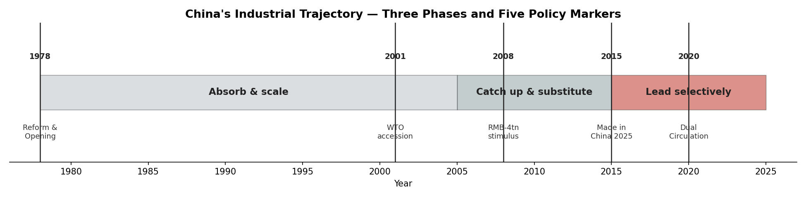

The phase diagram summarises the framing. *Absorb and scale* — 1978 to
roughly the mid-2000s — was about WTO-era market access, foreign-invested
export factories, and the build-out of basic infrastructure. *Catch up
and substitute* — roughly 2005 to 2015 — was the period of mass
investment in domestic R&D, the rise of the indigenous-innovation
doctrine, and Made in China 2025 in its drafting phase. *Lead selectively*
— from roughly 2015 to today — is the period in which Chinese firms in
specific sectors set rather than chase the global frontier. The brief is
in essence a sectoral test of how much of the third phase is real and
where it stops.

---

## §3 From Imitator to Co-Innovator — The National Indicators

Before drilling into individual sectors, the national-level innovation
indicators are worth establishing as context. They are the necessary but
not sufficient evidence for the *lead selectively* hypothesis: a country
with collapsing R&D, falling patenting, and shrinking researcher density
could not credibly lead any frontier sector; a country with the opposite
trends can in principle do so.

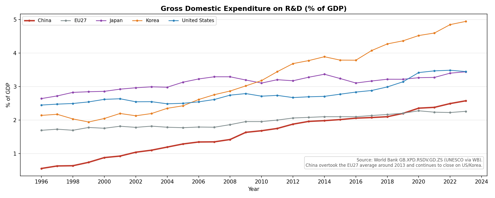

R&D intensity (gross domestic expenditure on R&D as a share of GDP) is
the cleanest input indicator. China's GERD share rose from 0.7% in 1991
to ~2.4% by 2023 — past the EU27 average around 2013, on a path to match
the US (3.6%) and Korea (4.9%) over the next decade. R&D intensity at
the present level is consistent with frontier participation in many
sectors; it is the *combination* with absolute scale that matters
strategically.

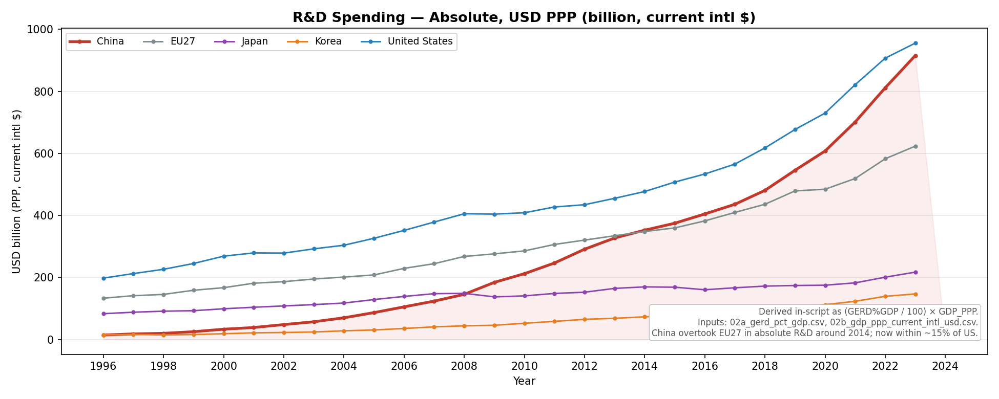

Absolute R&D spending — derived as GERD-share × GDP-PPP — is the
strategic metric. China passed the EU27 in absolute R&D around 2014
and is now within roughly 15% of US absolute R&D spending. This is the
metric that supports the *frontier participation* thesis: a country
spending \$600+ billion a year on R&D is not a follower.

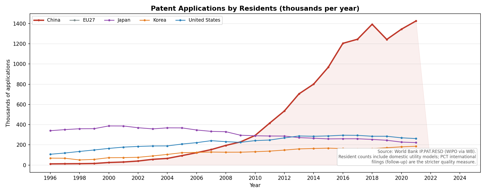

Resident patent applications need a quality caveat — Chinese patent
counts include large volumes of low-quality utility models, and the
international comparison is partly an artefact of which patent systems
apply which thresholds. The volume divergence is still striking. China
files more resident patents per year than the US, Japan and Korea
combined, with the gap widening through 2024. The stricter quality
metric is PCT (international) filings, where China and the US are now
neck-and-neck — discussed further in the sectoral chapters where the
patents are domain-specific (batteries, AI).

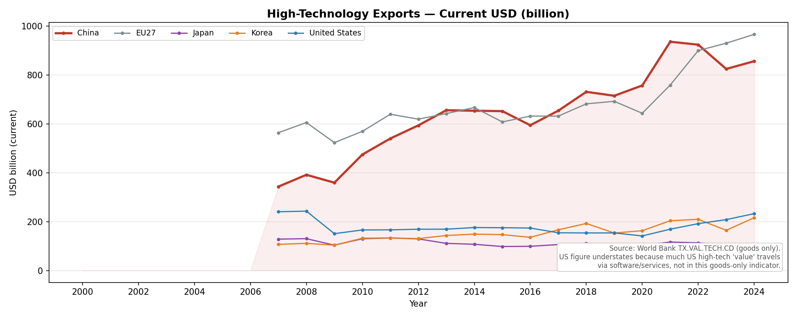

High-technology exports in absolute USD show China far ahead of every
comparator on the goods-only measure — but the US figure understates
because the World Bank indicator is goods-only and much US high-tech
"value" travels via software and services not captured here. The chart
should be read alongside (not instead of) the share chart below.

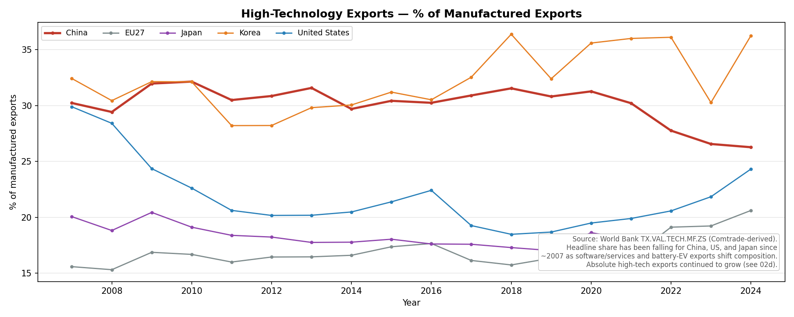

The share-of-manufactured-exports series has been falling for China, the
US and Japan since the mid-2000s. The reason is composition: software,
services, EVs, batteries and chemicals (in the case of China) have shifted
the export mix away from the narrow definition of "high-tech" the indicator
captures. The absolute series in 02d continued to grow over the same
period.

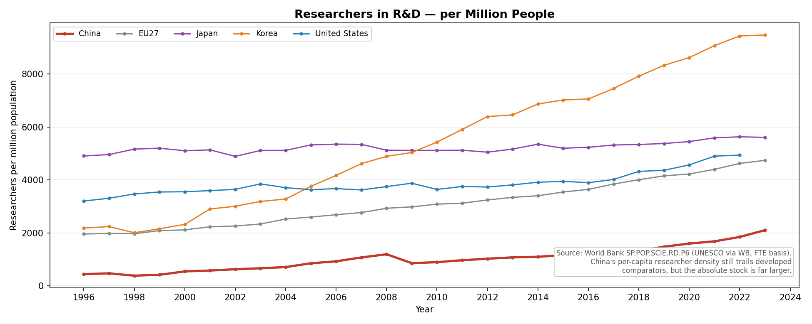

Researchers per million — the human-capital intensity metric — still
trails the four developed comparators. China sits at ~1,700 researchers
per million; Korea is at ~9,000, Japan ~5,500, Germany ~5,500, the US
~4,800. The Chinese absolute researcher stock is the largest in the
world by some margin (the country is large), but the per-capita
intensity has further to climb. This is the cleanest of the *China still
catching up* indicators and it cuts directly against any narrative that
the China-leads-everything frame is universal.

The composite read on the national indicators is the brief's framing
claim in compressed form: China has the absolute R&D scale, patent
volume, and high-tech export base of a frontier economy; it does not yet
have the per-capita researcher density of one. This is exactly what
"selective leadership" looks like in the data.

---

## §4 Sectoral Deep Dive — Lithium-Ion Batteries

Batteries are the cleanest case of the selective-leadership thesis and a
useful anchor for the rest of the sectoral discussion. The data is
unambiguous on three dimensions: market share, cost frontier, and
chemistry leadership.

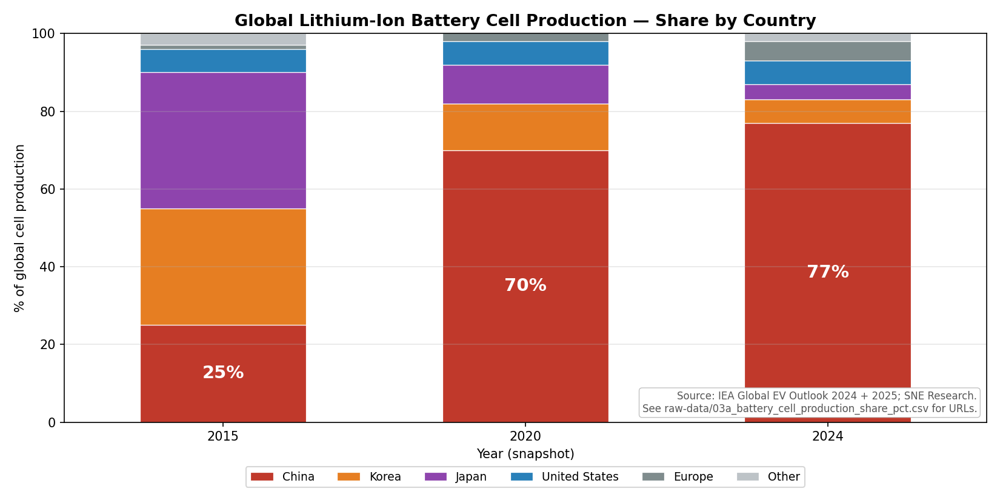

The market-share story is dramatic. In 2015 Japan and Korea together
manufactured about 65% of the world's lithium-ion cells; China about
25%. By 2024 China makes roughly 77% of global cells. Japan and Korea
together hold ~10%. The United States, despite the IRA's explicit
production tax credit (45X) and the largest battery-manufacturing
greenfield-build cycle in its history, still sits at ~6%.

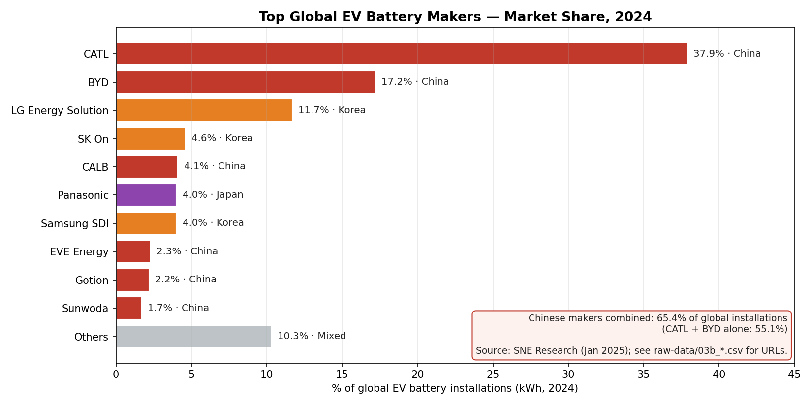

The top-makers snapshot resolves the share at the firm level. CATL and
BYD together hold ~55% of global EV-battery installations in 2024.
Adding the next-tier Chinese makers (CALB, EVE, Gotion, Sunwoda) brings
the Chinese-company share to roughly 65%. The remaining 25–30% is split
between LG Energy Solution, Samsung SDI, SK On (Korea), and Panasonic
(Japan).

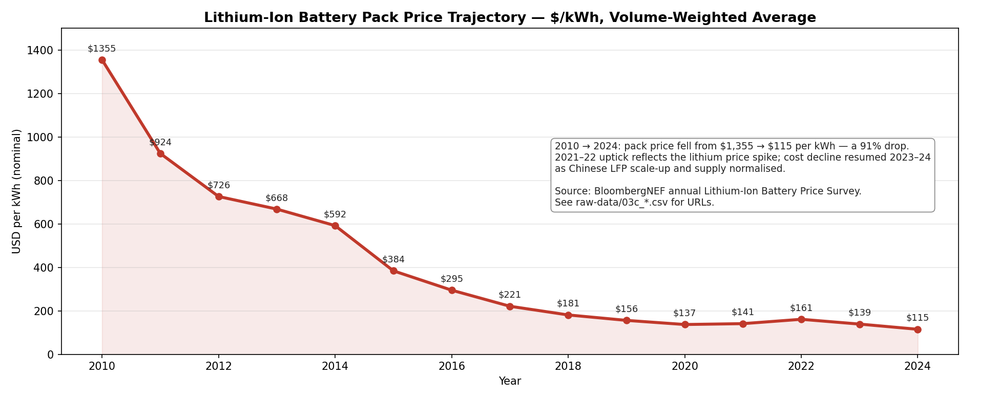

The cost frontier is the part of the battery story that matters most for
strategic forecasting. Volume-weighted average pack prices fell from
\$1,355/kWh in 2010 to \$115/kWh in 2024 — a 91% decline. The 2021–22
spike was the lithium-carbonate price episode; the 2023–24 fall resumed
the trend as Chinese LFP scale-up brought lithium prices back down and
manufacturing costs continued to compress. \$100/kWh is the threshold
commonly cited as the point at which EVs become unsubsidised
price-competitive with ICE vehicles on total cost of ownership; the
2024 print (\$115) is the closest the volume-weighted global average
has been, and BNEF's own forecast in the same release projects \$80/kWh
by 2026 if current cost-curve dynamics hold.

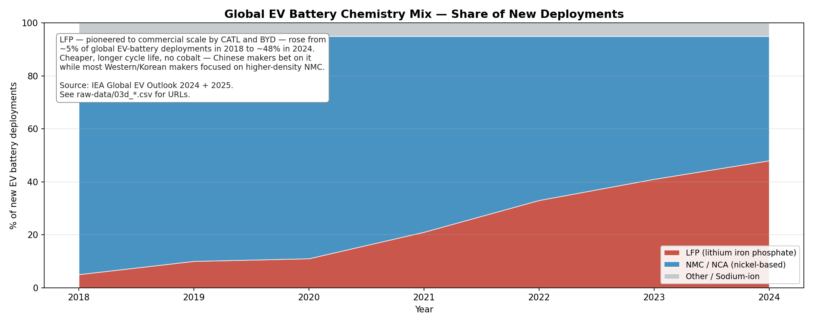

Chemistry is where the leadership claim gets its sharpest support. In
2018 LFP (lithium iron phosphate) cells were ~5% of the global EV-battery
mix; the consensus view at the time was that LFP's lower energy density
made it unsuitable for serious EVs and that NMC (nickel-manganese-cobalt)
chemistries would dominate. CATL and BYD, in particular, bet differently.
By 2024 LFP is roughly 48% of global EV-battery deployments; NMC has
fallen to 47%. The dominant-paradigm bet has flipped. LFP is cheaper,
longer-cycle, cobalt-free, and (with new manufacturing approaches like
CATL's cell-to-pack) competitive on usable range for non-premium EVs.
Most Western and Korean makers are now retrofitting LFP lines.

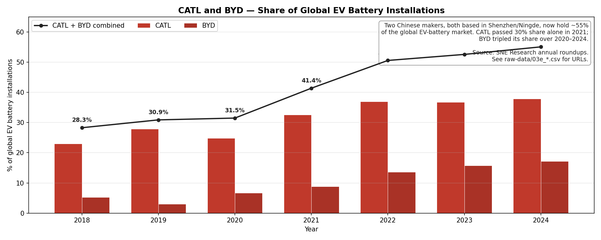

The two firms are worth singling out. CATL's share climbed from 23%
(2018) to 38% (2024); BYD's from 5% to 17%. Their combined share crossed
50% in 2022 and continues to expand. Both are based in southern China
(Ningde for CATL, Shenzhen for BYD), both vertically integrated (BYD
makes its own cells, motors, and vehicles; CATL co-invests in lithium
upstream), and both run high-cadence R&D programmes that produce a major
cell-format generation roughly every 18 months.

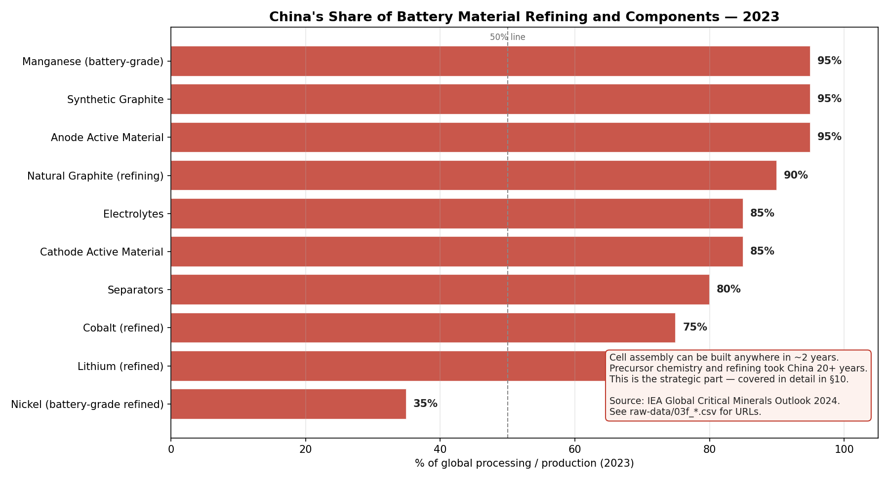

The upstream chart sets up Chapter 10. Cell assembly can be built
anywhere in roughly two years; precursor chemistry, electrode coating
and material refining required two decades of capital, learning, and
permissive environmental policy in China and are not similarly portable.
China refines or processes 70–95% of every battery-grade material
shown — and that is the real strategic chokepoint, not the cells.

The composite battery picture is the most important sectoral evidence in
this brief. Two Chinese firms with combined R&D budgets larger than most
mid-size national R&D programmes now hold over half the global market
for the energy-storage technology underpinning the EV transition, the
grid-storage build-out, and (as Chapter 8 shows) the data-centre buffer
energy stack.

---

## §5 Sectoral Deep Dive — Electric Vehicles

Batteries are the input. The EV market is the application.

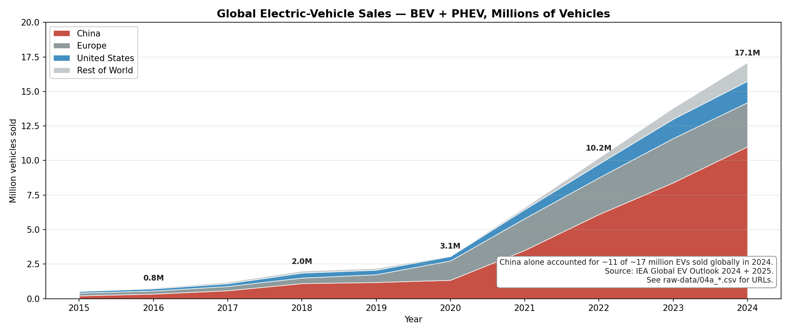

Global EV sales rose from ~0.55 million units in 2015 to ~17.1 million
in 2024 — a 31-fold expansion in nine years. China alone accounted for
~11 million of the 2024 total, more than Europe (3.2M), the US (1.55M),
and the rest of the world (1.35M) combined. The chart understates the
turnover: 2025 forecasts cluster around 22 million units globally with
China at ~14M.

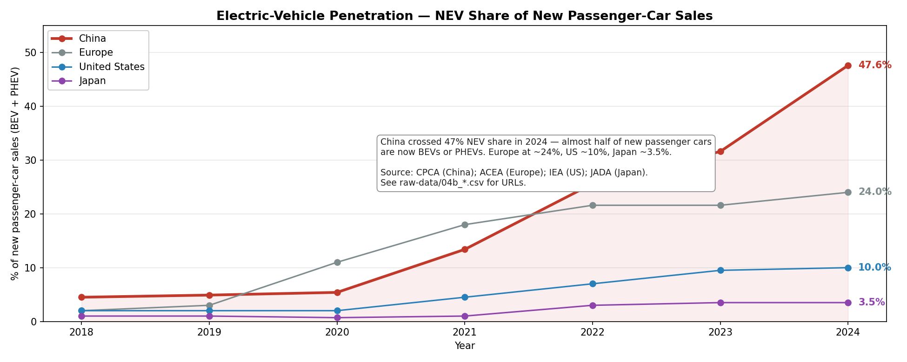

The penetration chart describes how mainstream the technology has become
in different markets. China crossed 47% NEV (BEV + PHEV) share of new
passenger-car sales in 2024 — almost half of new cars sold in China
have a plug. Europe is at ~24%, the US ~10%, Japan ~3.5%. China is in
a different phase of the diffusion curve from every developed-economy
comparator.

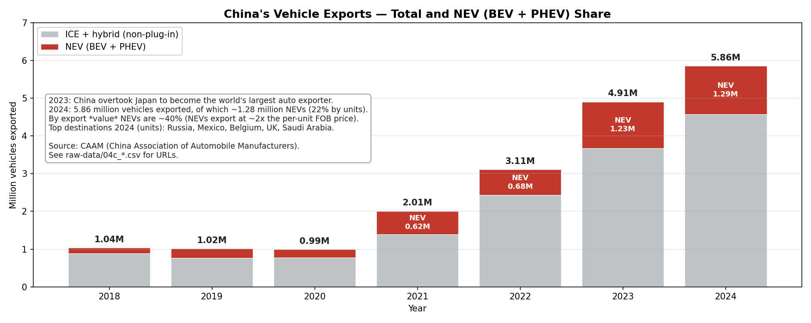

China became the world's largest auto exporter in 2023, overtaking Japan
on units shipped. The 2024 total was 5.86 million vehicles, of which
roughly 1.28 million were NEVs (BEV + PHEV) — 22% by unit count, but
about 40% by export *value* because NEVs ship at roughly 2x the per-unit
FOB price of the ICE vehicles in the export mix (the higher figure is
often what trade-press headlines quote). Top destinations in 2024
included Russia, Mexico, Belgium, the UK, Saudi Arabia and Brazil. The
EU's October 2024 countervailing duties on Chinese BEVs (17.4–35.3% on
top of the existing 10% tariff) have been visible in the destination
mix but have not collapsed the export trajectory.

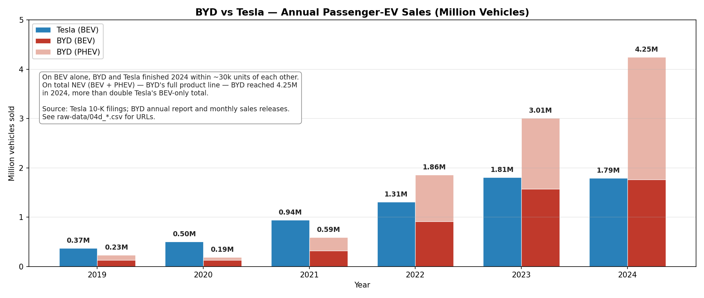

The two-firm comparison is now a horizontal one. On BEV-only volume BYD
and Tesla finished 2024 within ~30,000 units of each other (1.76M vs
1.79M). On total NEV — BYD's full product line which includes PHEVs —
BYD reached 4.25M units in 2024, more than 2x Tesla's BEV volume. The
gap is widening in BYD's favour each quarter. BYD's product range
runs from the roughly \$10,000 Seagull to the Yangwang U9 at around
\$200k; Tesla's mid-cycle Model 3/Y refresh has not changed the
trajectory.

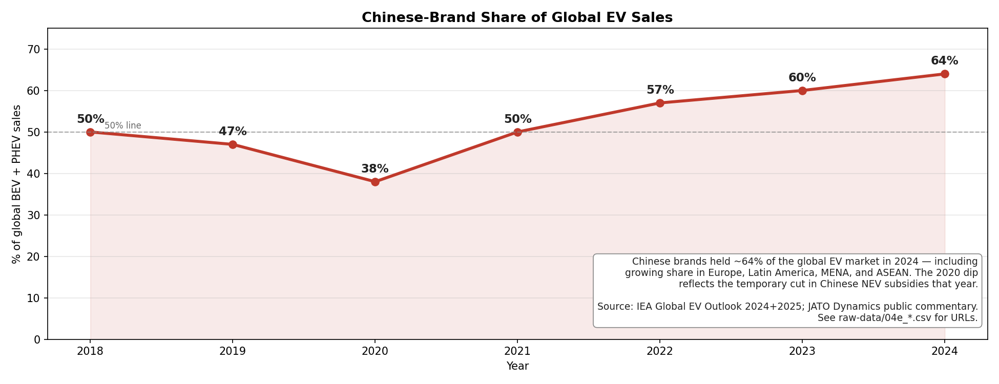

The brand-of-origin view (a BYD sold in Brazil counts as Chinese-brand;
a Tesla shipped from Shanghai counts as US-brand) is now ~64% of global
EV sales for Chinese brands. The 2020 dip in the series reflects the
temporary cut in Chinese NEV subsidies that year, not a competitiveness
issue.

The EV story is best read as the *visible* sectoral expression of the
battery story in Chapter 4. The two are inseparable: Chinese vertical
integration (BYD making its own cells, CATL co-investing in lithium and
recycling, Geely owning Volvo and Polestar, Great Wall co-developing
with BMW) means the same cost-frontier and chemistry advantages that
appear in Chapter 4 show up here as price points and product breadth.

---

## §6 Sectoral Deep Dive — Artificial Intelligence

AI is the messiest of the three frontier-sector cases — and the most
contested. The data supports a "China at or near frontier in some AI
dimensions, behind in others" picture rather than a clean
leader/follower binary.

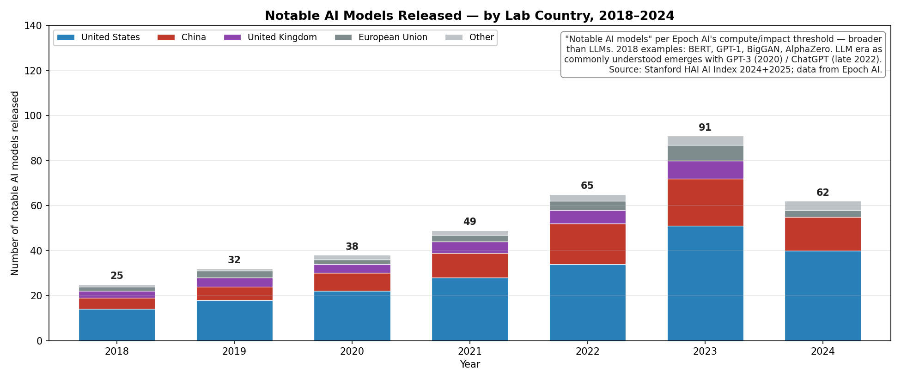

On notable-model output the US is still well ahead in absolute count,
and the gap actually widened in 2024. In 2018 the US released ~14
notable models per year; China released ~5. The 2024 Stanford AI Index
(Epoch AI database, March 2025 snapshot) puts the US at 40 notable
models, China at 15, France at 3, with single releases from Canada,
Israel, Saudi Arabia and South Korea. All major regions released fewer
notable models in 2024 than in 2023 — driven by larger training runs
concentrating output in fewer, bigger releases. Note that "notable" is
Epoch AI's compute/impact threshold; the top-end frontier — GPT-class
and Claude-class closed models — is narrower still and remains
US-dominated.

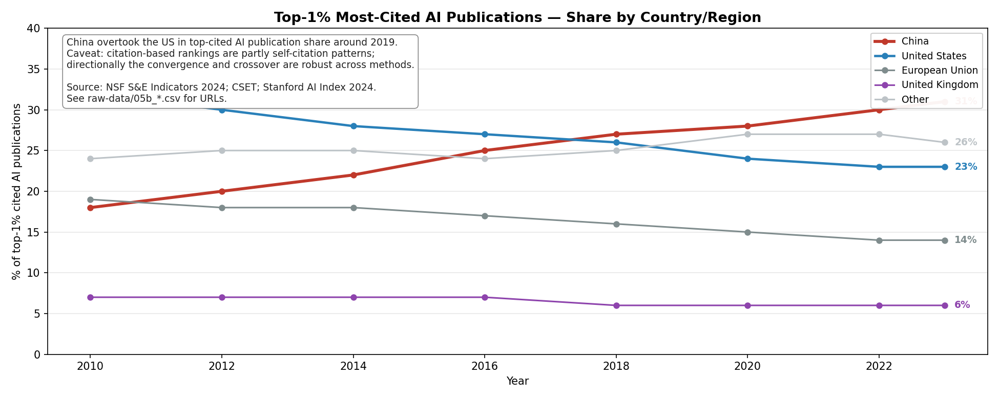

On citation share China overtook the US around 2019 and is now at ~31%
of top-1% most-cited AI publications. Citation-based rankings reflect
partly self-citation patterns; the directional crossover and ongoing
trend are robust across the methods used by Stanford HAI, NSF, and CSET.

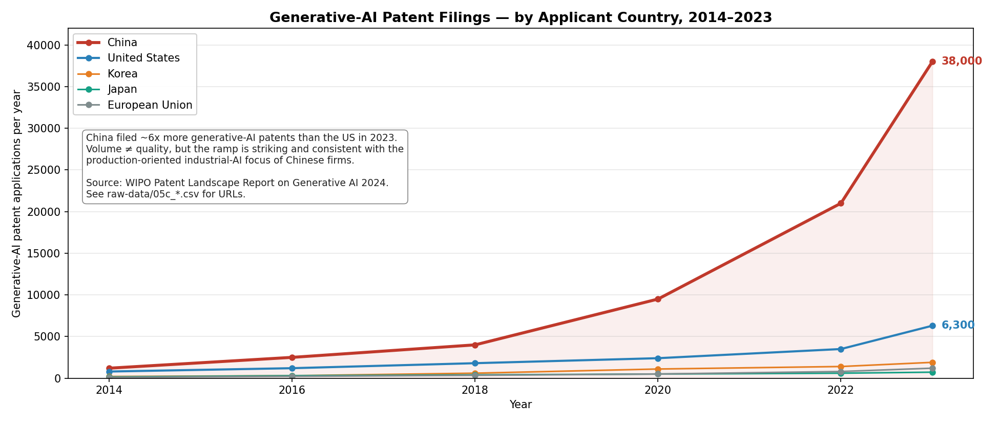

The patent picture is the starkest of the three. Generative-AI patent
families — a sub-set of all AI patents that WIPO's 2024 Patent Landscape
Report breaks out specifically — show China filing 38,210 cumulative
families across 2014–2023, against 6,276 for the US. That's a ~6x lead
across the decade, with China outpacing the rest of the world combined
every year since 2017. By 2023 alone, global annual GenAI filings had
risen above 14,000, of which ~70% originated in China. Volume is not
quality, but the ramp is consistent with the production-oriented
industrial-AI focus of Chinese firms.

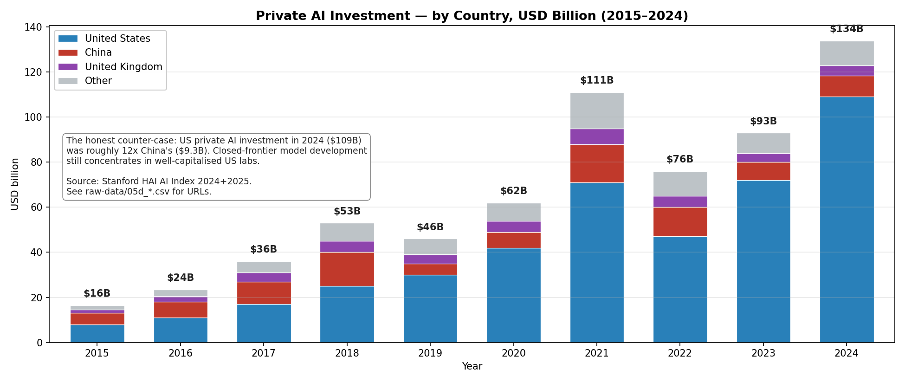

Private investment is where the honest counter-case lives. US private
AI investment in 2024 was \$109.1 billion — roughly 12x China's
\$9.3 billion in the Stanford AI Index aggregation, and ~24x the UK's
\$4.5 billion. Closed-frontier-model development (Anthropic, OpenAI,
Google DeepMind, xAI) is concentrated in US-headquartered labs with
capital, infrastructure, and chip access that Chinese firms cannot
fully match under current export controls.

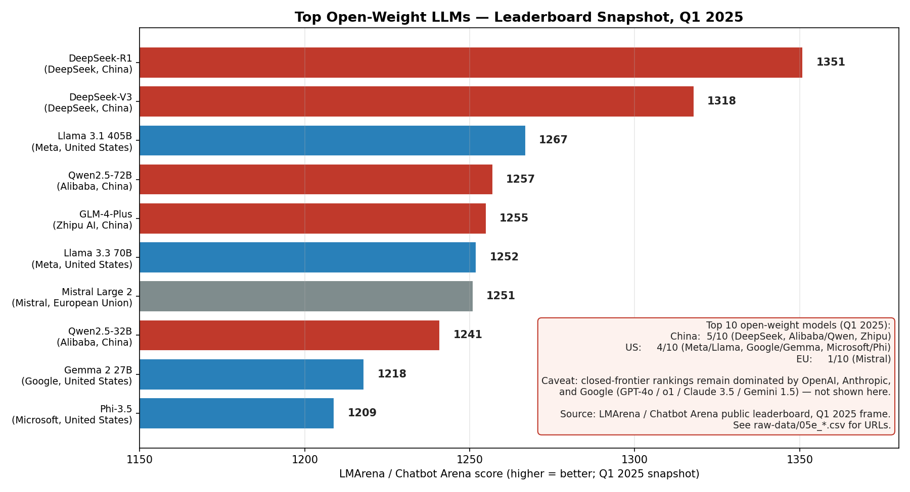

The open-weight leaderboard is a useful tie-break. Of the top 10
open-weight models on LMArena in Q1 2025, five are from Chinese labs
(DeepSeek-V3, DeepSeek-R1, GLM-4-Plus from Zhipu, Qwen2.5-72B and -32B
from Alibaba), four are from US labs (three Meta/Llama variants, one
Google/Gemma, one Microsoft/Phi), and one is from Europe (Mistral).
DeepSeek-R1 sat at the top of the open-weight leaderboard in early 2025
and the publication of its training-cost claims in January 2025
triggered a substantial market reassessment of the AI-compute cost
curve. Closed-frontier rankings (GPT-4o, o1, Claude 3.5, Gemini 1.5)
remain US-dominated and are not included on this chart.

The composite AI picture, then, is asymmetric. China leads on citation
share, GenAI patents and open-weight model quality; the US leads on
notable-model count, capital, closed-frontier models, and per-firm
compute access. Both leaderboards are moving fast enough that any
single-quarter snapshot will be obsolete within ~6 months; the trend,
not the snapshot, is the read.

---

## §7 Sectoral Deep Dive — Robotics & Industrial Automation

Robotics sits at the intersection of China's three earlier strengths
(manufacturing scale, battery/motor supply chain, applied AI), which
makes it the natural next-frontier candidate.

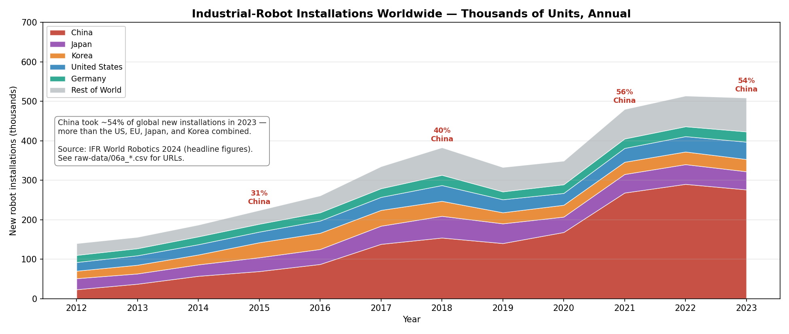

The installations chart is the headline. China took ~54% of global new
industrial-robot installations in 2023, more than the US, EU27, Japan,
and Korea combined. In 2012 China was ~16% of global installations;
the rise has been linear and continuous.

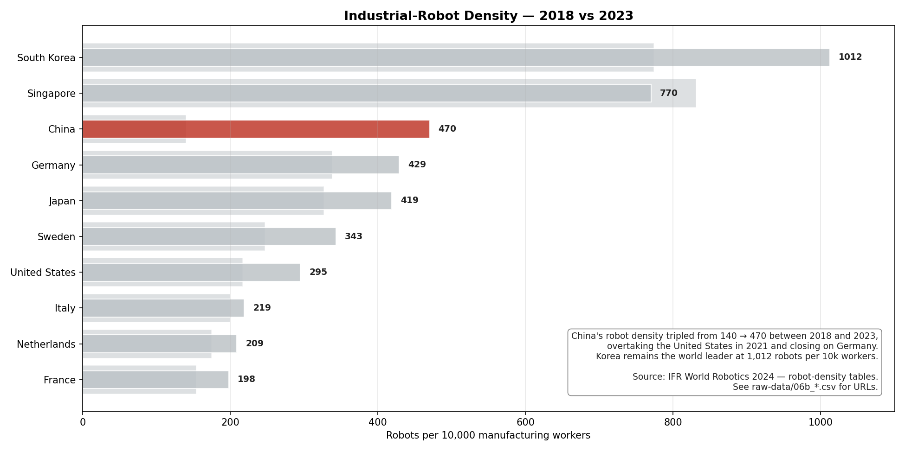

Density (robots per 10,000 manufacturing workers) is the strategic
metric — it captures how saturated each country's manufacturing base is
with automation. China rose from 140 (2018) to 470 (2023). Germany is
at 429, Japan 419, the US 295. South Korea remains the world leader at
1,012. China overtook the US in robot density in 2021 and is now
within 10% of Germany and Japan.

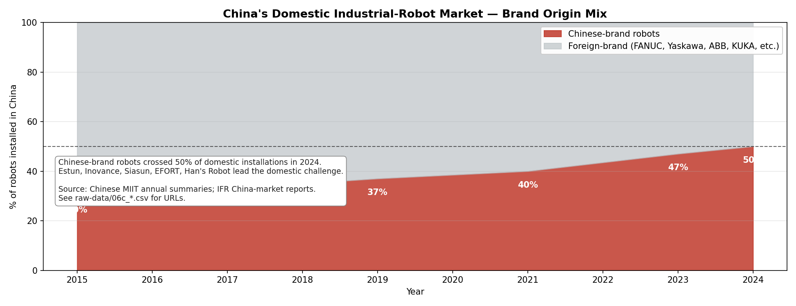

The brand-origin chart is the import-substitution success story. In
2015, ~70% of the robots installed in China were from the foreign "Big
Four" (FANUC, Yaskawa, ABB, KUKA). By 2024 Chinese brands — Estun,
Inovance, Siasun, EFORT, Han's Robot — held 50% of the domestic
market. This is the textbook Chinese industrial-policy pattern: massive
domestic demand absorbed initially by foreign suppliers; tax / land /
finance preferences for domestic challengers; gradual but durable
share gain.

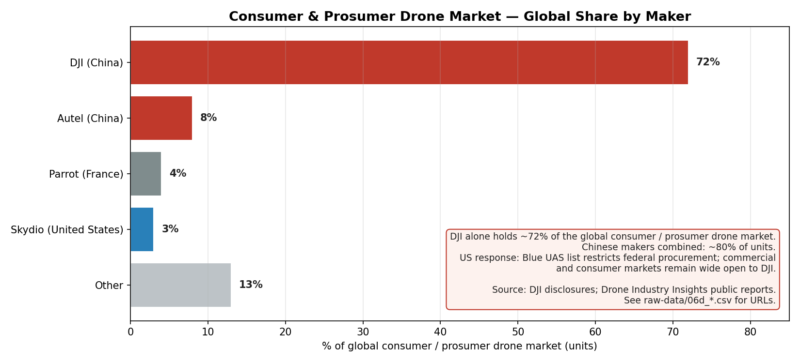

The drone snapshot illustrates the depth of consumer-tier dominance.
DJI alone holds ~72% of the global consumer / prosumer drone market;
Chinese makers combined are ~80%. The US response (the DoD's Blue UAS
list restricting federal procurement) does not affect commercial or
consumer markets and DJI continues to expand.

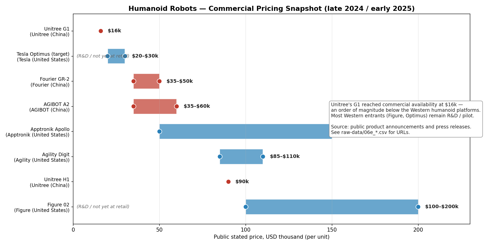

The humanoid pricing snapshot is the 2024–25 inflection point. Unitree's
G1 reached commercial availability at \$16,000 in mid-2024 — an order
of magnitude below the Western humanoid platforms (Figure 02, Tesla
Optimus, Apptronik Apollo) most of which remain in R&D or pilot. AGIBOT
A2 and Fourier GR-2 are commercially available at \$35–60k. The
pricing differential will not persist as Western platforms scale, but
the inflection — that a usable humanoid platform now costs less than a
mid-trim car — is real and is changing investor expectations.

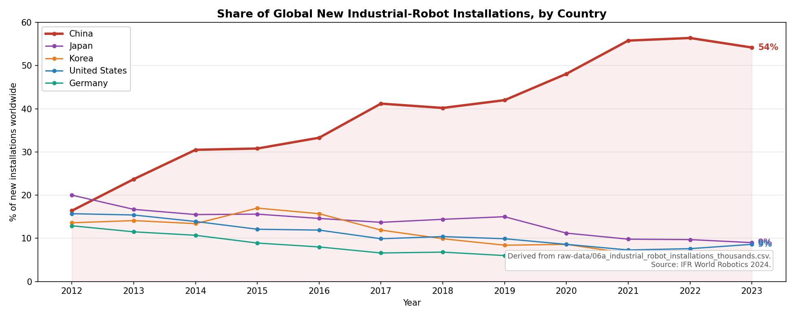

The share-trajectory chart documents the linearity of the rise. China
went from 16% in 2012 to 54% in 2023. None of the comparators (Japan,
Korea, US, Germany) has materially gained share; the entirety of the
global expansion has accrued to China and to a smaller-share "rest of
world" bucket.

Robotics is the fourth frontier-leadership case alongside batteries,
EVs, and parts of AI. As with batteries, the frontier-leadership claim
rests on three legs — domestic-market scale, indigenous-component supply
chain, and a cost-frontier reset — and as with batteries, the depth of
the Chinese position is much greater than the headline market-share
number alone suggests.

---

## §8 Energy — The AI-Era Strategic Asset

Energy is not strictly a frontier-innovation chapter — it is a
*structural-advantage* chapter. The thesis it tests is that in the era
where AI is becoming energy-bound rather than purely chip-bound, China's
electricity build-out gives it a structural cost and capacity advantage
that is not easily reversed by policy.

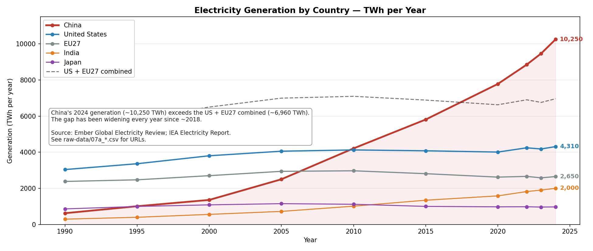

The scale chart is the framing graphic. China's 2024 electricity
generation was ~10,250 TWh — more than the US (~4,310 TWh) and EU27
(~2,650 TWh) combined. India is at ~2,000 TWh and rising. The
divergence has been widening every year since ~2018; China's annual
incremental generation addition (~600–800 TWh) is itself larger than
the entire annual generation of Germany or France.

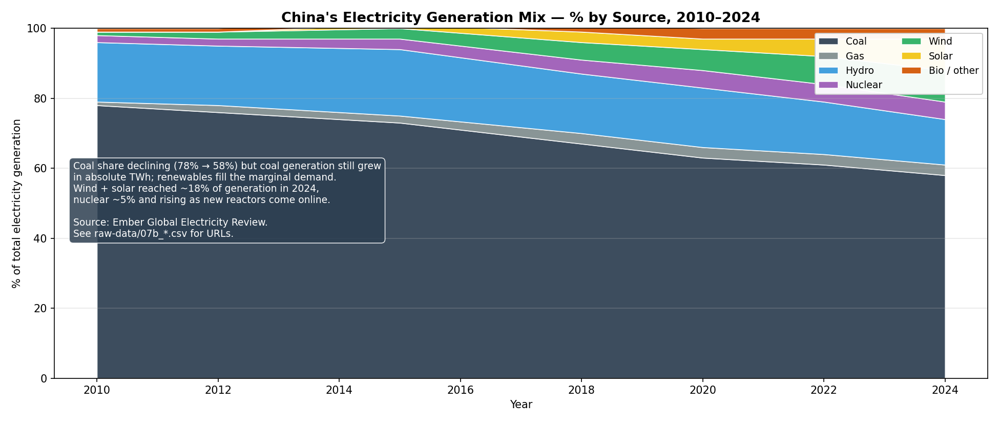

The mix chart resolves the source story. Coal share has fallen from 78%
(2010) to 58% (2024) but coal generation in absolute TWh continued to
grow (the system grew faster than the renewables build-out, so coal's
*share* fell while its absolute production rose). Wind and solar
together reached ~18% of generation in 2024; nuclear is at ~5% and
rising. The system is decarbonising in *share* terms while still adding
fossil capacity at the margin — the climate-policy honest read of what
has actually happened.

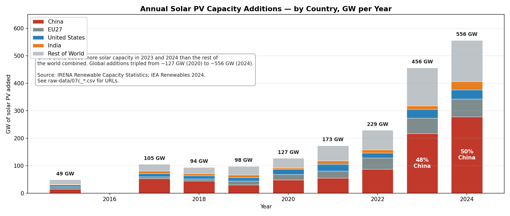

The solar PV additions chart is the most striking single energy data
point in this brief. China added ~278 GW of solar PV capacity in 2024 —
more than the entire global solar PV capacity in operation in 2014.
Global solar additions tripled from 127 GW (2020) to 556 GW (2024);
China accounted for half of that 2024 total. The 2023 and 2024
additions individually exceeded the combined additions of every other
country.

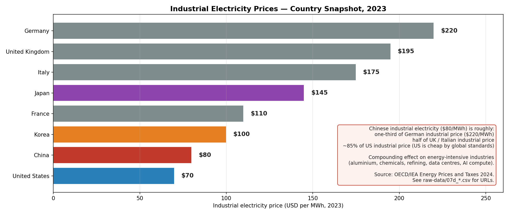

Industrial electricity prices are where the cost story lands. Chinese
industrial users pay \$80/MWh; the US \$70/MWh; Korea \$100; France
\$110; Japan \$145; Italy \$175; the UK \$195; Germany \$220. For
energy-intensive industries — aluminium smelting, chemicals, refining,
data-centre operation, AI-compute farms — a 2-3x cost differential
compounds dramatically over a multi-decade asset life.

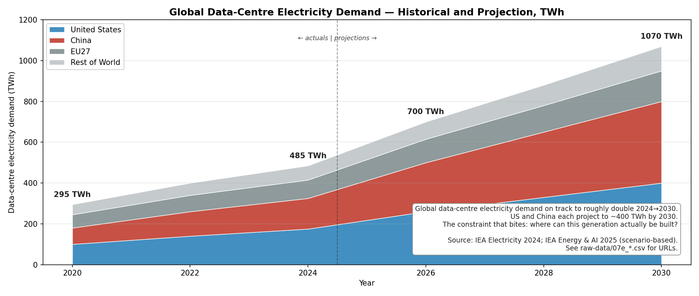

The data-centre demand projection is the AI-era part of the energy
story. Global data-centre electricity demand has roughly doubled from
~295 TWh in 2020 to ~485 TWh in 2024. IEA scenarios project a further
doubling by 2030, with the US and China each at ~400 TWh — i.e. each
country's data-centre demand by 2030 will be larger than the entire
electricity consumption of Italy today. The binding constraint is
generation availability and transmission, not chips: the Northern
Virginia, Dublin, and Phoenix interconnection queues are already
multi-year. China's combination of cheap industrial electricity, large
spare capacity in the western provinces, and the East-Data West-Compute
("dong shu xi suan") policy directive that subsidises moving compute
to the spare-generation provinces is an obvious structural advantage.

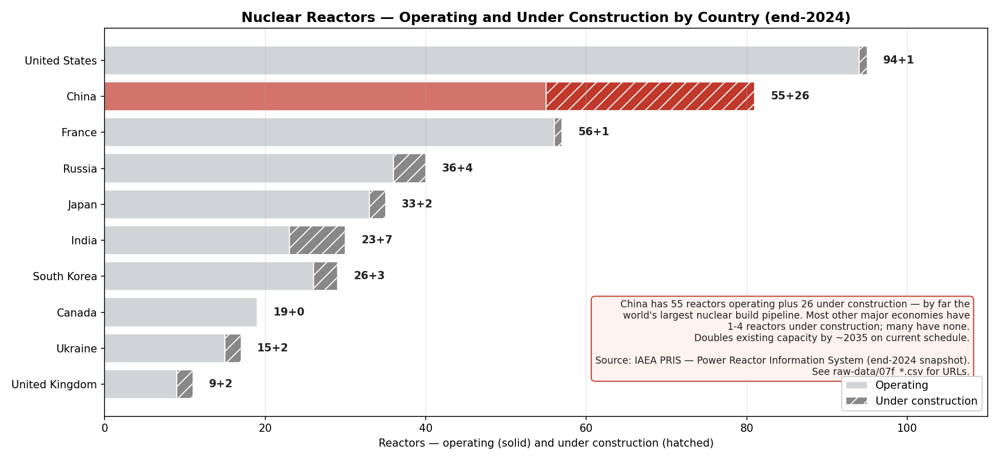

Nuclear is the longer-horizon read. China has 55 reactors operating and
26 under construction. The next-largest under-construction pipelines are
India (7), Russia (4), Korea (3), Japan and the UK (2 each). The US has
exactly one reactor under construction (Vogtle Unit 4) and a comparable
operational fleet of 94. By 2035 China is on track to roughly double its
nuclear fleet to ~110 reactors — comparable in size to today's US
nuclear fleet. The strategic implication is straightforward: for any
energy-intensive technology that depends on cheap clean baseload
electricity through the 2030s, the Chinese cost base is structurally
advantaged.

The energy chapter is the only one in this brief where the leadership
case rests almost entirely on *scale* and *integrated build-out* rather
than on frontier innovation. The technology in each generation type is
internationally available; the differentiator is the ability to build at
this rate, at this cost, with this much grid integration.

---

## §9 Where China Is *Not* Yet Leading — The Honest Counter-Evidence

A brief that only inventoried Chinese strengths would be misleading.
Several major industrial domains remain firmly Western-led; this chapter
documents them to keep the framing honest and the "selective leadership"
claim precisely selective.

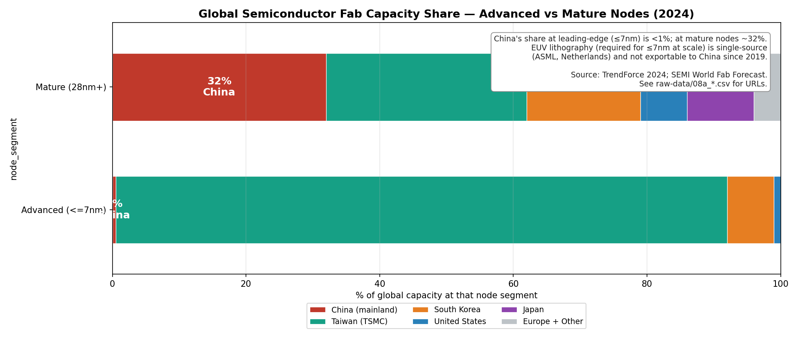

The semiconductor picture is the most consequential lag. At the leading
edge — ≤7nm logic nodes, where every modern AI accelerator, every
high-end mobile SoC, and every advanced GPU is fabricated — China's
share is under 1%. TSMC alone holds ~91%; Samsung and Intel make up
the rest. EUV lithography (the photolithography tool required for ≤7nm
production at commercial yields) is single-source: ASML in the
Netherlands, no DUV-only path to scale, and ASML has been blocked from
exporting EUV systems to China since 2019. SMIC has demonstrated 7nm-class
fabrication using DUV multi-patterning (the Huawei Kirin 9000s in 2023
is the public evidence), but DUV multi-patterning at scale is
substantially more expensive and lower-yielding than EUV. At mature
nodes (28nm and older — where most analog, power management, automotive
and IoT chips live) China holds ~32% and is building further; this is
the segment where Chinese fab capacity actually matters today.

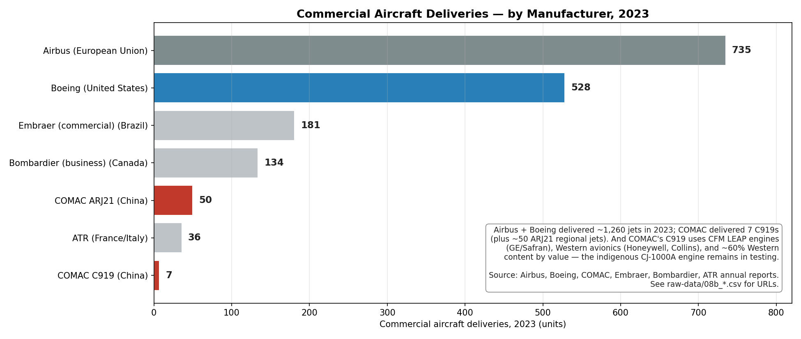

Commercial aerospace is the second clear lag. Airbus and Boeing together
delivered ~1,260 commercial jets in 2023; Embraer 181; Bombardier 134;
COMAC 7 (C919, which entered service with China Eastern in May 2023)
plus ~50 ARJ21 regional jets. The C919 itself uses CFM LEAP engines
(GE/Safran), Western avionics (Honeywell, Collins), and ~60% Western
content by value. The indigenous CJ-1000A turbofan remains in flight
testing as of 2025. Commercial aerospace combines 60+ years of
accumulated certification experience, an extremely demanding safety
regime, and global airline maintenance networks; the path to challenger
status is well under way but is multi-decadal, not multi-year.

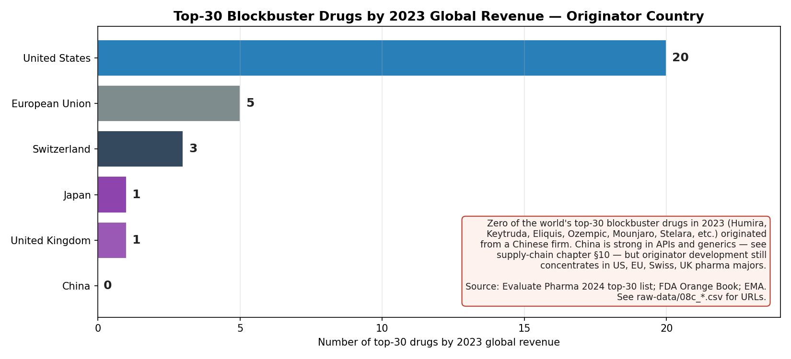

Originator biopharmaceuticals are the third lag. Zero of the world's
top-30 prescription drugs by 2023 global revenue (Humira, Keytruda,
Eliquis, Ozempic, Mounjaro, Stelara, etc.) was originated by a Chinese
firm. The US accounts for 20 of the 30; the EU for 5; Switzerland 3;
the UK and Japan one each. China is strong in active pharmaceutical
ingredients (APIs) and in generics — see Chapter 10 on supply-chain
leverage — but originator-drug development (the integrated combination
of basic science, clinical-trial infrastructure, IP enforcement, and
regulator-developer interaction that produces new molecular entities)
still concentrates in the US, EU, Swiss and UK majors.

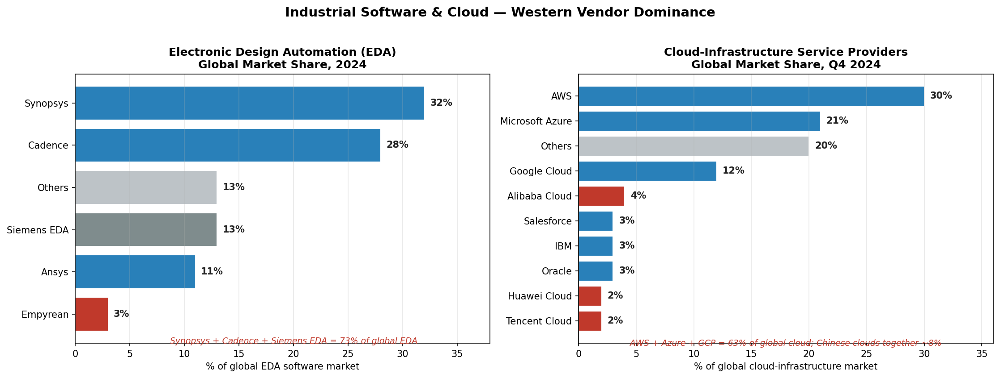

The industrial software stack and the cloud-infrastructure layer are
the fourth and fifth lags. In Electronic Design Automation (EDA — the
software used to design every modern chip) Synopsys, Cadence and
Siemens EDA jointly hold ~73% of the global market; the largest Chinese
EDA firm (Empyrean) holds ~3%. In cloud-infrastructure services AWS,
Azure and Google Cloud together hold ~63% globally; the Chinese
hyperscalers (Alibaba Cloud, Tencent Cloud, Huawei Cloud) hold ~8%
globally — dominant inside China, marginal outside. The pattern is
consistent: Chinese firms are competitive on the *applications* layer
of the digital economy and on the *commodity-hardware* layer, but the
high-margin platform and tooling layers remain Western.

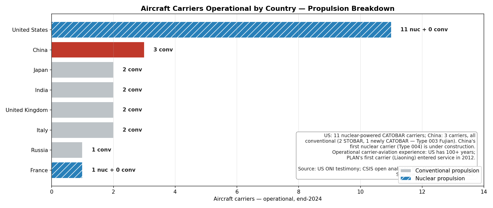

Defense systems are the sixth lag, and the one that most cleanly
illustrates the *experience* dimension of catch-up. The US Navy
operates 11 nuclear-powered CATOBAR aircraft carriers, each with
~70+ years of accumulated carrier-aviation institutional knowledge
behind it. The PLAN operates three conventionally-powered carriers:
Liaoning (ex-Soviet hull commissioned 2012), Shandong (first
indigenously-built, 2019), and Fujian (Type 003 with CATOBAR
electromagnetic catapults, 2024 sea trials). A nuclear-powered fourth
hull (Type 004) is under construction. Carrier-aviation proficiency at
scale takes decades and the PLAN's first carrier entered service in
2012; the gap is partly an asset-count gap and partly an
operational-experience gap.

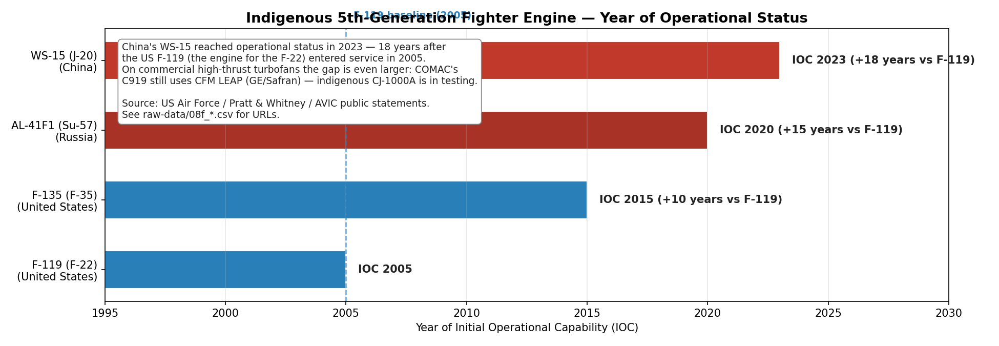

The fighter-engine timeline is the cleanest "China is catching up
but the gap is real" defense data point. The US F-119 (the F-22's
engine, by Pratt & Whitney) reached initial operational capability in
2005. The F-135 (F-35's engine) in 2015. Russia's AL-41F1 (Su-57) in
2020. China's WS-15 (J-20) in 2023 — 18 years after the F-119. On
commercial high-thrust turbofans the gap is even larger: COMAC's C919
uses the CFM LEAP and the indigenous CJ-1000A remains in testing.

The composite picture is that China's lag is concentrated in domains
that share three features: *single-source upstream inputs* (EUV
lithography, certain APIs), *deep accumulated institutional experience*
(commercial aerospace certification, carrier aviation), and
*platform-level network effects* (cloud, EDA). These are exactly the
domains where catch-up is hardest and where US/Western capacity is most
durably differentiated.

---

## §10 Supply-Chain Leverage

The second pillar of the brief. Independent of frontier innovation,
China controls upstream chokepoints across several strategic supply
chains. The leverage is real, asymmetric, and finite — it is currently
binding and is decaying only slowly as alternative-supply build-outs
catch up.

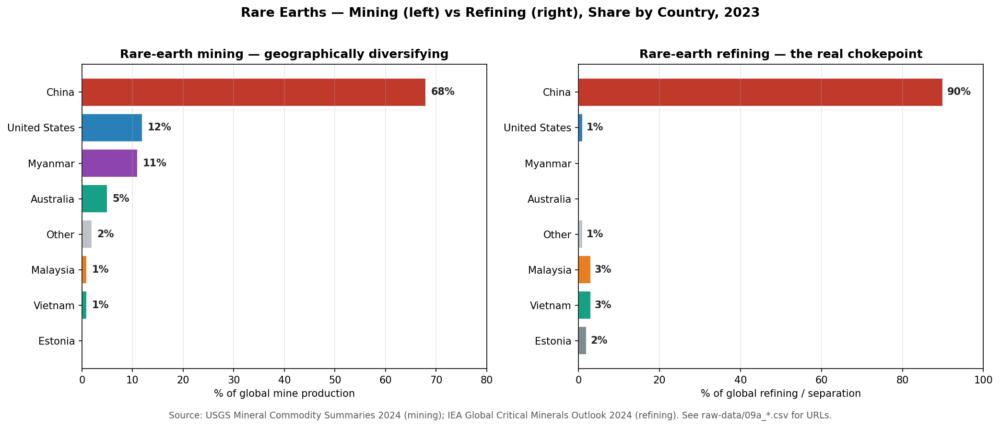

The rare-earths chart is the canonical case. China holds ~68% of global
rare-earth mine production and ~90% of refining and separation. Mining
is diversifying — US Mountain Pass (operating), Australia Lynas
(processing partly in Malaysia), African and Brazilian projects coming
online — but refining is the chokepoint, not mining. Building a rare-earth
separation plant from green-field takes 5–10 years and tolerates
environmental practices that are not currently permitted in OECD
jurisdictions.

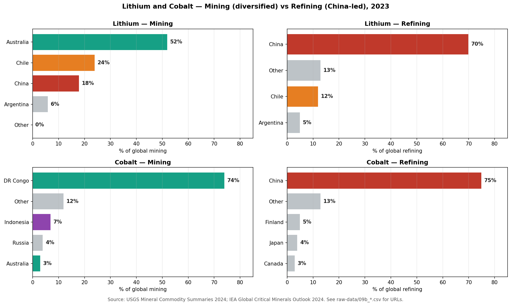

Lithium and cobalt show the same pattern. Lithium mining is mostly
Australian (52%) and Chilean (24%); cobalt mining is mostly DRC (74%).
Both are refined predominantly in China — 70% of refined lithium, 75%
of refined cobalt. The pattern recurs across critical minerals: the
mine is wherever the geology dictates; the refinery is where capital,
permits, and integrated downstream demand have been provided. China has
been the integrated-downstream-demand pole for two decades.

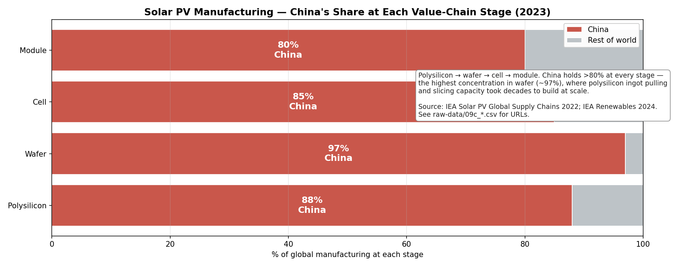

Solar PV manufacturing is the cleanest supply-chain dominance case in
this brief. China holds 88% of global polysilicon, 97% of wafers, 85%
of cells, and 80% of modules. The build-out cost in the West is
non-trivial — polysilicon plants and wafer-pulling facilities are
multi-billion-dollar capex, and the integrated-cluster effects (each
stage's feed-in to the next) compound. The IRA's 45X production credit
and the EU Net-Zero Industry Act both aim to build alternative capacity;
the achievable share over 5 years is realistically 10–20% of the
respective domestic markets, not displacement of Chinese global share.

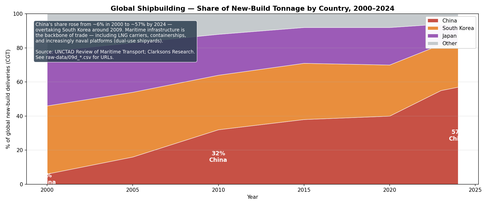

Shipbuilding is the under-covered supply-chain story. China's share of
global new-build merchant tonnage rose from ~6% in 2000 to ~57% in 2024,
overtaking South Korea around 2009. Shipbuilding is the upstream of
international trade — LNG carriers, containerships, bulk carriers, car
carriers — and increasingly of naval platforms (dual-use shipyards are
how the PLAN has expanded so rapidly). The US share is below 0.5%.

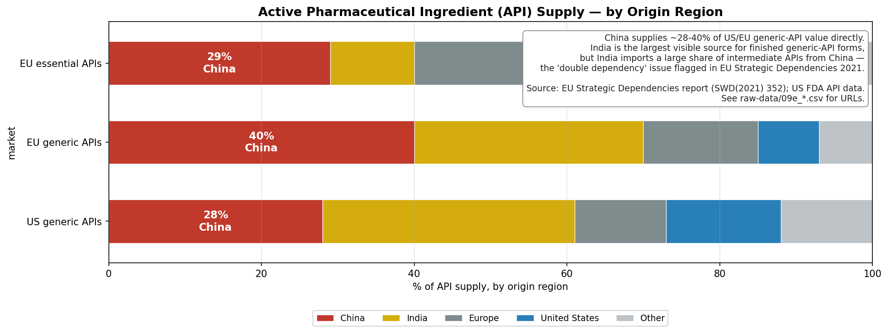

Pharma APIs are the supply-chain leverage point that has been least
internalised in Western policy discussion. Roughly 28–40% of US and EU
generic-API value originates in China. India is the largest visible
finished-API source for US/EU generic markets — but India imports a
large share of *intermediate* APIs from China, producing the "double
dependency" issue flagged in the EU's 2021 Strategic Dependencies
report. The single-source risk for essential generic antibiotics,
heparin precursors, and several oncology APIs is documented and is
discussed regularly in WHO and FDA shortage-tracking reports.

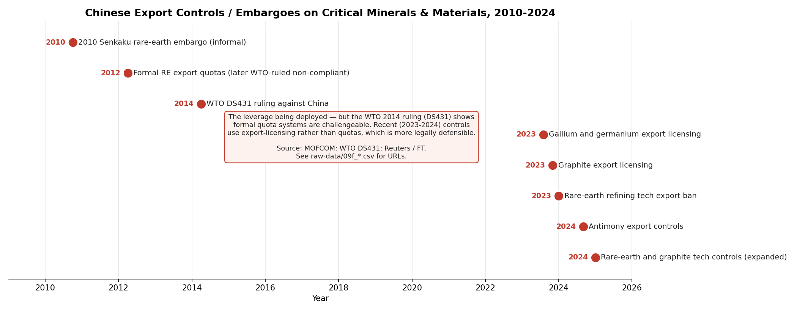

The export-control timeline is the deployment record. The 2010 Senkaku
episode was an informal embargo on rare-earth shipments to Japan
following a maritime incident; the WTO 2014 ruling (DS431) found the
subsequently formalised rare-earth quotas WTO-non-compliant and they
were rolled back in 2015. Since mid-2023 China has imposed
export-licensing requirements on gallium, germanium, graphite,
rare-earth processing technology, antimony, and (December 2024) an
expanded list of rare-earth and graphite processing equipment. The
shift from formal quotas to export-licensing is the regulatory lesson
from DS431: licensing is harder to challenge at the WTO and gives
discretionary case-by-case denial authority.

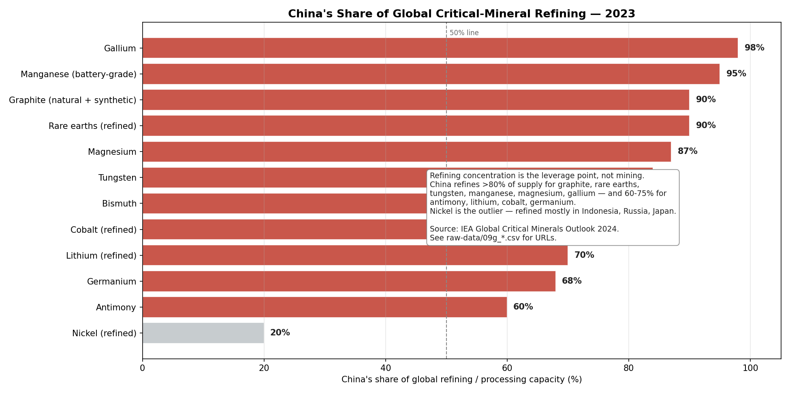

The critical-minerals overview summarises the leverage map. China
refines >80% of global supply for graphite, rare earths, tungsten,
manganese, magnesium and gallium; 60–75% for antimony, lithium, cobalt
and germanium. Nickel is the major outlier — Indonesia (mine + refine),
Russia, Japan, and Canada hold most of the refining capacity, and
nickel is the only critical mineral in this group where China lacks
durable upstream leverage.

The leverage chapter's central analytic claim is that supply-chain
leverage is real, asymmetric (China can deny what the West cannot
similarly deny), but finite. The post-2010 rare-earth episode triggered
the Mountain Pass restart, the Lynas Malaysia processing build-out, and
several years of Japanese inventory stockpiling. Each binding leverage
episode triggers exactly the alternative-supply investment that erodes
the leverage. The policy-relevant question is therefore not whether the
leverage exists but how to manage the 5–10 year window in which it
binds while alternative supply catches up.

---

## §11 Industrial Policy Mechanics

How the Chinese model actually works — not as a recipe to copy, but as
a system to understand.

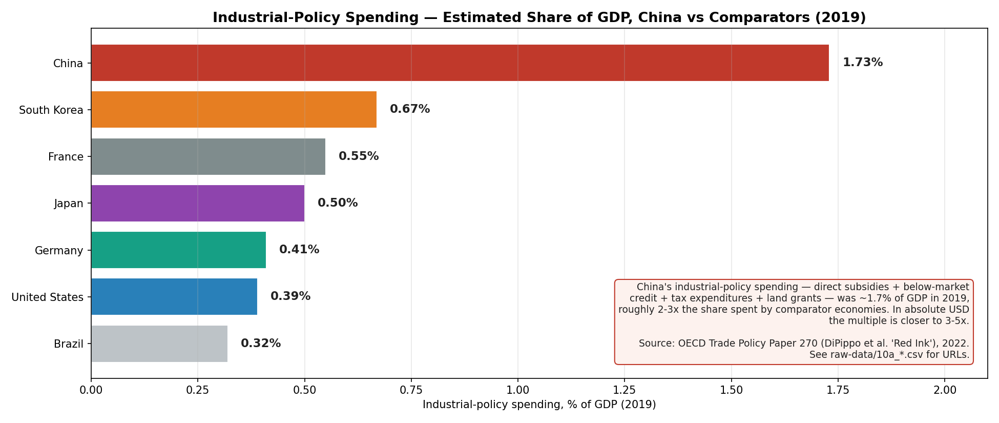

The first useful framing is comparative spending intensity. The CSIS /
OECD "Red Ink" estimate puts China's 2019 industrial-policy spending —
direct subsidies plus below-market credit plus tax expenditures plus
land-use preferences — at ~1.7% of GDP, roughly 2–3x the share spent
by Korea, France, Germany, Japan, the US, or Brazil. In absolute USD
the multiple is closer to 3–5x. The methodology is contested at the
edges (some Chinese spending categories are hard to identify cleanly;
some Western categories are similarly hard) but the directional gap is
robust.

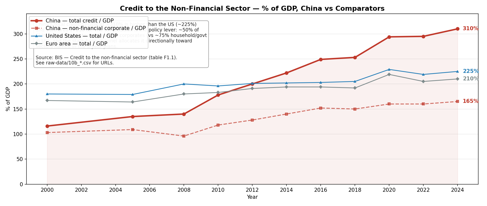

The credit-to-GDP chart describes the financing engine. China's
total-credit-to-GDP ratio sits at ~310%, higher than the US (~225%) and
the euro area (~210%). The strategically relevant detail is *composition*:
roughly half of Chinese credit goes to non-financial corporates, versus
roughly a quarter for the US (where household and government credit
dominate). The state-bank lending channel — Industrial and Commercial
Bank of China, China Construction Bank, Bank of China, Agricultural
Bank — is the operational arm of the sectoral-priority designations
that come out of the National Development and Reform Commission. When
the 14th Five-Year Plan names a sector, this channel directs credit at
preferential terms toward firms in that sector.

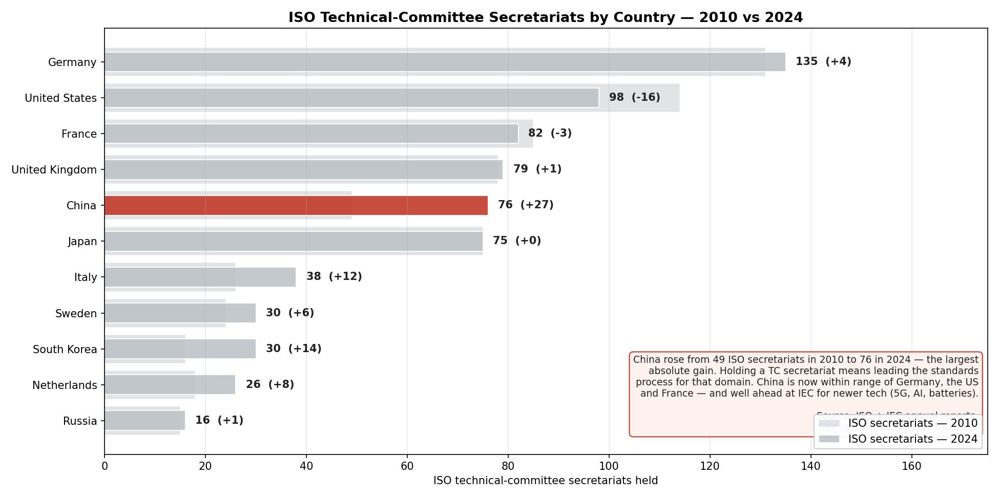

International standards-setting is the under-discussed leverage tool.
China rose from 49 ISO technical-committee secretariats (2010) to 76
(2024) — the largest absolute gain over the period. Germany, the US,
France, the UK and Japan have historically led; China is now within
range of Germany and ahead of the US on this measure for newer-domain
TCs (5G, AI, batteries). Holding a TC secretariat means chairing the
standards-development process for that domain — defining test methods,
acceptance criteria, and reference architectures. This is durable,
diffuse, and quiet influence.

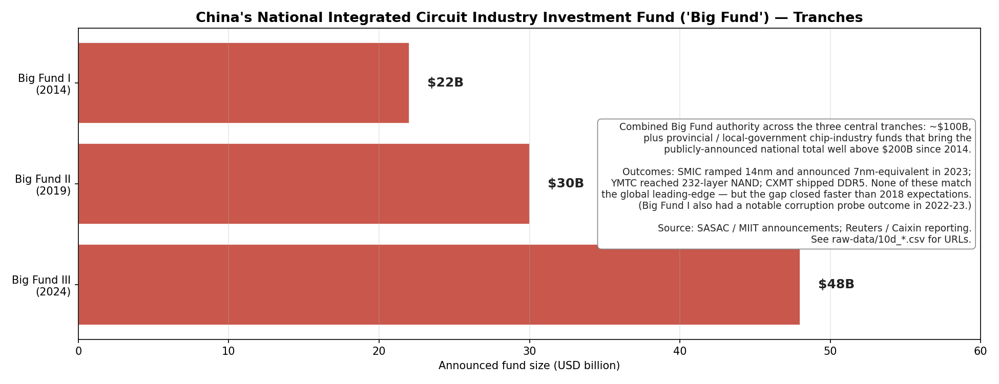

The Big Fund tranches are the most-discussed single industrial-policy
vehicle. Phase I (2014): \$22B. Phase II (2019): \$30B. Phase III
(May 2024): \$48B. Combined central authority over ten years: \$100B,
plus provincial and local-government chip funds that bring the
publicly-announced national total well above \$200B. Outcomes have
been mixed: SMIC ramped 14nm and demonstrated 7nm-class fabrication;
YMTC reached 232-layer NAND; CXMT shipped DDR5. None match the global
leading edge, but the gap has closed faster than the 2018 consensus
forecast. Phase I also had a notable corruption-probe outcome (2022–23
arrests including the fund's chairman).

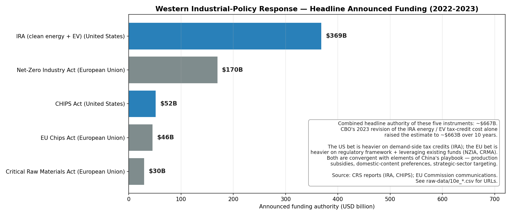

The Western convergence chart is the response-side of the same story.
The IRA's headline clean-energy and EV authority is \$369B (CBO's 2023
revision pushed this to \$663B over ten years); the CHIPS Act \$52B;
the EU Net-Zero Industry Act \$170B in linked funding streams; the EU
Chips Act \$46B; the EU Critical Raw Materials Act \$30B in channelled
funds. The instruments are different — the US emphasis is demand-side
tax credits; the EU emphasis is regulatory framework plus existing-fund
channelling — but the strategic targeting (clean energy, semiconductors,
critical minerals, batteries) is convergent. The brief notes the
convergence without prescribing one model.

The composite read on policy mechanics is that the Chinese system is a
*guided market* — fierce private competition (hundreds of EV and
battery firms, brutal price wars, regular bankruptcies of the weak)
combined with state direction on *which sectors* are favoured and
*which firms* get capital access. This is qualitatively different from
Soviet planning (no fierce private competition) and from Western market
economies (no state-bank-allocated credit at scale toward named
sectors). The model has failure modes — overcapacity cycles in steel
(2014–16), solar (2011–13), and EVs (2024–25); wasted Big Fund I
capital; local-government debt overhang — and a brief that doesn't
acknowledge those would be incomplete.

---

## §12 What Could Derail It — and the Counter-View

The honest forward-looking section. Two-sided: risks to China *and*
risks to "we can wait it out" Western complacency.

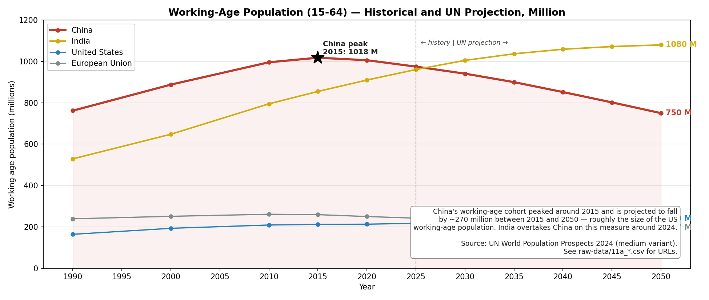

The demographic backdrop is the first-order risk. China's working-age
population (15–64) peaked around 2015 at ~1.018 billion. UN World
Population Prospects 2024 (medium variant) projects a fall to ~750
million by 2050 — a decline of roughly 270 million, larger than the
entire US working-age population. India's working-age cohort overtakes
China's around 2024. The manufacturing-labour pool will tighten further
and innovation-relevant cohorts will compress. The Japan 1990 and
Germany 2005 analogies apply with the caveat that China is
substantially younger as a per-capita-income economy than either of
those was at the same demographic turning point.

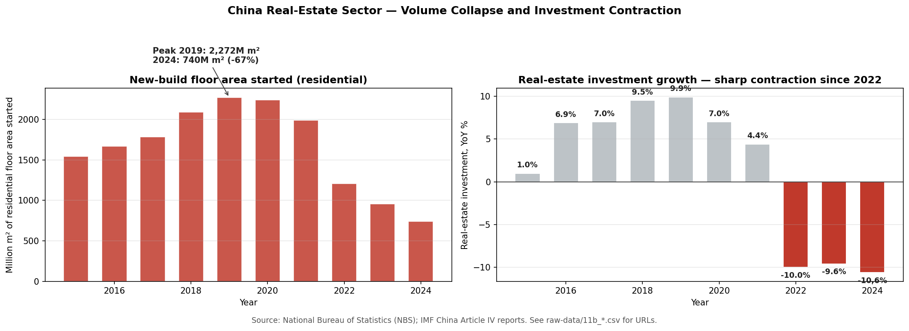

The real-estate slump is the second first-order risk. New-build
residential floor area started peaked at ~2,272 million m² in 2019 and
fell to ~740 million m² in 2024 — a 67% drop. Real-estate investment
has been contracting year-on-year since 2022, with full-year 2024 down
10.6% on 2023. Real estate had been ~25–30% of the Chinese economy on
broad measures (including upstream and downstream linkages) through
the 2010s; the contraction has been an outright drag on aggregate
demand and on local-government finances (because urban land-sales
revenue was a major local-government income source). The Evergrande and
Country Garden defaults in 2021–22 marked the inflection.

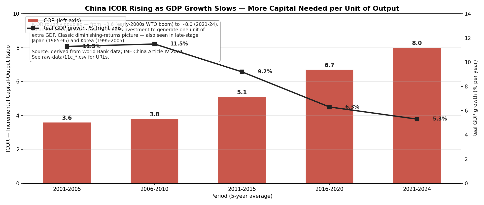

The ICOR chart describes the capital-allocation distortion. The
incremental capital-output ratio — gross capital formation divided by
real GDP growth — roughly doubled from ~3.6 in the early 2000s WTO boom
to ~8.0 in 2021–24. Each unit of GDP growth now requires twice as much
investment as it did at the peak of the previous expansion. The
historical analogues (Japan 1985–95, Korea 1995–2005) suggest that the
investment share of GDP must compress and the consumption share must
expand for growth to continue at this stage of development. China's
consumption share remains below 40% of GDP — historically and
internationally low — and the rebalancing has been slow.

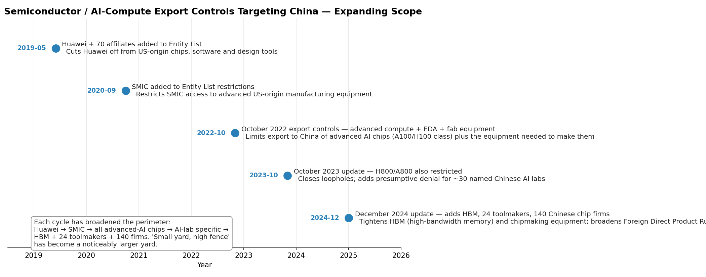

The US-export-controls trajectory is the policy-driven risk. Each cycle
since the May 2019 Huawei Entity List addition has expanded the
perimeter: Huawei (2019) → SMIC (2020) → all advanced AI chips and the
equipment to make them (October 2022) → specific Chinese AI labs
(October 2023) → HBM, 24 specific toolmakers, and 140 named Chinese
chip firms (December 2024). "Small yard, high fence" has become a
noticeably larger yard. The cumulative effect on Chinese access to
leading-edge AI compute is substantial; the open question is whether
this materially slows Chinese frontier-AI capability or simply forces
a longer indigenous-substitution path.

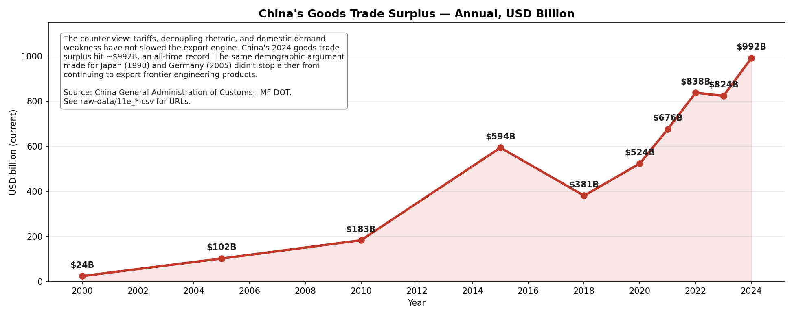

The trade-surplus chart is the counter-view. Despite tariffs, despite
decoupling rhetoric, despite weak domestic demand, China's goods trade
surplus hit \$992 billion in 2024 — a fresh all-time record. The
export engine has not broken; the same demographic and capital-allocation
arguments made for Japan in 1990 and Germany in 2005 did not stop
either country from continuing to export frontier engineering products.

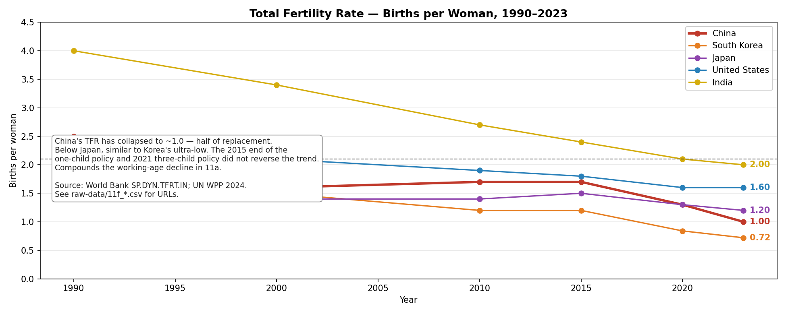

The fertility-rate chart adds depth to the demographic story. China's
total fertility rate fell from ~2.5 in 1990 to ~1.0 in 2023 — below
Japan (1.2) and approaching Korea's ultra-low ~0.7. The 2015 end of the
one-child policy and the 2021 three-child policy have not reversed the
trend. The implication is that the working-age cohort in chart 11a is a
*best case* on current policy: if Chinese fertility does not recover,
the post-2050 trajectory is sharper still.

The composite headwinds picture is real and serious, but it should not
be read as "China has peaked." Both Japan and Germany at comparable
demographic and capital-efficiency turning points continued to be
formidable exporters of high-end engineering goods for several
decades. The headwinds will narrow the rate of expansion, not flip the
direction.

---

## §13 Implications for Western Policy

The brief is analytical and does not advocate a single policy
framework. But four implications follow from the data presented above
and are worth setting out clearly.

**First, the "selective leadership" frame should replace the "China is
or isn't innovating" binary.** China leads selectively, in sectors
where the combination of scale, integrated supply chain, energy cost
base, and learning-curve depth has compounded over a decade or more.
The sectors where China leads are not random — they share a common
profile (mid-skill manufacturing scale, plus a state-directed
demand-pull, plus integrated upstream materials), and that profile
predicts which *additional* sectors will be at risk of similar
displacement (drones-at-defense-scale, mid-range commercial aircraft
beyond 2035, certain specialty chemicals, advanced grid hardware).

**Second, supply-chain leverage is a multi-year transition problem,
not a permanent veto.** The 2010 rare-earth episode is the prototype:
Chinese leverage was deployed, partner countries reacted with
alternative-supply investment, and the leverage degraded over the
subsequent decade. The 2023–2024 critical-mineral export-licensing
round will likely follow the same pattern, on a similar 5–10 year
horizon. The policy-relevant question is therefore not whether to break
the leverage (it will erode regardless) but how to manage the binding
window — strategic stockpiling, accelerated permitting for new
processing facilities in OECD jurisdictions, allied-supply
diversification, and the explicit pricing of environmental costs into
the alternative-supply build-out.

**Third, energy and grid build-out is the under-priced strategic
asset.** The data-centre electricity demand projections (Chapter 8)
indicate that AI is becoming energy-bound rather than purely
chip-bound. The countries that can build large-scale clean baseload
generation and the grid to deliver it at competitive industrial prices
will have a structural advantage in AI-compute economics. The current
generation mix and build-out rate favours China substantially. The US
and EU policy response on this dimension has been less coordinated than
on chips or batteries — which may be the most important under-prioritised
gap in Western industrial policy.

**Fourth, Western industrial policy has already converged toward
production subsidies, domestic-content preferences, and
strategic-sector targeting (IRA, CHIPS, EU NZIA, EU CRMA).** The
question is no longer *whether* to do industrial policy but *how* to do
it effectively. The Chinese mechanism — guided market with fierce
private competition under state-directed credit allocation — is
qualitatively unlike Western systems and cannot be transplanted
directly. But the *targeting principles* (long-horizon, sectoral, with
deliberate willingness to absorb early overcapacity cycles) are
adaptable, and the EU and US have begun to adapt them. The next phase
of Western industrial policy will be a learning exercise about which
mechanisms work at scale in OECD institutional environments and which
do not.

The brief deliberately does not recommend specific tariff levels,
export-control thresholds, or budget allocations. The data summarised
here is intended to inform those choices, not pre-determine them.

---

## §14 Conclusion

China is no longer the world's workshop and is not yet the world's
laboratory — it is a distinct third thing: a producer-economy of
unprecedented scale that has developed selective frontier capability in
a small number of strategically chosen sectors while retaining the
upstream supply-chain leverage accumulated over the prior two decades.

The brief tested three propositions. The three-phase trajectory is
clearly visible in the macro data. Selective frontier leadership is
clearly visible in the sectoral data for batteries, EVs, parts of AI,
robotics, solar PV manufacturing, and electricity build-out. Supply-chain
leverage is clearly visible across rare earths, battery materials, solar
PV, pharma APIs, and merchant shipbuilding — and has been deployed
visibly enough since 2010 to establish that it is not merely
theoretical.

The honest counter-evidence is that several major industrial domains
remain firmly Western-led — advanced semiconductors, commercial
aerospace, originator pharmaceuticals, industrial software and cloud,
and a substantial portion of defense systems. These are not minor lags;
they are the high-margin platform layers of the modern economy. The
gap is real, durable, and unlikely to close in the next decade in most
of these domains.

The headwinds are also real. A working-age population that peaked nine
years ago, a fertility rate at ~1.0, a real-estate sector down two-thirds
from its peak, doubled ICOR, and an expanding US export-controls
perimeter are not minor frictions. They will tighten the constraints on
the Chinese model in the coming decade.

But — and this is the framing claim the brief argues for — the
combination of selective leadership *and* supply-chain leverage *and*
the structural energy advantage *and* a record \$992 billion trade
surplus in 2024 does not describe an economy that has peaked. It
describes one that has matured into a different and durable
configuration: not the cheap-labour workshop of 2005, not the universal
frontier-rival the most aggressive readings sometimes assume, but a
producer-economy with selective frontier capability and substantial
upstream leverage — capable of forcing real strategic choices on its
trading partners over a multi-decade horizon, and unlikely to be talked
or tariffed out of those capabilities within the time-frames that
matter for current Western policy.

The right question for Western capitals is not whether China will
continue to lead in batteries, EVs, parts of AI, robotics, solar, and
the energy build-out — the data presented here suggests it will, for
the next decade at minimum. The right question is how to manage the
multi-year window in which Chinese supply-chain leverage binds while
alternative-supply build-outs catch up, and how to invest selectively
in the domains where Western institutional advantages — IP enforcement,
deep capital markets, originator-pharma clinical-trial ecosystems,
advanced lithography, dominant platform software — remain genuinely
durable.

---

*Data and sources for every chart in this brief are documented in
[`raw-data/SOURCES.md`](raw-data/SOURCES.md). Each chart's underlying
CSV in `raw-data/` carries `# source:` / `# url:` / `# retrieved:`
header comments. World Bank–sourced charts can be refreshed by running
`python3 00_fetch_world_bank.py`; other CSVs are hand-compiled from the
cited public reports and are updated by editing the CSV file directly.*
