# Greece: Crisis, Adjustment, and the Slow Reconstruction

### A Data-Driven Analysis, 2000–2025

---

## Executive Summary

Between 2008 and 2016 Greece lost a quarter of its GDP, a third of its bank deposits, half its property values, and roughly 700,000 working-age residents. The non-performing loan ratio peaked near 50% — a figure normally associated with post-war financial systems. Sovereign yields touched 36% in early 2012. By every standard macroeconomic measure, Greece experienced the worst peacetime depression of any developed economy since the 1930s.

A decade later the headline numbers have stabilised. Real GDP in 2024 is still 16% below its 2007 peak and 7% below its 2010 level — the recovery is real but partial. Public debt has fallen from 207% of GDP (2020) to roughly 153%. NPLs are below 5%. Unemployment has dropped from 28% to about 10%. Bond yields trade inside Italy's. The current account has stayed in deficit but is funded by record tourism receipts (€20bn) and a structural shipping surplus (€21bn) that together cover most of a chronic goods deficit.

But the recovery is incomplete and uneven. Per-capita GDP in PPS remains around 70% of the EU average — the same level as 2003, before the boom. Attica, the dominant economic region, fell from 127% of the EU average in 2006 to 86% in 2020 and has only partly recovered. Eleven of thirteen NUTS2 regions lost population over 2007–2024; West Macedonia lost 14%. Tertiary attainment among 25–34-year-olds, which had been climbing for two decades, ticked downward after 2022 — consistent with the persistent brain drain that net migration data confirm.

Greece in 2025 is no longer in crisis but is not converging. The fiscal turnaround is real and durable. The banking system is repaired. Tourism is a runaway success. Yet the economy that emerged from the adjustment is smaller, older, more service-dependent and more regionally concentrated than the one that entered it. The chapters below reconstruct the trajectory from the data.

---

## 1. The Macroeconomic Trajectory

### 1.1 The boom, the bust, the long flatline

Real GDP grew at 4% per year in the half-decade before 2008, fuelled by cheap euro-denominated credit, public spending, and Olympics-related construction. Output peaked in 2007 and then contracted in nine of the following ten years. By 2013 the economy was 27% smaller in real terms than at peak.

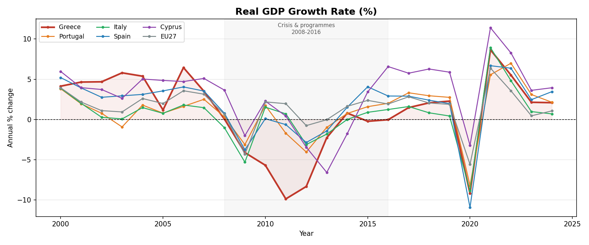

Recovery began tentatively in 2014, was interrupted by the 2015 capital controls episode, then resumed at modest rates of 1–2% until COVID. The post-pandemic rebound was the strongest stretch of growth Greece had seen since the early 2000s: 8.7% in 2021, 5.6% in 2022. Even so, real GDP in 2024 is still 7% below its 2010 level and 16% below the 2007 peak. On a 24-year horizon, Greek output is roughly where it was in 2003.

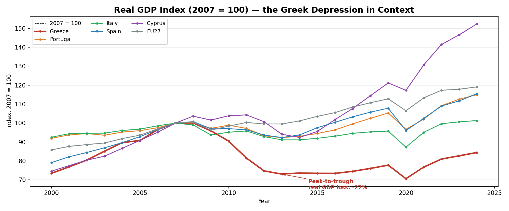

In nominal per-capita terms, Greece peaked at about US$32,000 in 2008, fell to roughly US$18,000 by 2015, and has slowly climbed back. The 2024 figure sits below the 2008 peak even before adjusting for inflation.

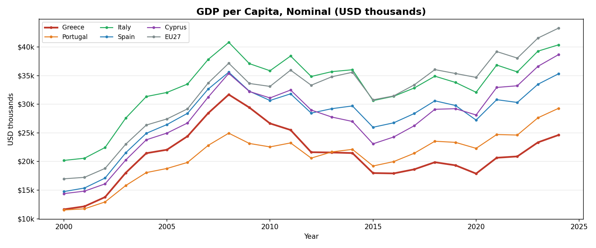

### 1.2 Convergence reversed

The PPS-adjusted level of per-capita GDP captures the deeper story. Greece reached 95% of EU27 average in 2007. By 2013 it was at 71% and has hovered there ever since, with 2024 around 71%. Portugal, Spain and Italy all converged or held steady over the same period; Greece is the only euro-area country that diverged. The Maastricht convergence promise — that monetary union would deliver real convergence to richer Europe — was, for Greece, reversed.

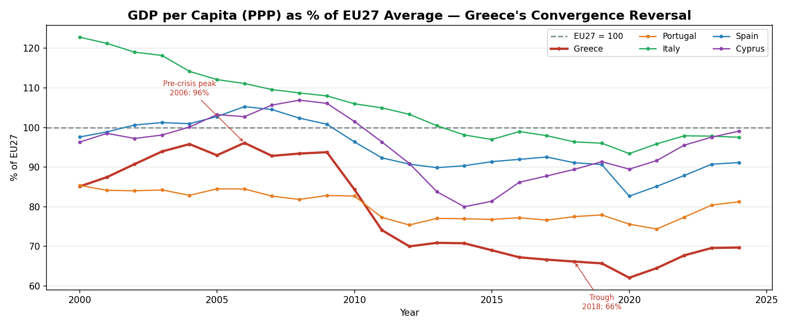

### 1.3 Sectoral composition

The shape of the economy shifted with the crisis. Industry's share is essentially flat at 14–15% of value added. Services dominate at roughly 80% of GVA. The trade-transport-tourism aggregate held its share around 25% — meaning it shrank in absolute terms only as much as the rest of the economy and grew faster on the way out. Construction collapsed, as the dedicated charts in [§7.2](#72-construction-a-90-collapse) show.

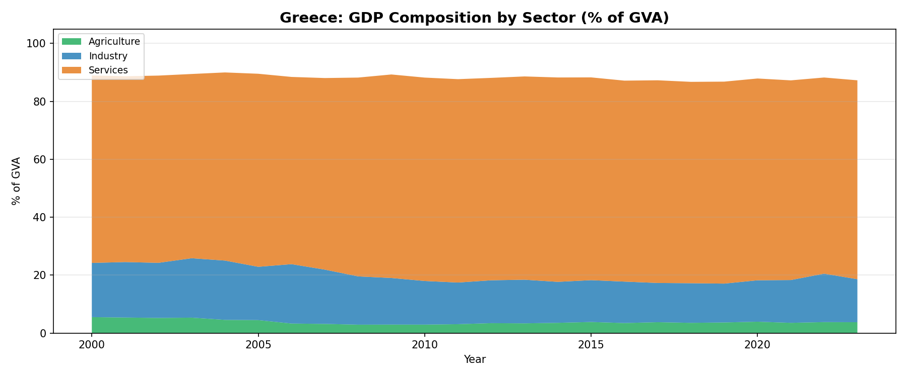

---

## 2. Public Finances: From Crisis to Surplus

### 2.1 The deficit

The 2009 budget deficit was 15.1% of GDP — and the in-year revisions that produced that number triggered the loss of market access. Six years and three programmes later, Greece ran a primary surplus of 4.1% of GDP in 2016. By 2024 the headline balance was a surplus of 1.3% of GDP with a primary surplus of 4.8%. Few advanced economies have ever sustained primary surpluses this large for this long.

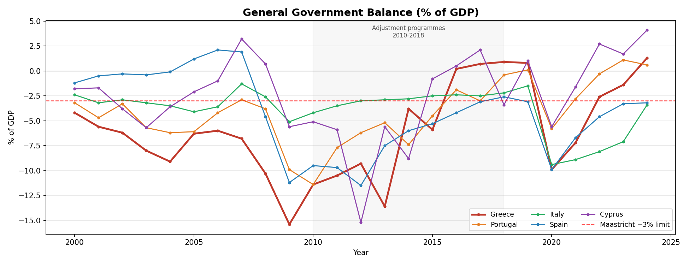

Tax revenue rose sharply during the adjustment as both rates and enforcement intensified. By 2024 tax-revenue-to-GDP sits around 40%, well above the pre-crisis level and roughly at the euro-area average.

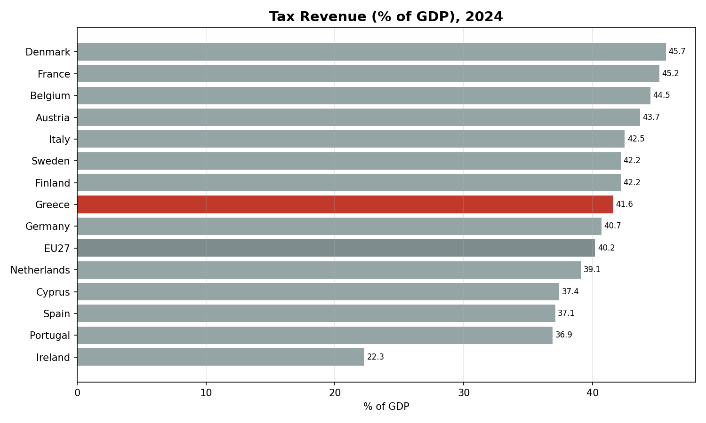

The revenue and expenditure trajectory together show the squeeze: revenue rose while expenditure was cut, closing the gap from both sides.

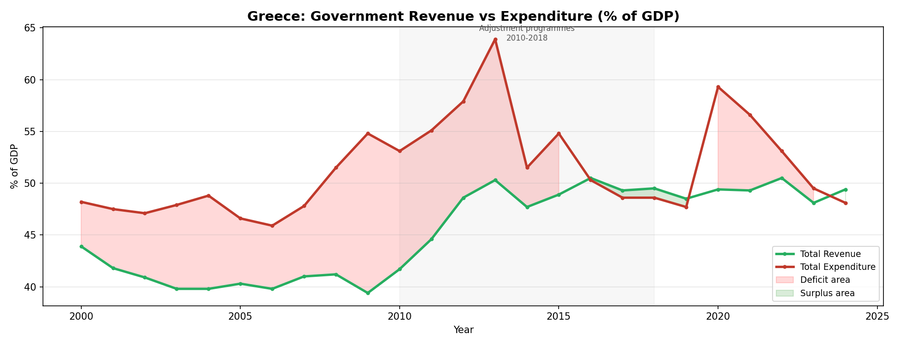

### 2.2 The debt

Public debt rose from 103% of GDP (2007) to a peak of 207% in 2020. The 2012 Private Sector Involvement (PSI) — the largest sovereign restructuring in history — wiped roughly €100bn off the debt stock and dramatically shifted its composition.

In plain terms: pre-2012 Greece borrowed mainly by selling **bonds** — tradable IOUs held by banks, pension funds and hedge funds. The PSI was a forced swap. Bondholders gave up €100 of old bonds for new bonds worth €46.50 in face value, with lower coupons and longer maturities — a "haircut" of about 53.5% in nominal terms, closer to 75% in present-value terms once the worse interest rates and longer wait are taken into account. It applied only to *private* creditors (hence the name); official loans from EU governments and the IMF were untouched.

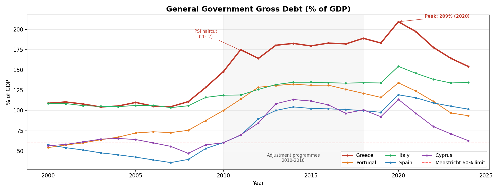

The composition chart below splits the total debt by instrument. **Bonds** are tradable IOUs whose price moves with market sentiment, refinanced every few years at whatever rate investors demand. **Loans** are direct, non-tradable contracts with a specific lender on fixed terms — no rollover risk, no mark-to-market. Pre-PSI, market-held bonds were the largest creditor class. The bailout packages (EFSF, ESM, bilateral euro-area partners, IMF) replaced most of those bonds with loans on extraordinarily soft terms. By 2024 about 70% of Greek debt is owed to official lenders at concessional rates with maturities stretching to the 2070s.

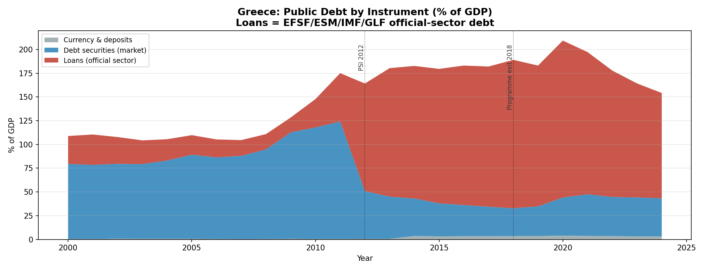

This is why the headline debt/GDP ratio overstates the actual burden. Italy sits at ~135% but mostly in market bonds it must keep refinancing; rate moves bite quickly. Greece is at ~153% but mostly in long-dated official loans at fixed concessional rates — so the effective interest rate on the debt stock averages around 2%. Markets recognised this in 2023, when Greece regained investment-grade ratings.

### 2.3 The primary-balance achievement

First, the terminology. The **headline balance** is total government revenue minus total government spending — *including* interest payments on existing debt. It is the figure the EU's 3%-of-GDP deficit ceiling refers to. The **primary balance** strips out the interest line and measures only revenue minus *non-interest* spending. So `primary balance = headline balance + interest paid`.

The distinction matters because interest payments are largely fixed by past borrowing — they are not what this year's tax-and-spend decisions can move. The primary balance is. A country can run a primary surplus and still post a headline deficit if the interest bill swallows the surplus. Greece's 2024 numbers go the other way: a primary surplus of **+4.8% of GDP**, interest payments of **3.5%**, leaving a headline surplus of **+1.3%** — a remarkable position for a country whose 2009 headline deficit was 15.1%.

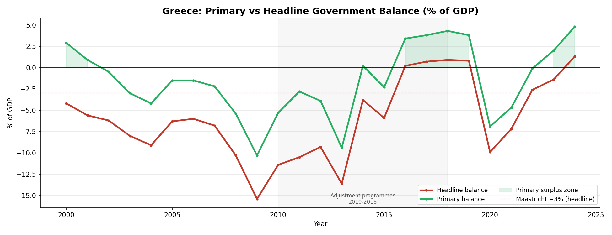

Debt-to-GDP has fallen by roughly 50 percentage points since 2020. The mechanics: when nominal GDP grows faster than the effective interest rate on debt — what economists shorthand as "r minus g" working in your favour — the ratio falls automatically, even before counting any primary surplus on top. Greece has both working: long-dated official loans at fixed rates averaging around 2%, and nominal GDP growth of 5–8% in recent years from real growth plus inflation. The primary surpluses contributed too but were not the dominant driver. The political economy of austerity produced both the worst macroeconomic outcomes in the EU and the strongest fiscal discipline.

The trajectory is now sustainable on conservative assumptions, and Greece regained investment-grade ratings in 2023 — restoring market access after a fourteen-year exile.

---

## 3. Labour Market and Demographics

### 3.1 The employment collapse and partial recovery

The Greek labour market suffered the deepest collapse in the modern OECD. Unemployment rose from 7.8% (2008) to **27.8%** (2013); by 2024 — the latest full annual reading — it had fallen to 10.1%, with monthly data through 2025 trending below 9%.

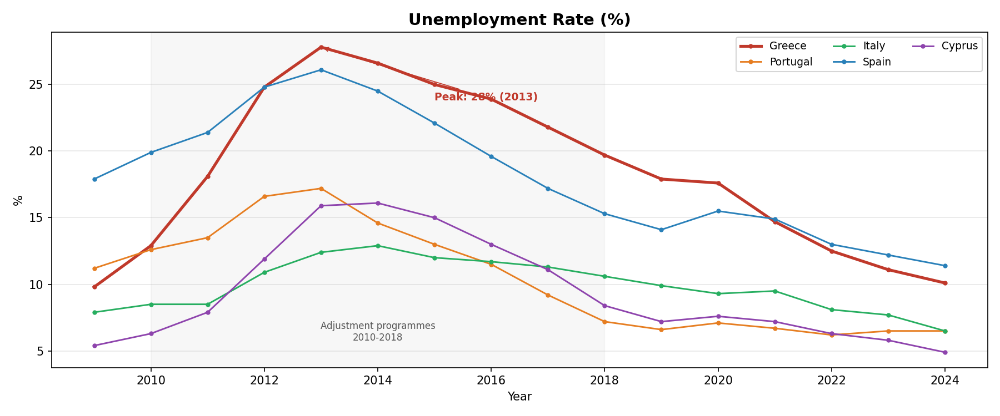

Youth (15–24) unemployment peaked at **59.4%** in 2013 — at one point, three out of five young job-seekers were unemployed. The 2024 figure of 22.5% is still high but normalised.

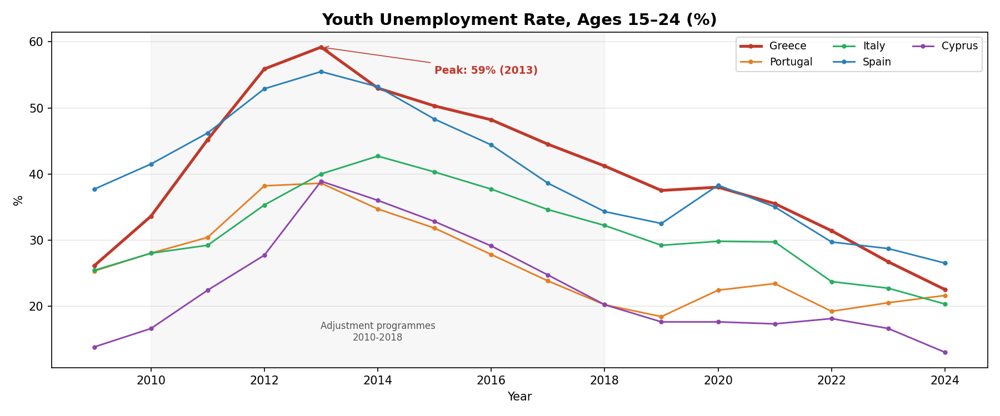

The employment rate (15–64) recovered to 63.3% by 2024 — well above the 2013 trough of 48.5%, but on the Eurostat data this is the highest reading on record for Greece.

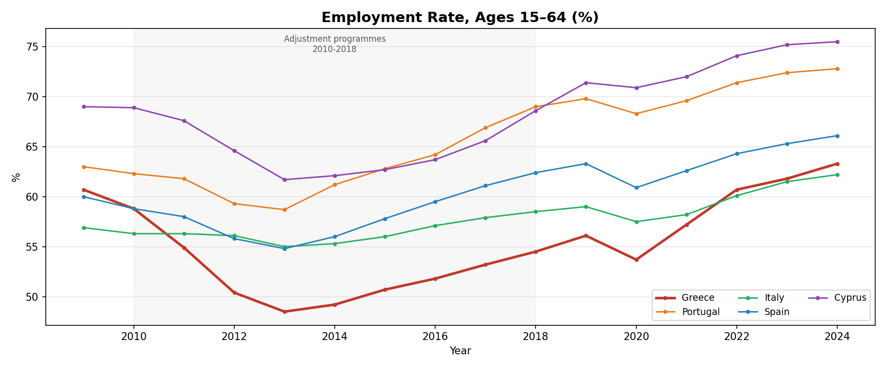

### 3.2 Internal devaluation

With the exchange rate locked, adjustment ran through wages. The labour cost index fell sharply between 2010 and 2016 — a real wage cut of comparable magnitude. The competitiveness gain is real but the cost to household incomes was severe.

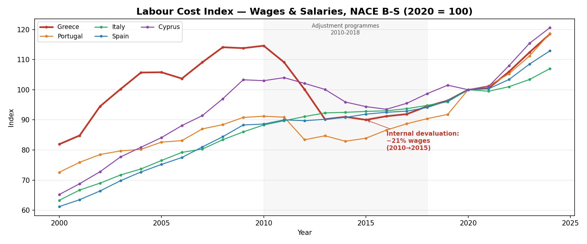

### 3.3 Demographic loss

Greece's population peaked at 11.13 million in 2008 and has fallen every year since, reaching 10.43 million in 2024 — a loss of roughly 700,000 people, or 6% of the total.

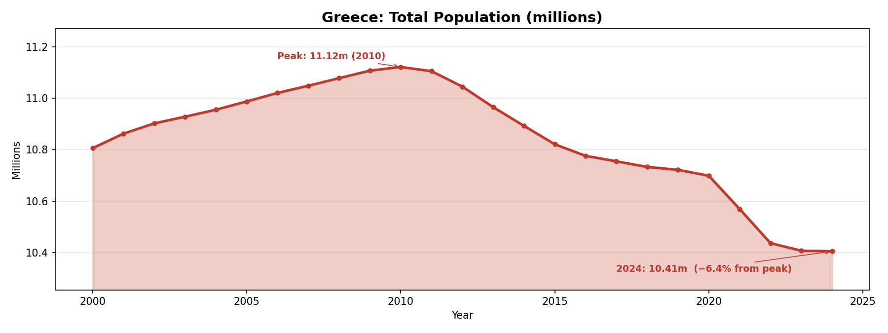

Indexed to 2000, Greece has lost population while every other peer has grown:

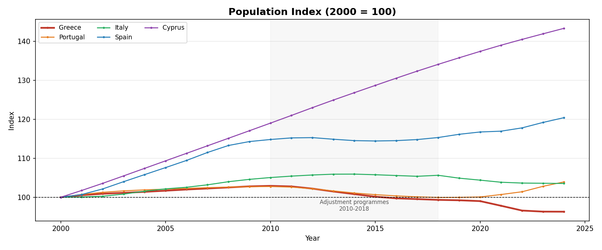

Net migration turned strongly negative in 2010–2017 (peak outflow of about 6 per 1,000 residents per year). This is the brain-drain channel that doesn't appear in the regional or labour data but underpins both.

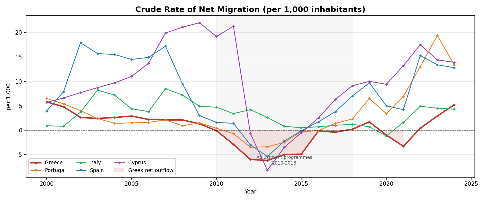

The age-dependency ratio reached 60% in 2024, among the highest in the EU.

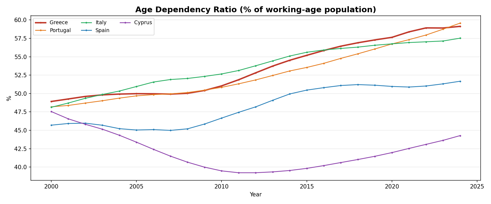

The total fertility rate sits at 1.3 — well below the EU average and far below replacement. Greece is ageing and shrinking simultaneously.

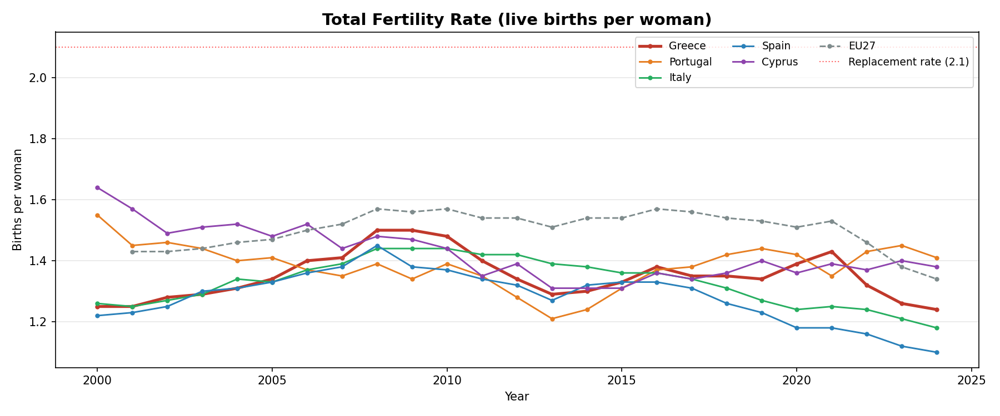

---

## 4. Inflation, Yields and the Loss of Monetary Sovereignty

### 4.1 Deflation, then disinflation

Greece experienced **four consecutive years of HICP deflation (2013–2016)** — a textbook symptom of a fixed-exchange-rate adjustment with no monetary offset. CPI fell cumulatively by about 2.5%. By contrast, the 2022 energy shock pushed headline inflation to 9.6% — closer to the euro-area average than the gap that opened during the crisis.

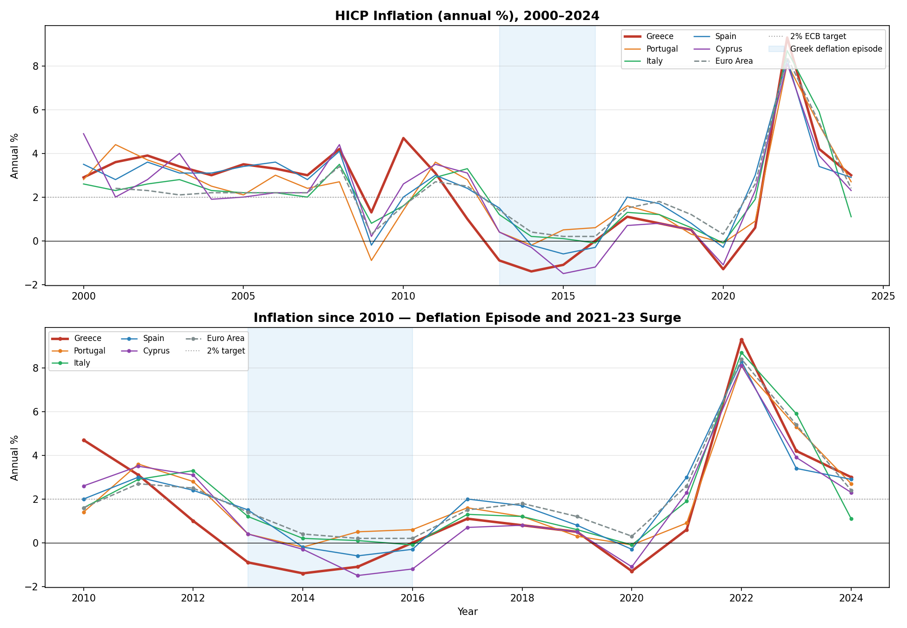

### 4.2 Sovereign yields

The 10-year Greek government bond yield rose from below 5% in early 2010 to **22.5%** monthly average in early 2012, with intraday peaks above 36%. Successive bailouts, the PSI, and ECB liquidity progressively normalised the yield curve. By 2024 the 10-year annual average was 3.35%, below Italy's 3.71% — Greek paper now trades inside Italian.

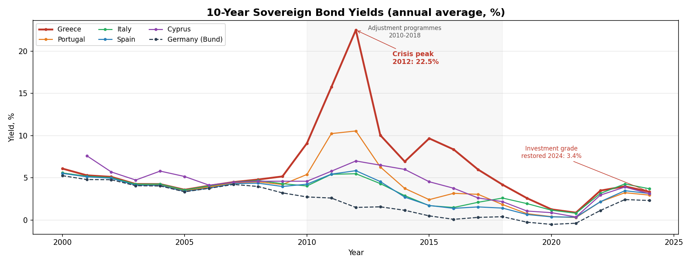

The Greek–Bund spread reached 21 percentage points at the peak of the crisis. The convergence trade that vanished in 2010 has substantially reconstituted itself.

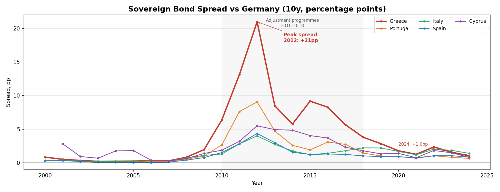

### 4.3 Competitiveness

The CPI-deflated real effective exchange rate appreciated by roughly 15% over 2001–2008 — the loss of competitiveness inside the euro that no policy lever could correct. The subsequent 2009–2016 depreciation of roughly 12% was achieved entirely through internal devaluation: deflation and falling wages.

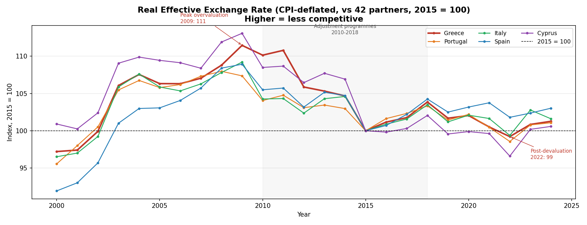

Nominal unit labour costs tell the same story even more cleanly. Greek NULC in 2024 sits at 110 on the 2015=100 index — roughly the 2009 level (107) — while the euro-area aggregate has risen from 96 to 126 over the same period, a 32% increase.

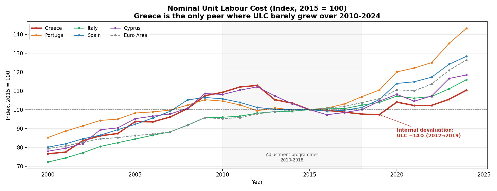

---

## 5. Banking: From Near-Collapse to Recovery

### 5.1 The NPL crisis

The Greek banking system experienced one of the largest non-performing loan accumulations in modern banking history. The NPL ratio rose from under 5% (2008) to **45.6%** (2017) — a level normally seen only in post-war or post-currency-collapse economies. Resolution came through securitisation under the Hercules state-guarantee scheme: NPL ratios fell to 4.6% by 2024.

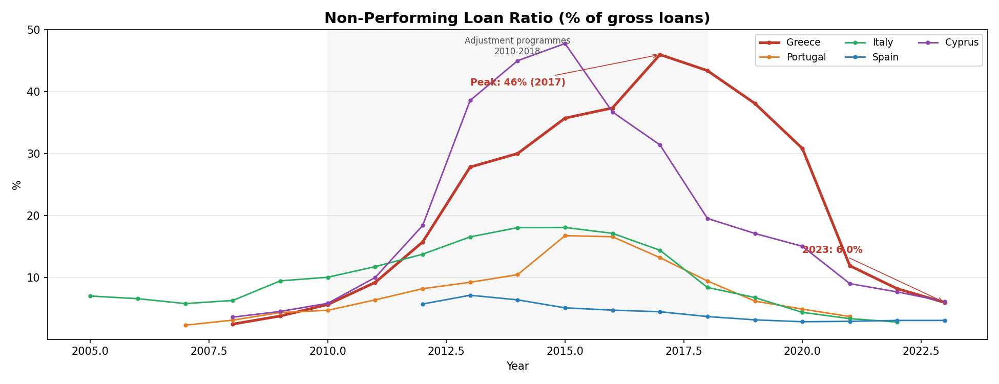

### 5.2 The deposit flight

Private-sector deposits at Greek MFIs peaked at €238bn in late 2009. By early 2015, on the eve of the third bailout and the imposition of capital controls, they had fallen to €120bn — a loss of roughly half. Capital controls (June 2015–September 2019) stemmed the bleed and gradually deposits rebuilt. By 2024 they stood at roughly €180bn, still well below the peak in nominal terms.

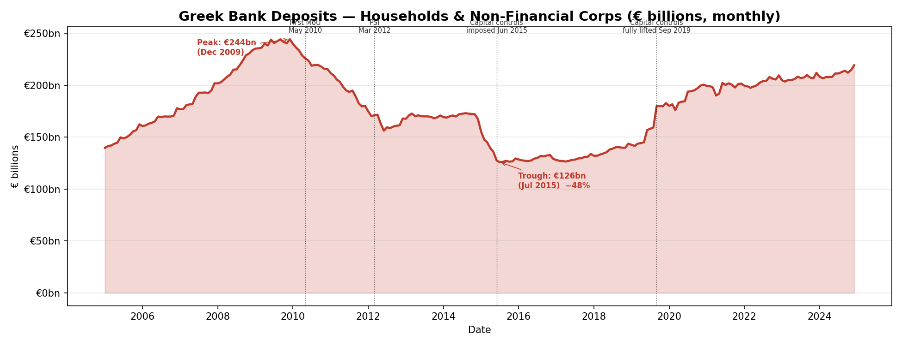

### 5.3 Credit deleveraging and bank capital

Domestic credit to the private sector by banks reached 120% of GDP at the boom's peak; by 2024 it had fallen to 48%. Part of this is denominator collapse (smaller GDP) but most is genuine deleveraging — both balance-sheet repair by banks unwilling to lend and depressed demand from households and firms. Greek private credit penetration is now among the lowest in the euro area.

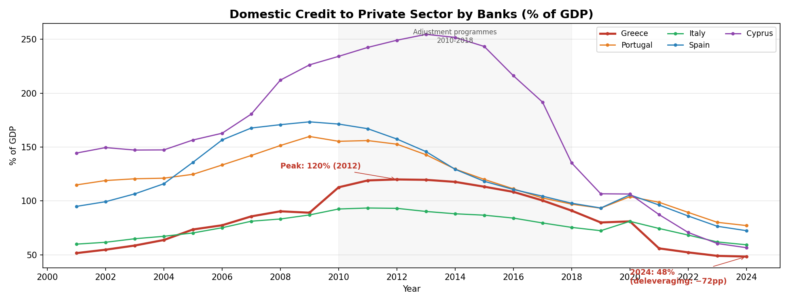

Multiple recapitalisations restored bank capital ratios from near-zero levels at the trough back to peer norms.

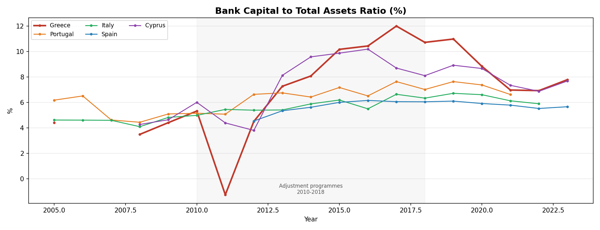

---

## 6. External Sector: Tourism, Shipping and the RRF

### 6.1 The current account

The pre-crisis current account ran a chronic deficit of 7–14% of GDP — financed by capital inflows that reversed sharply in 2010. Internal devaluation and import compression cut the deficit to near balance by 2014 and held it there through 2019. The post-2020 reopening combined with energy shocks pushed it back to deficits of 7–11%.

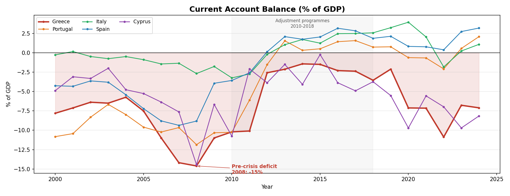

### 6.2 Goods deficit, services surplus

The distinctive Greek pattern: a structural goods deficit of €20–40bn per year, partly offset by a structural services surplus driven by tourism and shipping. The services surplus reached €22bn in 2024 — its highest level ever. Goods trade has never been balanced; the question is how much of the gap services can close.

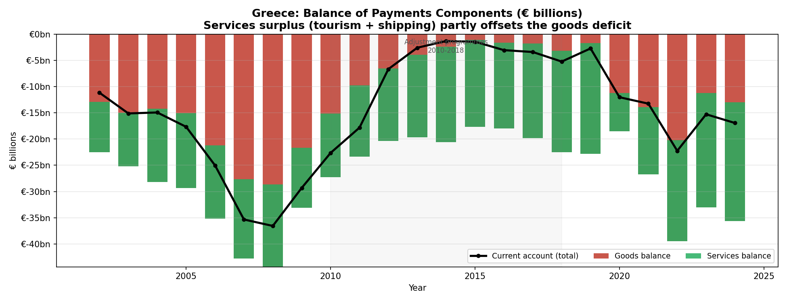

### 6.3 Tourism and shipping

Tourism credits rose from €4bn (2020 COVID low) to **€21.6bn** in 2024 — an absolute record. Shipping receipts ran at €21bn in the same year. Together these two sectors generated roughly €43bn of foreign-currency earnings — about 20% of GDP, and the single largest source of resilience in the Greek balance of payments.

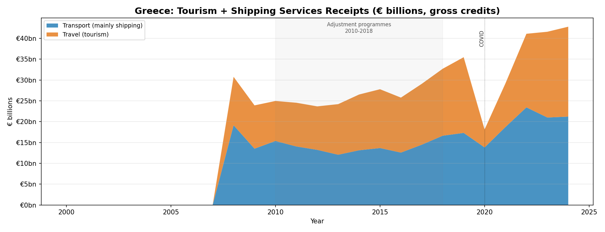

Per-capita tourism intensity makes the scale clear: nights spent at accommodation per resident nearly tripled from 5 (2005) to 15 (2024), pushing Greece behind only Cyprus among the peer group.

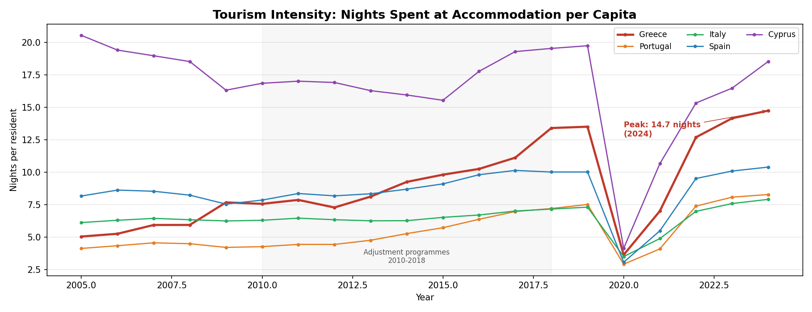

### 6.4 FDI

FDI flows have been chronically thin. Greece struggled to attract greenfield investment during the crisis and remains below peer levels even now, despite a recent uptick to about 2.6% of GDP. The structural shortfall is one reason RRF and EU funds matter so much.

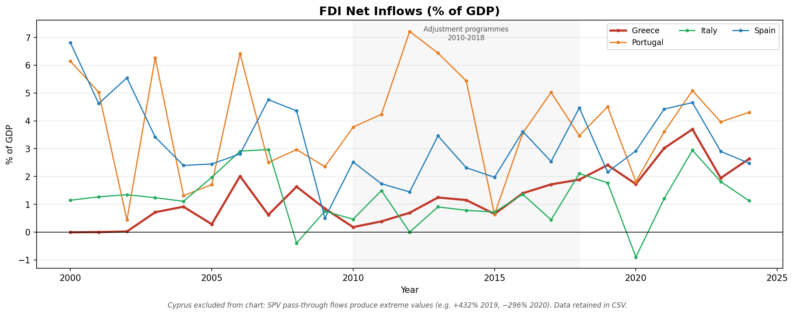

### 6.5 The RRF

Greece is the **largest per-capita beneficiary** of the EU Recovery and Resilience Facility, receiving allocations equivalent to 16.5% of 2023 GDP (grants plus loans). Its disbursement rate of 62% is tied with Italy for the EU's highest. The Greek RRF profile — heavy on green transition and digitalisation, with serious reform conditionality — is one of the genuinely bright spots in the post-2020 trajectory.

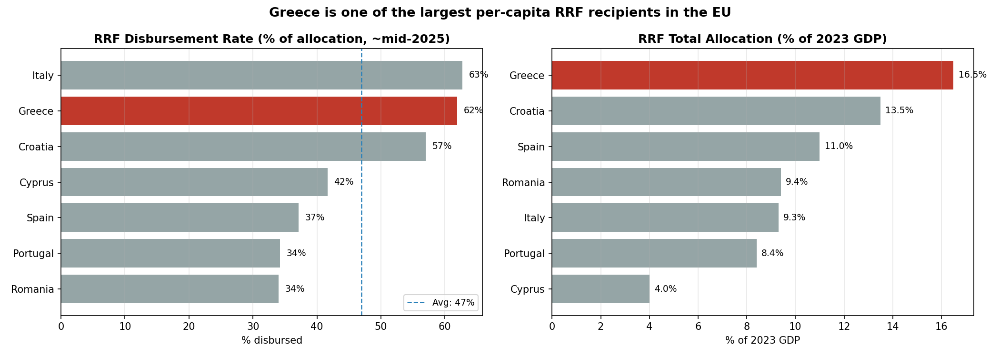

---

## 7. Sectoral Structure

### 7.1 The shape of value added

Greek gross value added is now overwhelmingly services. The construction share collapsed from 9.4% (2006) to 2.2% (2024). Public administration, education and health peaked at 21% of GVA in 2013 — austerity contracted private activity faster than the public payroll. Real estate rose to 18%, partly a denominator effect, partly a rental-yield revival post-2017.

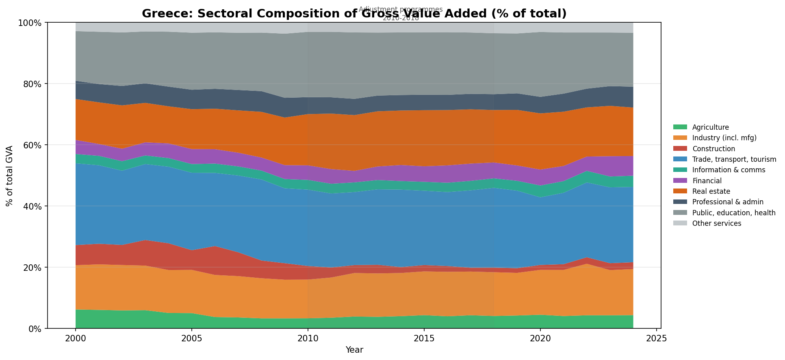

Manufacturing accounts for about 10% of GVA, near the bottom of the EU and only above Cyprus. Italy at 17%, Portugal at 14% and Spain at 12% all maintain larger industrial bases. Greek industrial weakness predates the crisis and has not improved through it.

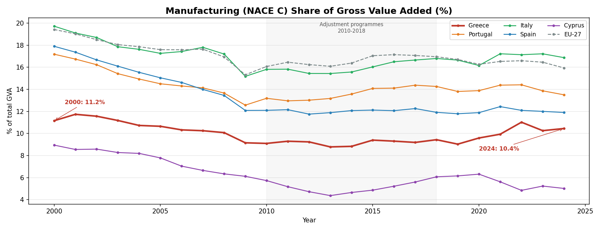

### 7.2 Construction: a 90% collapse

The Greek construction production index — a quirky series, with 2015 = 100 — peaked at **651 in 2002** (the Olympic build-out) and fell to **63 in 2020**: roughly a **90% collapse from peak**. The recovery since has been modest: the index reached 84 in 2022. No peer experienced anything comparable. The construction collapse explains a large fraction of both the unemployment surge and the credit deleveraging.

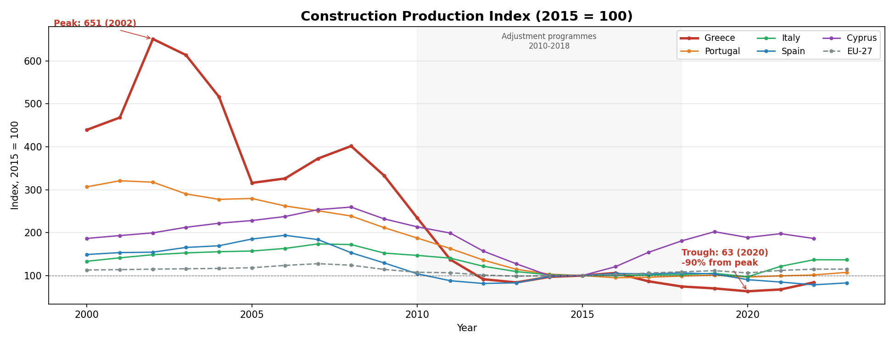

### 7.3 Renewables: a quiet success

The share of renewables in gross final energy consumption rose from 7.2% (2004) to **25.4% (2024)** — above the EU average. Portugal leads peers at 36%, but Greek progress has been steady through the crisis decade and has accelerated post-RRF.

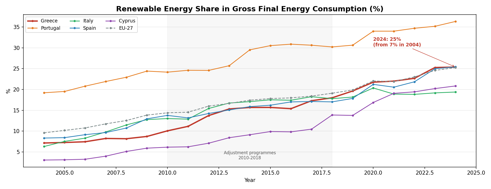

---

## 8. Regional Disparities

### 8.1 Attica dominates

Greater Athens (NUTS2 region EL30) accounts for roughly half of Greek GDP from about 35% of the population. North Aegean is at 42% of EU27, among the EU's poorer regions; West Macedonia at 48%, having fallen from 85% in 2006.

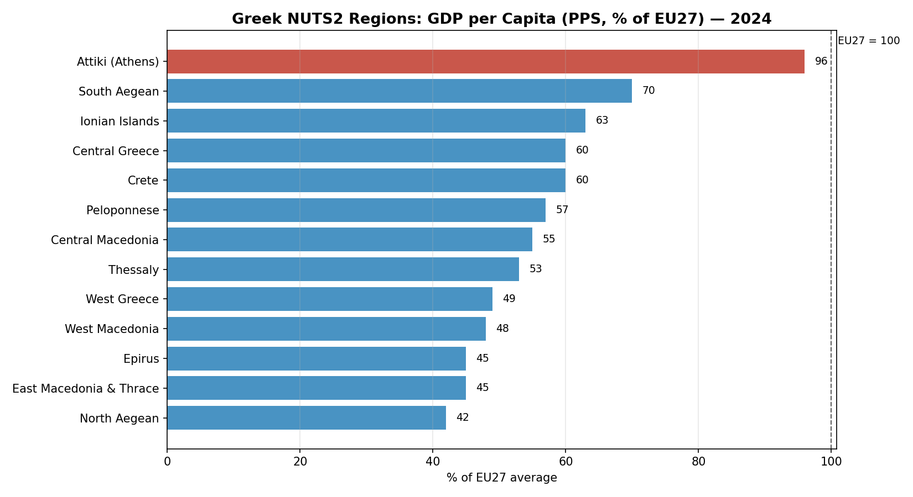

Per-capita output in Attica was 1.49× the rest of Greece in 2000; by 2024 the ratio had widened to **1.67×**. The gap opened most decisively during the crisis years and has not closed.

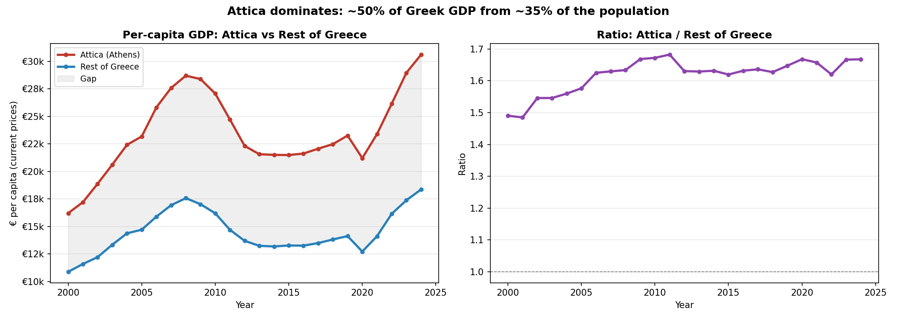

The capital is not particularly rich by European capital standards — at 96% of EU27 average in PPS, Attica trails Lisbon (PT1A: 129), Madrid (125) and Rome's Lazio (113). The most economically dynamic Greek region is, by international standards, a middle-income area.

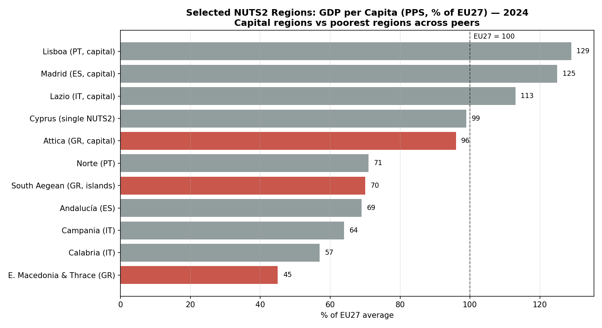

### 8.2 The reversal of convergence at NUTS2 level

The two regions that fell the furthest are illustrative. Attica went from 127% of EU27 (2006) to 86% (2020) — a 41-point collapse, recovered only partially. West Macedonia, the coal-and-lignite region around Ptolemaida, fell from 85% (2006) to 48% (2024) — a 37-point collapse tied to the energy transition that has produced no successor industry.

### 8.3 Depopulation

Eleven of thirteen Greek NUTS2 regions lost population over 2007–2024. West Macedonia lost 14%. Even Attica lost 210,000 people (−5%). Only Crete (+2%) and North Aegean (+0.9%) grew. The hollowing-out of the continental periphery is one of the structural problems most resistant to short-run policy.

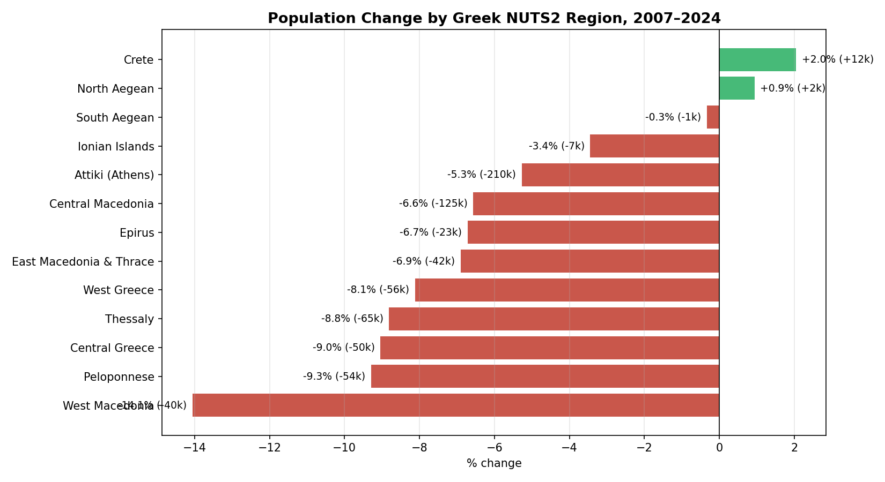

### 8.4 Unemployment dispersion

In 2024, regional unemployment ranged from 7.1% (North Aegean, Peloponnese) to 16.2% (Ionian Islands) — a reversal from 2013, when the Ionian Islands had the lowest rate and West Macedonia hit 31.6%. Tourism-dependent regions are now more cyclically exposed than continental ones.

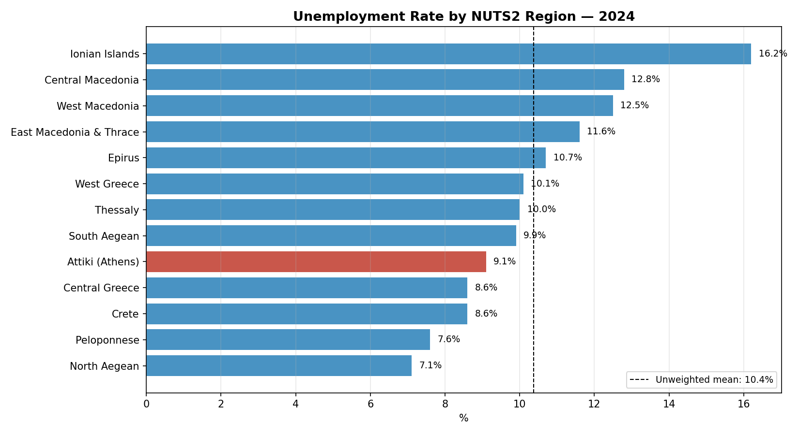

---

## 9. Social Outcomes

### 9.1 Poverty and inequality

The at-risk-of-poverty-or-social-exclusion rate peaked at **36% in 2014** — more than one Greek in three. By 2025 it had fallen to 27%, still well above the EU average of 21%.

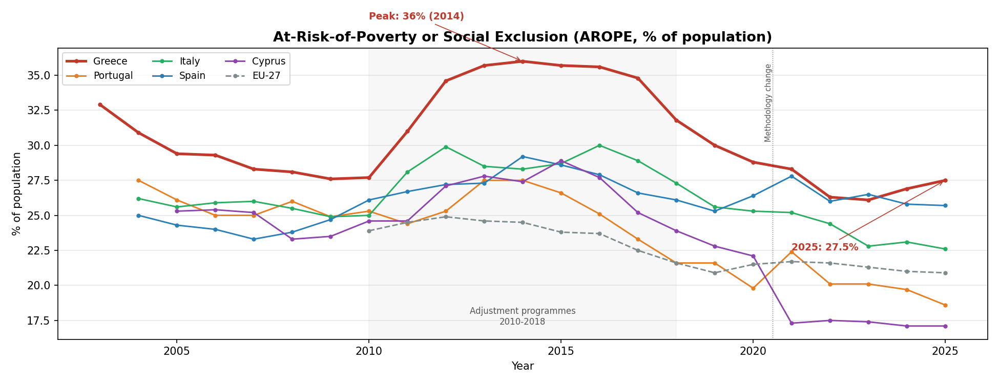

The Gini coefficient, in contrast, stayed remarkably steady through the crisis: between 34 and 37 throughout. Greek inequality didn't blow up because incomes contracted across the distribution; this is poverty as a level effect, not a distribution effect.

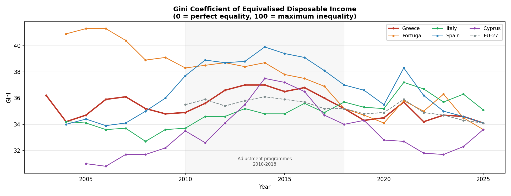

### 9.2 The NEET story

Greece's NEET (not in employment, education or training) rate for ages 15–29 hit **28.1% in 2013** — the worst in the EU. The fall to 13.5% by 2025 is one of the largest improvements in any member state. It coexists, however, with continued outward migration of educated young people.

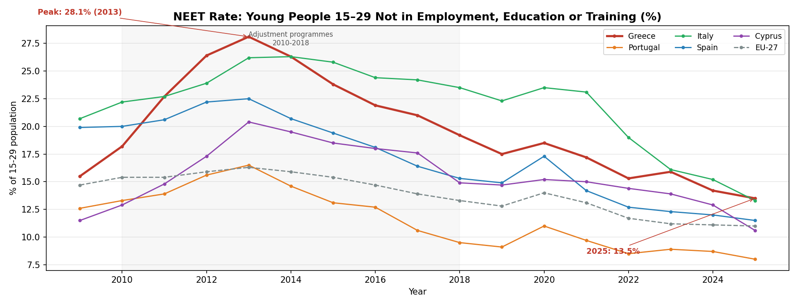

### 9.3 Education and the brain drain

Tertiary attainment among 25–34-year-olds rose from 19% (1992) to 45% (2022), then ticked downward to 42.8% (2025). Spain (52.5%) and Portugal (42.5%) overtook Greece in this period despite weaker baselines. The recent dip is consistent with the demographic data: educated young Greeks emigrated during the crisis and many have not returned, while domestic university enrolment slowed.

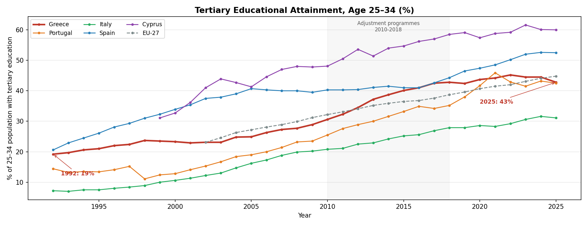

### 9.4 Life expectancy

Greek life expectancy at birth held up remarkably well through the austerity decade. The 2010 figure of 80.6 years rose to 81.9 by 2018 despite the crisis. COVID erased about 1.7 years and the recovery has been slow: the 2024 figure of 81.9 just regained the pre-COVID peak. Greece now trails Spain, Italy and Cyprus on life expectancy by 1.5–2 years.

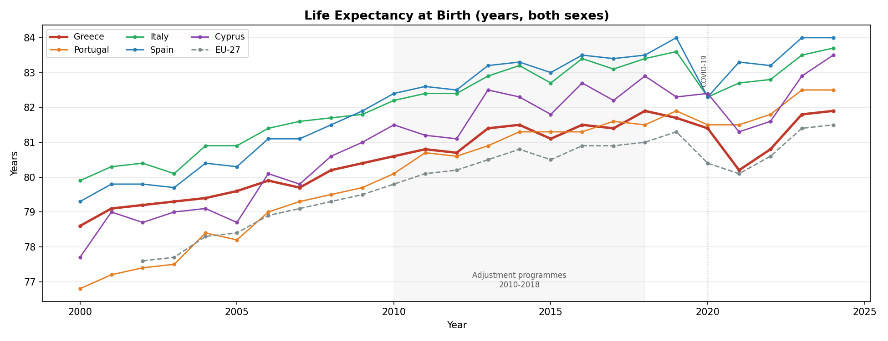

---

## 10. Synthesis: Where Greece Stands in 2025

The Greek crisis has not so much ended as receded. The acute symptoms have been treated — yields are normal, banks are solvent, unemployment is contained, fiscal balance is restored. The chronic conditions remain: an old, shrinking population; a manufacturing sector among the EU's smallest; a regional structure dominated by one mid-tier capital; and per-capita output that has not converged toward the EU average in twenty years.

The current trajectory has three strong tailwinds. **First**, RRF disbursements at an EU-leading pace are funding green and digital investment that the private sector and the depleted state could not. **Second**, tourism and shipping are at historical highs and there is no obvious cap on either. **Third**, the fiscal turnaround is genuine and durable — Greece has demonstrated political and institutional capacity to sustain large primary surpluses for a decade, which transforms the debt-sustainability calculation.

The headwinds are equally clear. **Demographics** are deteriorating without any visible policy response; the population is shrinking by roughly 0.4% per year. **Brain drain** is undocumented in macro data but visible in the tertiary-attainment downturn and the migration flows. **Manufacturing** has not recovered and shows no signs of doing so. **Regional convergence** has been replaced by regional divergence, with continental Greece — outside Attica and the tourism islands — depopulating.

What the data do not settle is whether the equilibrium being reached is the new normal or a way station to something better. Real GDP is still essentially flat over 24 years. Per-capita PPS output is at the same fraction of the EU average as in 2003. The recovery has been real but has not been convergence. Whether the green-and-digital RRF investment, combined with the cleaner banking system and a now-sustainable fiscal position, can produce the productivity acceleration that the previous twenty years failed to deliver is the central economic question facing Greece for the rest of this decade.

---

### Data sources

- Eurostat (national accounts, government finance, labour force, BoP, regional accounts, demography, SILC, education).
- World Bank World Development Indicators (GDP, FDI, NPLs, financial sector).
- ECB Statistical Data Warehouse (monthly bank deposits, yields).
- European Commission Recovery and Resilience Scoreboard (RRF allocations and disbursements).

All charts in `charts/`. All underlying data CSVs in `raw-data/`. Module scripts `01_*.py` through `09_*.py`.
