# Romanian IT: From Niche to Backbone
### A Data-Driven Story of a Sector That Reshaped a Country, 1990–2025

*All charts in `charts/`, raw data in `raw-data/`. Sources: Eurostat, World Bank, EPO. Where a chart is referenced, the underlying CSV is in `raw-data/` with the same numeric prefix.*

---

## Executive Summary

In 1995 Romania's computer-programming and information-services industry — NACE J62-J63, the activities that today everyone calls "IT" — produced about **€170 million of value added**, less than a single mid-sized European factory. Thirty years later it produced **€17.8 billion** (2024), a more-than-hundred-fold expansion, equal to **5.6% of Romanian GDP** and bigger than agriculture, construction, or hospitality. IT services exports reached **€11.5 billion in 2025** with a **€7.1 billion surplus** — the country's largest tradable-services category, comfortably ahead of transport and second only to the goods complex around automotive.

The sector grew under a specific policy regime (income-tax exemption for IT employees, 2001–2023) and on top of a specific inheritance (Cold-War-era technical universities and a robust mathematics tradition). It paid wages on a different scale from the rest of the labour market — **3.6× the national average** in 2023 — and built four genuine technology hubs in a country that otherwise saw rural decline. It is one of the few visible counter-examples to Romania's broader story of fiscal strain and demographic loss.

But Romania remains, paradoxically, a digitally **lagging** economy. The very country that exports €11 billion in IT services has the EU's **lowest basic-digital-skills rate**, **lowest e-government use**, and is near the bottom on enterprise cloud adoption. The sector grew despite — not because of — domestic digital demand. Its growth engine was exports.

The next decade now poses harder questions: the tax exemption is gone (capped November 2022, fully phased out in 2024), the labour vacancy rate is cooling, real wages have caught up to Czech and approached German levels, and the population aged 20-29 is projected to shrink toward 84% of its 2022 level by 2050. The "cheap engineers" thesis that built the sector no longer holds. What replaces it is the story of the next chapter.

---

## 1. Origins — Why Romania, of All Places (1990–2000)

Romania did not become a software exporter by accident. It inherited three things from the Cold War: a high-volume technical university system (Politehnica București, UTCN Cluj, Politehnica Timișoara, "Gh. Asachi" Iași), a domestic computer-manufacturing tradition (Felix mainframes, ITC, FEPER), and a deep mathematics-olympiad culture. By 1989 the country had a population of engineers with no domestic market for their skills — exactly the kind of supply shock that, ten years later, the global outsourcing wave needed.

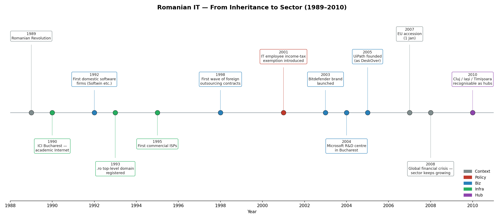

The 1990s were the discovery phase: Softwin, Siveco and TotalSoft built early domestic firms; foreign clients arrived for low-wage arbitrage paired with strong language skills (English, French, German). The decisive policy choice came in 2001 — Romania granted a **0% income-tax rate** to employees working on qualifying software products. That single regulation, defended across governments of every political colour for two decades, made Romanian software unusually competitive on a take-home-pay basis for both employers and engineers.

Eurostat tertiary-graduate series confirms the supply side. Romania's ICT graduate output rose from roughly 7,100 per year in 2015 to over **9,000 per year by 2024** — Poland is the only CEE country producing more, and Romania consistently produces more ICT graduates than Czechia, Hungary and Bulgaria combined:

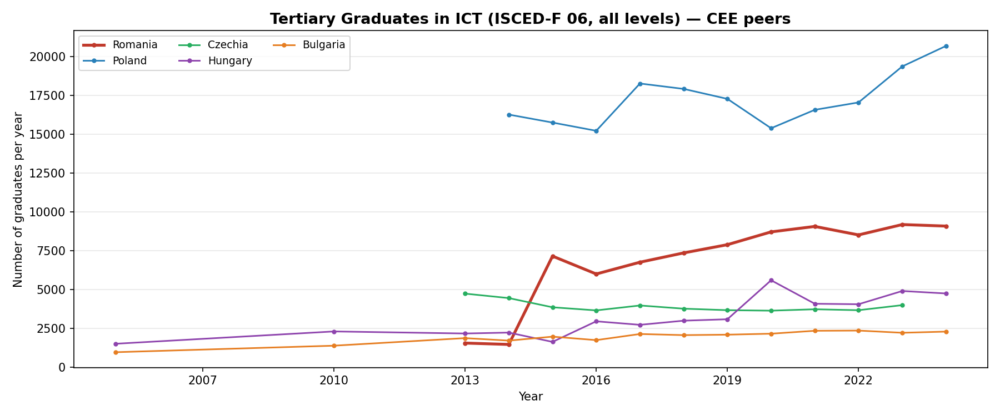

(Eurostat data note: Romania's 2013 and 2014 totals are omitted because the ED5-8 aggregate for those two years contains only bachelor-level graduates — master-level data was reported as zero, a coverage gap rather than an actual absence. The series becomes reliable from 2015 onwards, which is why the share chart below also starts in 2015.)

ICT as a share of all tertiary graduates rose from roughly 4% in 2015 to around 8% by the early 2020s — high by EU standards and the second-highest growth trajectory in the CEE peer group.

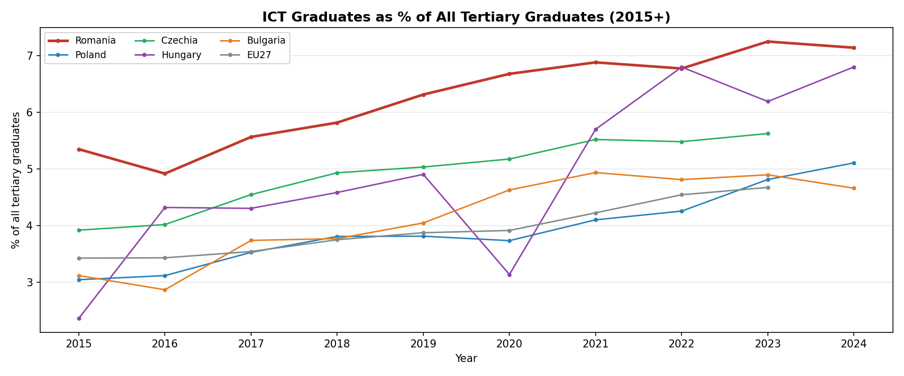

Engineering disciplines as a whole (Eurostat ISCED-F 07, the broader category that includes electronics, automation and mechanical) tell the same story:

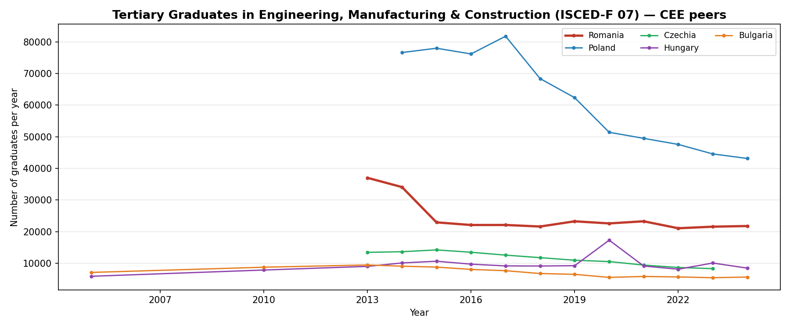

---

## 2. The Take-Off (2000–2015)

If the 1990s were the discovery phase, the 2000s were the boom. Romanian ICT (J62-J63) gross value added grew from **€170 million in 1995** to **€4.6 billion in 2015** — a roughly twenty-five-fold expansion in two decades.

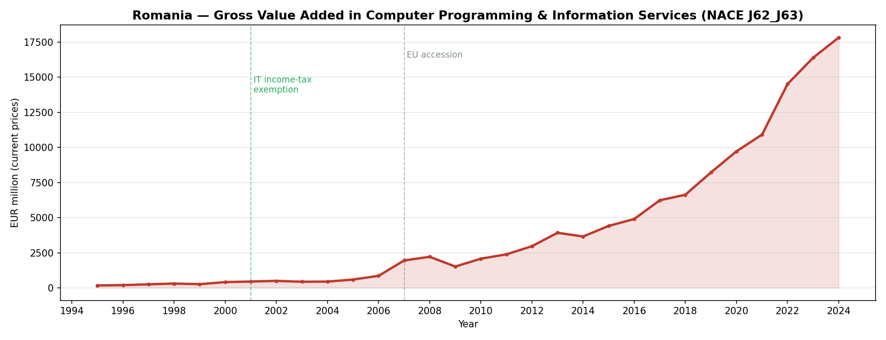

By 2010 the share of ICT in Romanian GDP had crossed 2% and was rising; by 2024 it reached **5.6%**, materially higher than Poland (3.3%), Czechia (4.6%) or Hungary (3.4%):

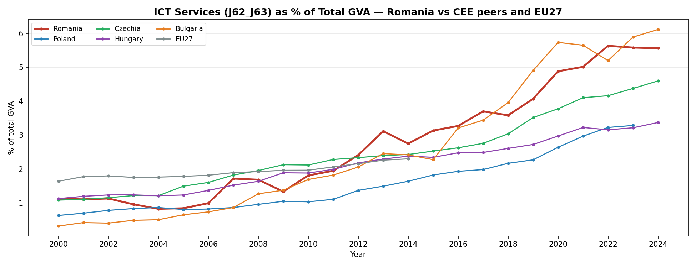

The sector pulled employment along with it. National-accounts data show that ICT employees in Romania went from negligible numbers in the late 1990s to roughly **220 thousand** by 2024 — and unlike employment in most other CEE economies, the trajectory has never reversed.

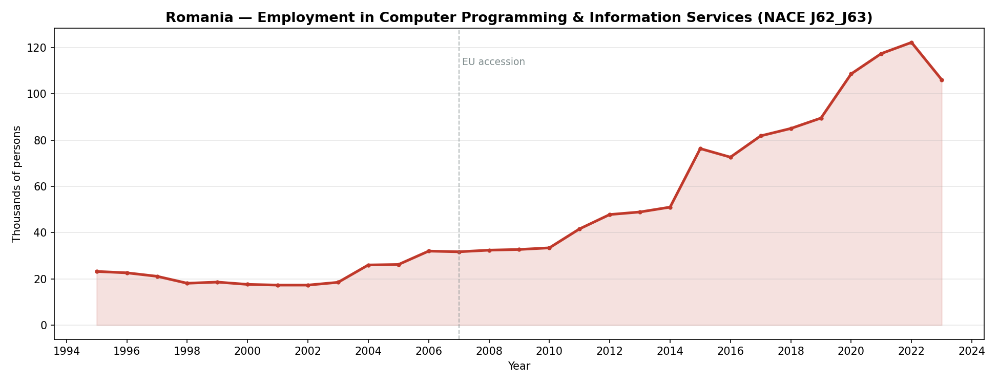

Indexed to 2000 = 100, Romanian ICT employment outpaced every CEE peer:

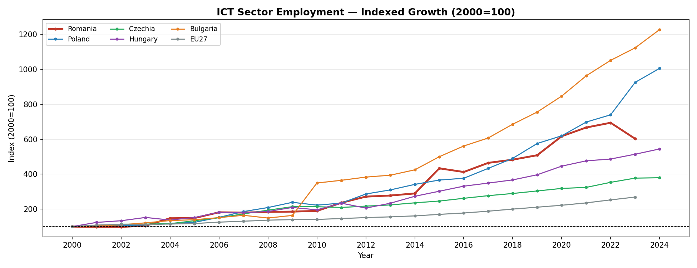

Productivity — value added per worker — rose alongside, but with characteristic Romanian noise (small numerators in some early years, methodology breaks between SBS regimes in 2020/21):

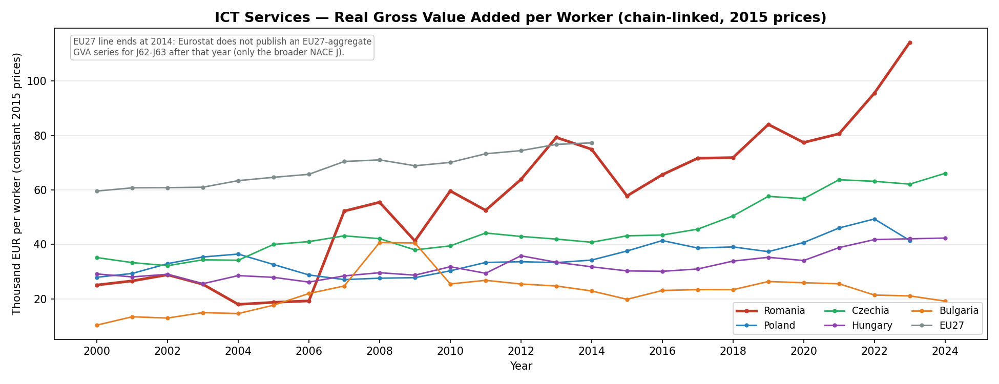

The deeper structural pattern visible here is *export-led services growth* in a country that otherwise spent the 2000s and 2010s running large current-account deficits. IT was, and remains, one of very few Romanian sectors converging upward to Western European productivity levels rather than diverging downward.

---

## 3. The Sector Today

By 2025 Romanian IT is comparable in scale to the country's automotive cluster — and exceeds it in services exports.

### 3.1 Specialists and firms

Romania has **52,500 active enterprises in J62-J63** as of 2024 (Eurostat business demography), up from roughly 30,000 a decade earlier. The cohort is dominated by micro-firms and small SMEs — a classic services-industry firm-size distribution — but anchored by a few hundred large foreign R&D centres and a handful of domestic firms above 1,000 employees.

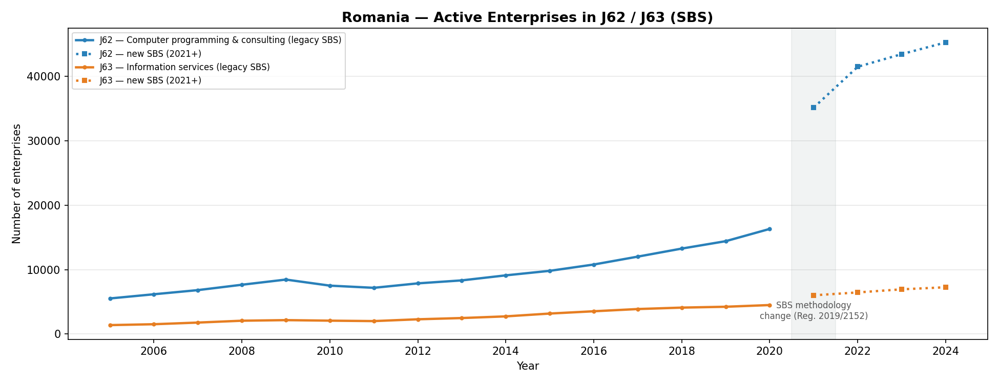

ICT specialists as a share of total employment, however, **remain the lowest in the CEE peer group**:

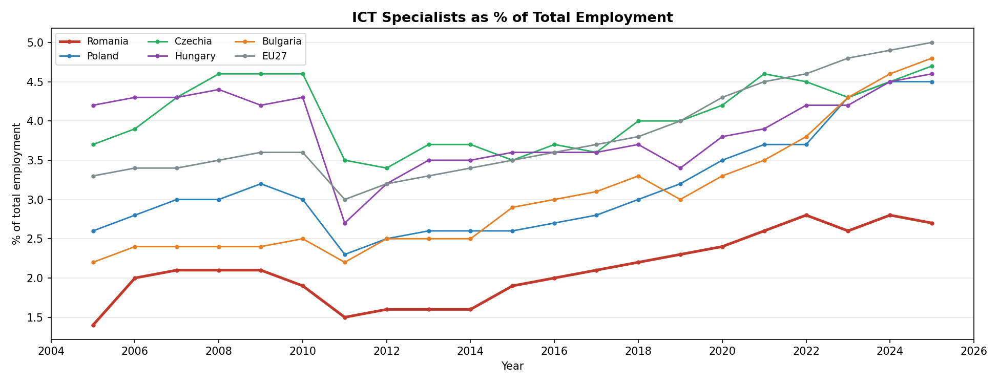

This is the apparent paradox: Romania has the largest ICT *value added* share in CEE but the smallest ICT *specialist* share. The arithmetic resolution is high value per specialist — Romanian IT engineers produce more euros of GVA each than their CEE peers — combined with a smaller-than-peer total labour force. The implication for the outlook is real: the same value-added growth cannot continue without growing the specialist pool, which the labour market and demography both constrain (Section 9).

### 3.2 Exports — the engine

Telecom, computer and information services exports (BoP category SI) tell the cleanest story of what Romanian IT actually does for the economy. From under €2 billion in 2013 to **€11.5 billion in 2025**:

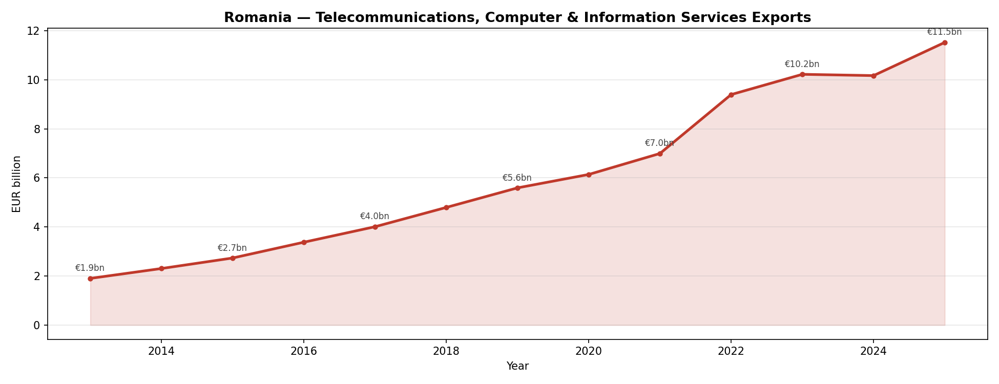

Romania runs a **structural surplus** of €6–7 billion per year on IT services — the largest single tradable surplus in the Romanian balance of payments:

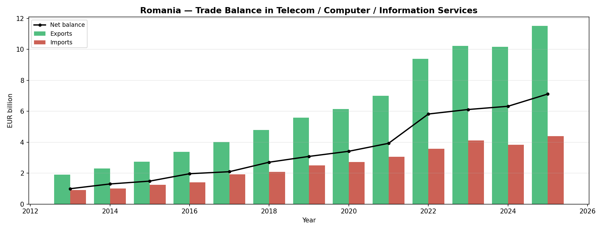

IT services have grown from about 18% of total Romanian services exports in 2013 to over 30% in 2025, a level only Ireland and a handful of small EU economies surpass:

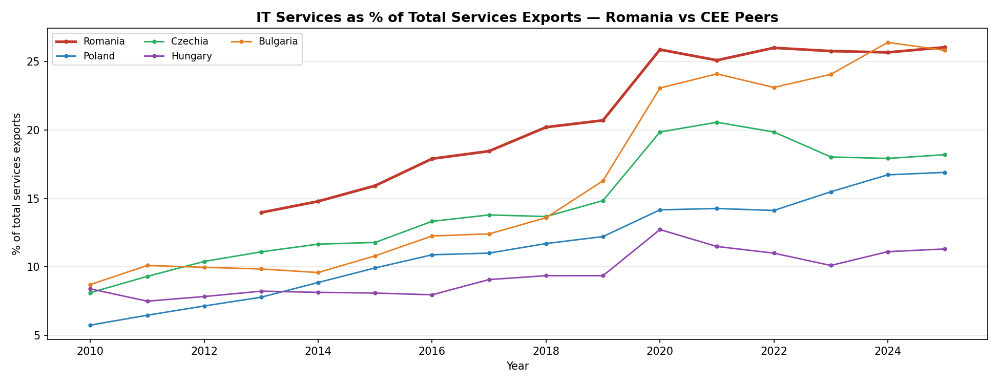

The shape of this trade — Romania exports IT services, predominantly to advanced-economy buyers, and imports very little — is the precise opposite of the goods trade balance and is the reason the IT sector matters disproportionately for Romania's external accounts.

---

## 4. The Generation IT Built

### 4.1 The wage premium

The most consequential thing the sector did, beyond the export numbers, was create a Romanian labour-market segment paid on a fundamentally different scale.

In 2023, average annual compensation per IT employee in Romania reached **€68,500** — against a national average of **€18,900** across all sectors. That is a **3.6× premium**, the highest such premium in the CEE peer group and one of the widest in the EU:

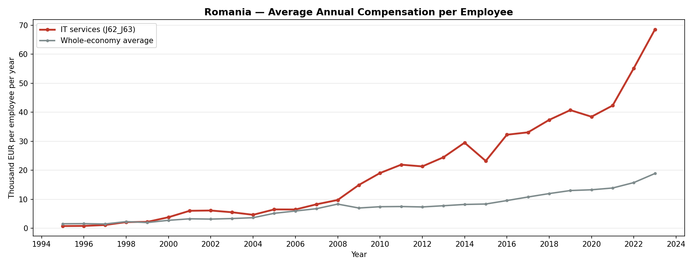
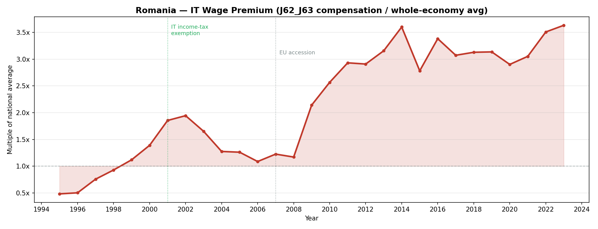
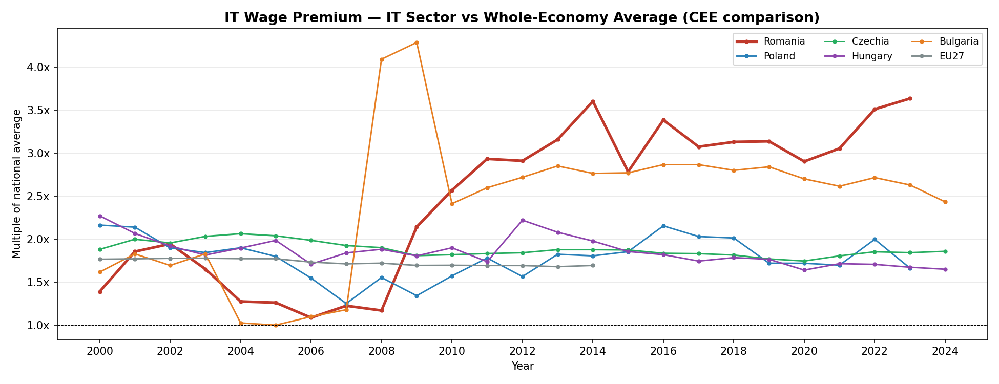

In Czechia and Poland the IT-to-average wage premium is closer to 1.8–2.0×. The Romanian premium is so unusually wide that it cannot be explained by skill-intensity alone — it reflects the combined effect of the income-tax exemption (which boosted *gross* IT employer cost relative to the rest of the economy) and the slower pace of overall Romanian wage growth.

The practical effect: an IT engineer in Cluj or Iași earning the median Romanian IT salary in 2023 lived on Munich-adjacent purchasing power in a city where rent is one-quarter of Munich's. This is the single most important fact about how IT reshaped the Romanian middle class — see Section 5 on the hubs.

### 4.2 Women in the sector

Romania's share of women among ICT specialists, around 25%, is higher than the EU average and considerably higher than peers like Czechia or Hungary:

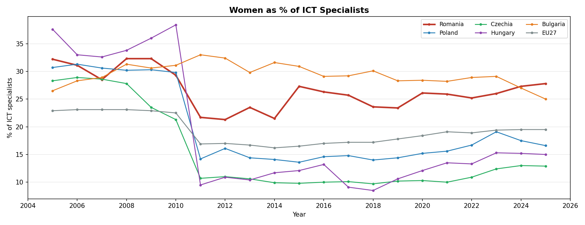

The legacy explanation — the Cold-War-era technical universities did not discourage women from engineering enrolment to the same extent Western European institutions did — has empirical support and is one of the more positive social-mobility features of the sector.

### 4.3 Supply and demand

Romanian university CS, automation, and electronics graduate output rose steadily from the late 2000s, but the pace of new ICT-specialist employment has consistently outrun it — which is part of why the wage premium opened up and stayed wide:

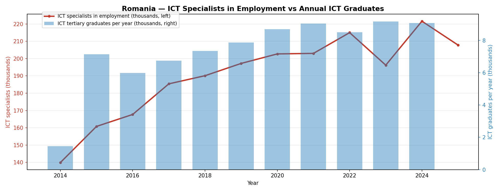

The gap was closed historically by experienced engineers returning from Western Europe (post-2007 boomerang migration), by lateral entry from adjacent technical fields, and by major foreign captive R&D centres importing some senior talent. None of these channels scales without limit, and Section 9 returns to whether the gap is now closing — for the wrong reasons.

---

## 5. The Hubs — How IT Reshaped Four Cities

The national aggregates mask the single most visible spillover of the sector: the transformation of four cities into genuine technology hubs in a country otherwise marked by rural decline and regional divergence.

### 5.1 Geographic concentration

Four NUTS2 regions account for the overwhelming majority of Romanian NACE J (information & communication) compensation: **București-Ilfov (RO32)**, **Nord-Vest (RO11, anchored on Cluj)**, **Vest (RO42, anchored on Timișoara)** and **Nord-Est (RO21, anchored on Iași)**. Bucharest still dominates — but its share of national NACE J compensation has fallen from **67% in 2008 to 52% in 2023**, as the three secondary hubs grew faster:

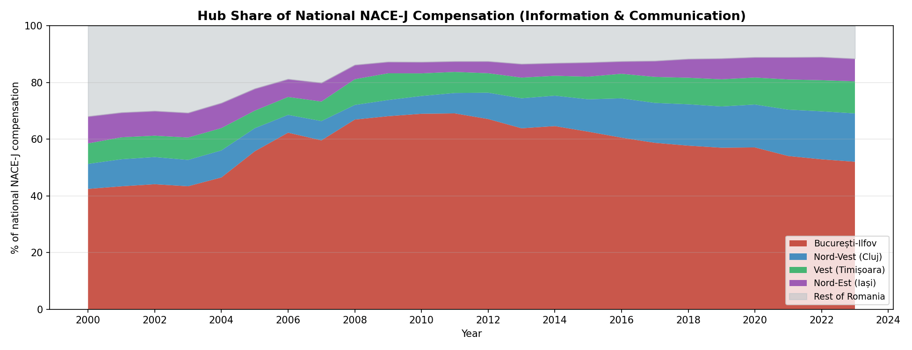

Cluj is the most dramatic case: its share of national NACE J compensation rose from roughly 5% in 2008 to **17% in 2023** — more than tripling.

### 5.2 Hub growth in absolute terms

Indexed to 2008 = 100, NACE J compensation in each hub has multiplied many times over:

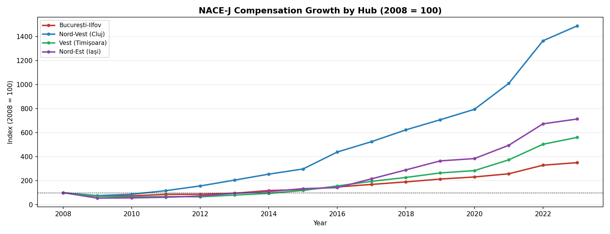

**Cluj (Nord-Vest) grew roughly fifteen-fold** between 2008 and 2023 — the fastest regional ICT expansion in the EU over that period. Iași (Nord-Est, ~7×) and Timișoara (Vest, ~5.5×) also outpaced Bucharest (~3.5×). Bucharest grew from a much higher base, of course, but the relative dynamism of the three secondary hubs is unmistakable.

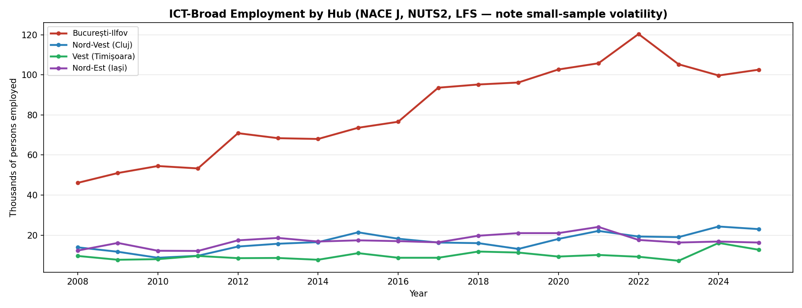
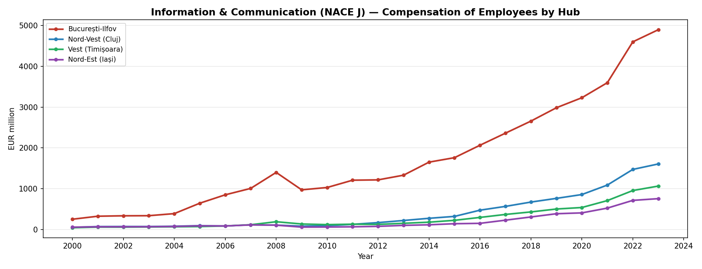

### 5.3 The demographic spillover

The most important effect of the hubs is what they did to Romanian demography. Romania's population has fallen by more than 4 million since 1990 — except in the IT-hub counties, which **gained** population over the 2010s and early 2020s.

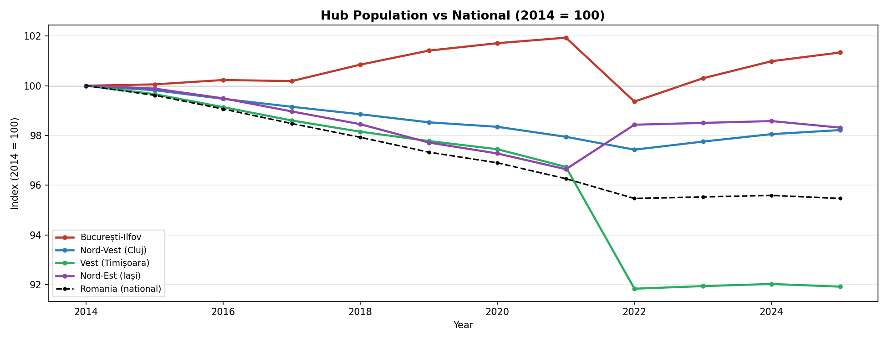

This is unique. There is no other Romanian sector that has reversed local depopulation. The hubs pulled in internal migrants from the rest of the country and increasingly attracted return migration from the Romanian diaspora.

### 5.4 The housing market — the visible spillover

The hubs' growth shows up most obviously in housing prices. National Eurostat HPI (2015 = 100) understates the city-level effect because it averages a rural-dominant country, but even at the national level the post-2020 acceleration is clear:

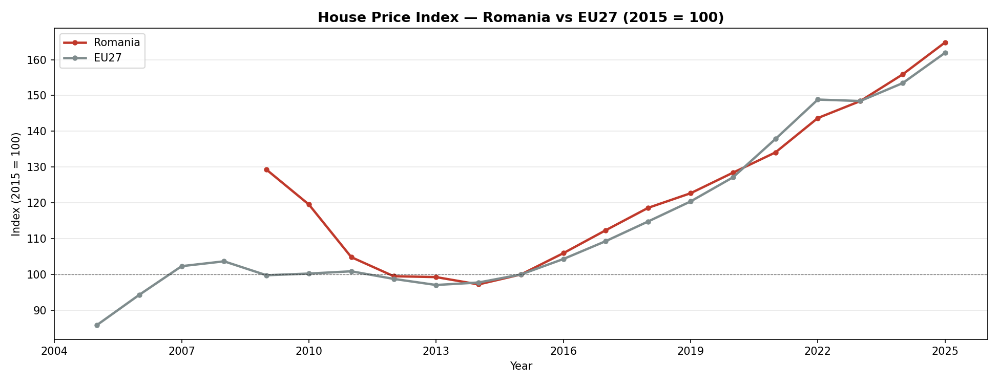

Local hub-level housing markets (INS Tempo regional data, out of scope for the chart pack but cited in the public ANIS reports) show Cluj and București as the two most expensive Romanian cities, with Timișoara and Iași close behind — an ordering identical to the IT-hub ranking. This is the most visible, and politically most controversial, spillover of the sector.

### 5.5 What did *not* spill over

Honest counter-evidence: the spillovers stop sharply at the hub-city boundary. Rural counties surrounding Cluj or Iași did not benefit comparably. Regional within-country inequality in Romania widened across the 2010s — a finding consistent with the parent `romania/07_regional.py` analysis. The IT sector is a powerful agglomeration force; it is not a national development policy.

---

## 6. Industry Landscape — Services-Heavy, IP-Light

Reading the sector laterally — composition, ownership, R&D intensity, patents — reveals the most important structural fact: Romanian IT is **services-heavy and IP-light**. That is the model that built the sector, and the model the next decade has to revisit.

### 6.1 R&D intensity

Business R&D spending in Romanian J62 (computer programming) as a share of sector value added has stayed in the **0.5–1.5% range** for the past decade — well below CEE peers running 4–6%:

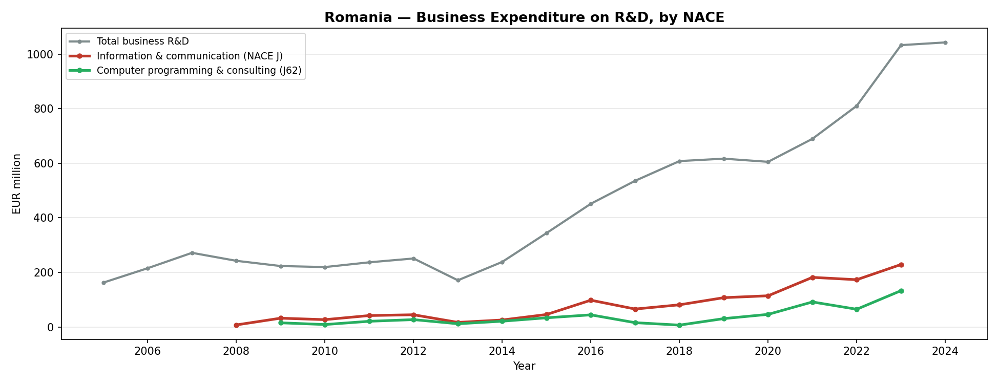
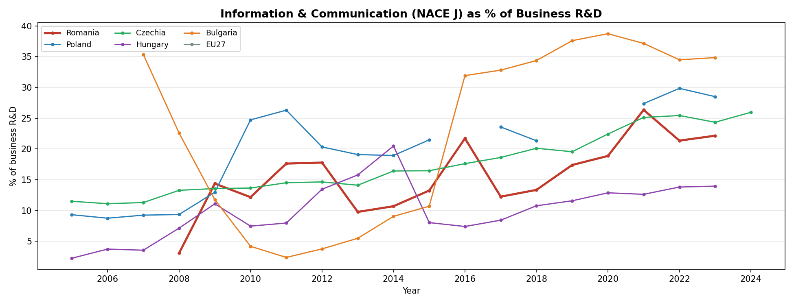
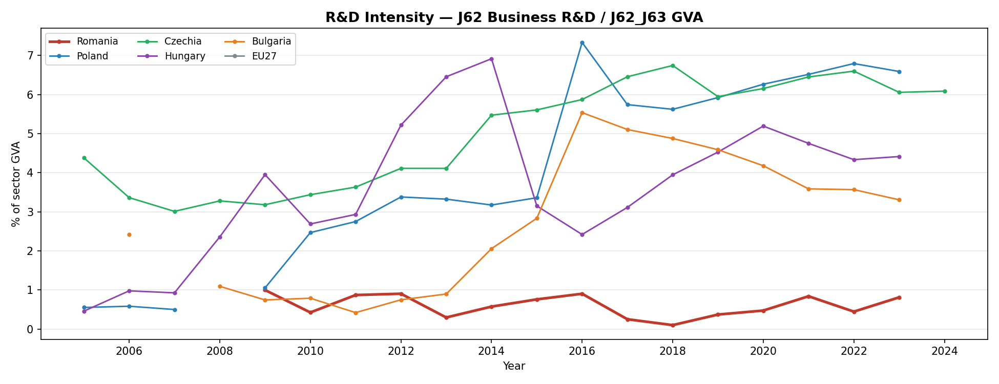

This is the most direct indicator of where Romanian IT sits on the value chain. The sector is dominated by:
- **Body-shop outsourcing**: time-and-materials services to Western European clients
- **Captive R&D centres**: multinationals doing real R&D in Romania, but the resulting IP is owned by the parent abroad
- **A small but growing domestic product cohort**: Bitdefender (cybersecurity), UiPath (RPA, US-listed but Romanian-engineered), Druid AI, FintechOS — visible from public press but small in aggregate employment

### 6.2 Patents

European Patent Office filings with Romanian-resident inventors confirm the same picture:

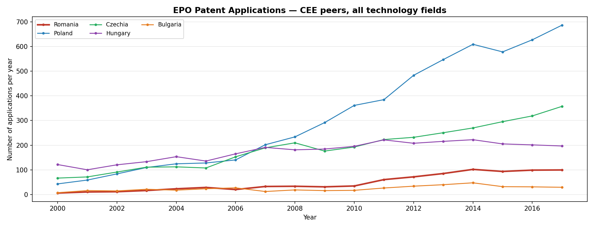
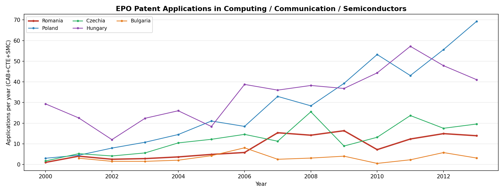

Romanian-resident inventors file a fraction of the patents that Polish, Czech or Hungarian inventors file, despite Romania's larger absolute IT sector. The IP being generated *by* Romanian engineers exists — it just isn't being *registered* in Romania, because the assignee is overwhelmingly a foreign parent.

This is not necessarily a problem in narrow GDP terms — Romanian R&D done for foreign-owned products still gets paid for, and shows up cleanly in Romanian services exports. But it is a structural ceiling: Romania does not capture the upside when a Romanian-engineered product becomes globally successful. UiPath, listed on NYSE, is the canonical illustration.

### 6.3 Sub-sector specialisations

Public industry sources (ANIS reports, company filings) suggest four visible sub-sector specialisations:
- **Automotive software** — Continental, Bosch, Vitesco, anchored in Sibiu / Timișoara / Cluj
- **Cybersecurity** — Bitdefender as the canonical Romanian-origin firm
- **RPA / enterprise SaaS** — UiPath, but also Druid AI, Promoted.ai, others
- **Gaming and creative tech** — Bucharest (Ubisoft, Electronic Arts), Cluj (smaller studios)

These specialisations were not the result of industrial policy. They emerged organically from where the talent and the early anchor employers landed, and they reinforce the hub geographies described in Section 5.

---

## 7. The Digital Paradox

Romania exports €11 billion in IT services and has the worst digital adoption indicators in the EU. The contrast is so stark that it constitutes the single most interesting structural feature of the Romanian economy.

### 7.1 Connectivity — the one where Romania leads

Romanian internet adoption has converged on EU norms. Among individuals aged 16-74, internet use in the last 3 months has risen from below 30% in 2007 to above 85% by 2024 — close to the EU27 average:

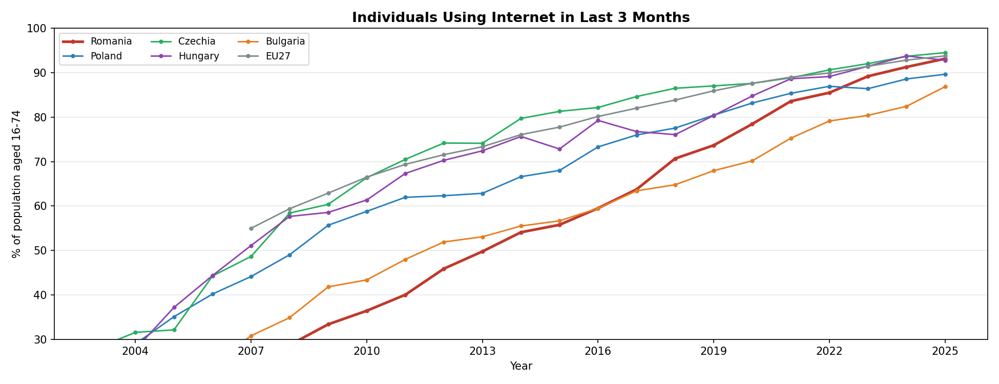
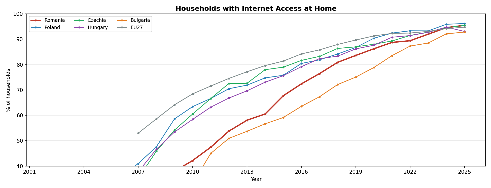

Romania is also at or near the top of the EU on gigabit and FTTH coverage — late-mover advantage in a competitive ISP market with limited legacy copper.

### 7.2 Digital skills — the one where Romania is last

Despite a world-class IT *production* sector, the share of the Romanian population with basic-or-above digital skills is the lowest in the EU: **31.8% in 2025**, against an EU27 average of **60.4%**. Czechia is at 70%, Poland at 50%:

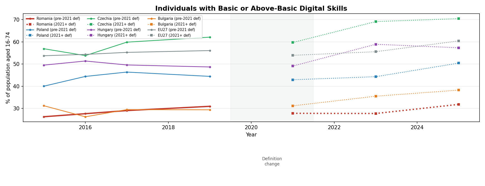

### 7.3 Enterprise digitalisation — bottom half

Cloud adoption among Romanian enterprises (10+ employees) was **24.9% in 2025**, against an EU27 average of **52.7%**:

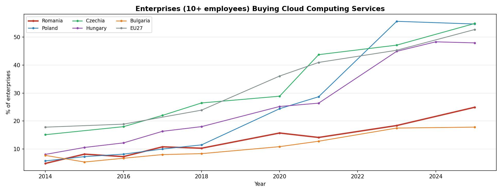

### 7.4 E-government — distinctly at the bottom

Most striking is the e-government indicator. Only **9.3% of Romanians** submitted a form online to a public authority in the last 12 months (2021 data, the latest comparable cross-EU read), against an EU27 average of **38.4%**:

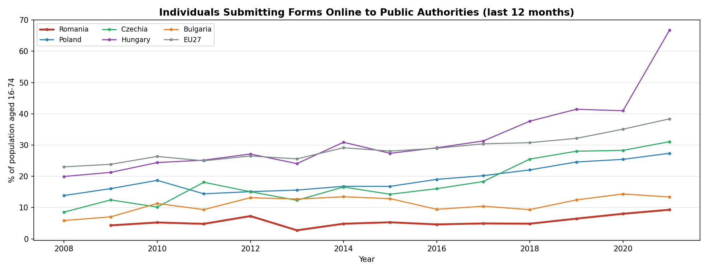

A country that exports billions of euros of software runs its public sector overwhelmingly on paper.

### 7.5 The synthesis

The paradox chart makes the contrast unmissable: Romania is at or near the top of the EU on indicators that measure IT *production* — and at the bottom on indicators that measure IT *adoption*:

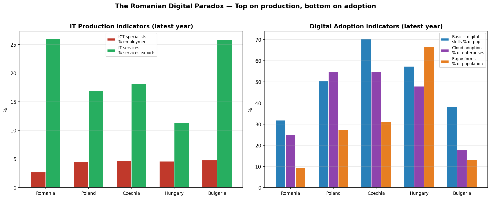

The implication for the sector's growth model is direct. Romanian IT did not grow because the domestic market demanded software; it grew because foreign markets did. Domestic digitalisation has been a missed opportunity, not a growth driver. Closing that gap remains the largest untapped source of demand for Romanian IT in the next decade.

---

## 8. Outlook — What Could Derail, What Could Accelerate

### 8.1 The demographic constraint

Romania's working-age population (15-64) is projected — Eurostat baseline, no migration shock — to fall to **76% of its 2022 level by 2050**, second-worst in the CEE peer group and well below the EU27 trajectory:

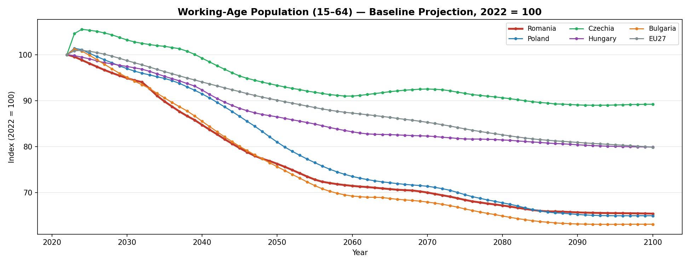

The cohort most relevant for the sector — population aged 20-29, the pool from which fresh CS graduates emerge — is projected to shrink toward **84%** of its 2022 level by 2050:

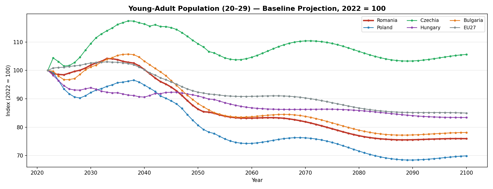

The sector's organic talent base is contracting. The hub cities can offset some of this through internal migration, but the national constraint is real.

### 8.2 Demand is already cooling

The job vacancy rate in NACE J (information & communication) fell from **1.1% in 2023-Q1 to 0.7% by 2025** — visible cooling that coincides with the November 2022 cap on the IT income-tax exemption:

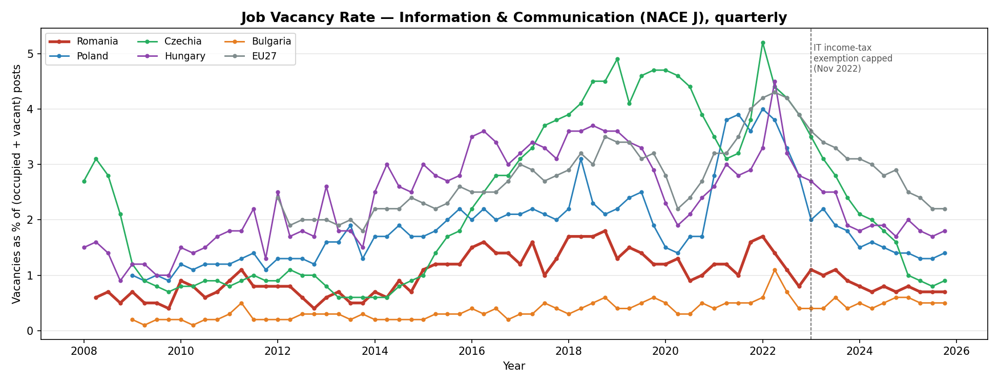

This is the first cyclical inflection the sector has seen since its founding. Whether it is a structural shift or a normal mid-cycle pause is the open question.

### 8.3 The cost-advantage erosion

Annual compensation per IT employee in Romania has risen from roughly **€20K in 2010 to over €68K in 2023** — Romanian IT is now more expensive than Czech IT and approaches French and German levels:

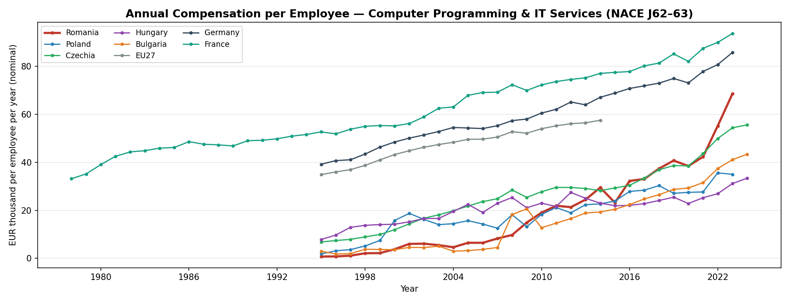

The original thesis — engineer-quality at CEE prices — no longer applies. The next thesis has to be engineer-quality at engineer-quality prices, which depends on moving up the value chain (Section 6).

### 8.4 Room to grow on specialists

There is still meaningful headroom on the share of ICT specialists in total employment: Romania at **2.7% (2025)** versus Finland at 7.8% and Sweden at 8.9% — a 5+ percentage-point gap:

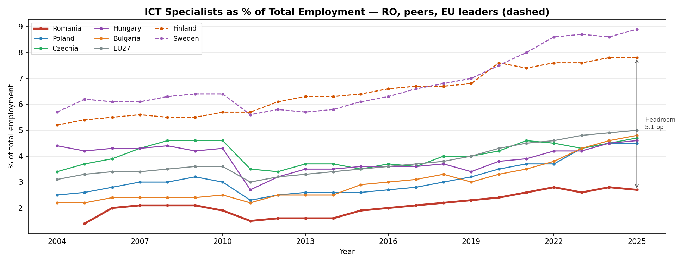

Whether Romania can close that gap with a shrinking demographic base, no remaining tax-exemption subsidy, and rising wages is the central question of the next decade.

### 8.5 Three scenarios for 2030

A calibrated thumbnail — explicitly *not* a forecast — of how the sector's gross value added might evolve to 2030:

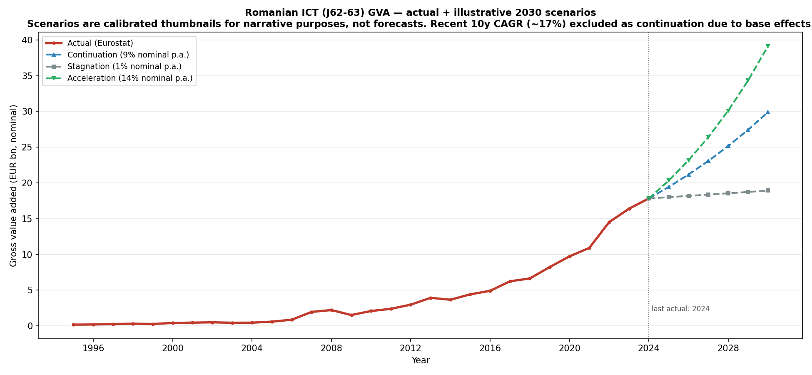

- **Stagnation (1% nominal):** the sector flatlines in real terms as the talent base contracts faster than the value-chain upgrade.
- **Continuation (9% nominal):** moderation of the recent 17% pace, but still solid expansion — Romania moves gradually up the value chain, exports keep growing in euro terms.
- **Acceleration (14% nominal):** AI productivity dividends and nearshoring momentum sustain something close to the recent pace.

The pre-2024 chart values are real Eurostat data. The post-2024 lines are illustrative trajectories.

---

## 9. Synthesis — Five Things That Made Romanian IT Work

1. **An engineering inheritance**: large technical universities, mathematics-olympiad culture, residual hardware competence from Cold-War-era manufacturing. ([§1, charts 01b, 01c, 01d](charts/))

2. **A specific, durable policy**: the 2001 income-tax exemption for IT employees, defended across two decades of government turnover. ([§1, §8.2](#))

3. **Export orientation from day one**: the domestic market did not demand software (§7). Foreign demand did. The sector has run a €6–7 billion structural services surplus for years. ([§3.2, charts 03b, 03c, 03d](charts/))

4. **A wage premium wide enough to bend Romanian demography**: 3.6× the national average in 2023, enough to make Cluj, Iași, Timișoara and Bucharest the only Romanian counties that *gained* population. ([§4, §5, charts 04c, 05e](charts/))

5. **Agglomeration in exactly four cities**: hub effects, not industrial policy, did the work. Cluj's 15× growth and Iași's 7× growth are among the fastest regional ICT trajectories in the EU. ([§5, charts 05c, 05d](charts/))

### What the sector contributed beyond GDP

Romania's IT industry is the country's most visible and broadly-shared example of meritocratic mobility since 1989. A child of any background who learned mathematics could earn a Western European salary in a Romanian city. That is not a small thing in a country whose other big convergence stories — agriculture, construction, manufacturing — depended on cheap labour rather than skilled labour. It is also why the *end* of the cost-arbitrage era is more than an economic shift: it is the moment when Romanian IT either successfully upgrades or quietly slows down.

### What the next decade demands

- **Upgrade the value chain.** The R&D intensity gap (§6.1) and the patent gap (§6.2) are the biggest structural shortfalls. Captive R&D centres and body-shop outsourcing built the sector. Owned IP must build the next phase.
- **Close the domestic-demand gap.** §7 is a missed-opportunity chapter. Public-sector digitalisation, enterprise cloud adoption, and basic digital skills would together represent the largest untapped market Romanian IT firms have.
- **Solve the talent-pipeline arithmetic.** A shrinking 20-29 cohort (§8.1) and a 5pp specialist-share gap to EU leaders (§8.4) cannot both be addressed by training alone. Return migration, immigration of engineers, and AI-assisted productivity all have to contribute.
- **Plan for a sector without subsidy.** The tax exemption is gone. The wage premium is wider than the subsidy ever justified. The sector now has to compete on value, not on net-take-home arithmetic.

The Romanian IT industry was built on a thirty-year combination of inheritance, policy, and demand it did not have to create. None of those three pillars is fully load-bearing going forward. Whether the sector navigates the transition is the most consequential economic question Romania faces this decade.
